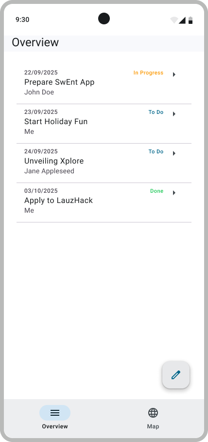
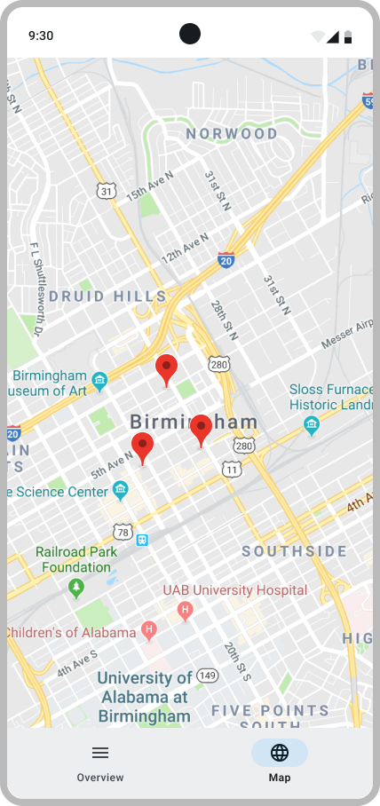

# SwEnt Bootcamp

This Bootcamp is an assignment for the [SwEnt course](https://github.com/swent-epfl/public/blob/main/README.md) course.
It starts on Monday, 8-Sep-2025, and ends on Monday, 29-Sep-2025.
The Bootcamp is split into three milestones, each one corresponding to roughly one week of work (8&ndash;12 hours) for the course.
You will find here all the information you need to complete the Bootcamp.

  - [The Assignment](#the-assignment)
  - [Deliverables](#deliverables)
  - [Grading](#grading)
  - [Getting Help](#getting-help)
  - [Getting Started](#getting-started)

## The Assignment

  
   

In this Bootcamp, you will build a mobile app for managing ToDos, i.e., for creating, viewing, and managing things you want to get done.
The app will include several features that are common in modern mobile applications, such as:

- Google authentication
- cloud-based backend (Firebase database)
- use of the current location and use of the Google Maps API
- use of the Nominatim API for geocoding and location-based information

### Learning Objectives

SwEnt is an engineering _methodology_ course, not a programming course.
The Bootcamp is meant as a guide to familiarize you with the Android ecosystem and to provide pointers for what to read in more depth in preparation for the project.
The Android ecosystem uses a variety of tools and frameworks, such as Kotlin, Jetpack Compose, or Firebase.
Learning them is an engineering task that will need to be performed in parallel with completing the Bootcamp&mdash;we will not be teaching any of these in lectures.

By the end of the Bootcamp, you should be able to start your own Android project from scratch, and in the project implement an amazing app by the end of the semester!

As part of the Bootcamp, you will experience some of the pitfalls of real-world software engineering: dealing with ambiguous and incomplete documentation, working around bugs and limitations of third-party tools, organizing code for compliance and integration with blackbox pipelines, etc. You will start learning how to plan and estimate development time effectively, in order to stay on schedule despite these pitfalls. During the project, you will hone these skills to mastery.

### Deliverables

At the end of each week, you will submit one deliverable for the corresponding milestone.
The deliverables are described in the [deliverables](deliverables/) folder.

## Grading

You must submit your Bootcamp deliverables by committing to your individual repository named `https://github.com/swent-epfl/bootcamp-25-<your GitHub username>`.
We will grade your Bootcamp by analyzing and testing the code in this repository.
There is no other mechanism for submitting your work.
See [here](deliverables/README.md) for more details.

### General Principles

- We have five tiers of performance, defined by analogy to the belts in martial arts:
  - White Belt is where students start. Typically the lack of effort and investment (and more rarely the lack of ability) keeps some students within this tier, where they do not achieve a satisfactory command of the basics, and so they do not pass the course. The grade ranges between [0, 4.0) out of 6.
  - Yellow Belt is for students who have more or less learned the basics, but do not demonstrate much more than a basic competence. The grade ranges between [4.0, 4.5).
  - Green Belt is for average students, i.e., those who have a good command of the basics and know some of the more advanced topics but not all. The grade ranges between (4.5, 5.0].
  - Blue Belt is for the good students, i.e., those who fully master the basics and are in good command of the more advanced aspects of the course. The grade ranges between (5.0, 5.5].
  - Black Belt is for those who demonstrate full mastery and true excellence. The grade ranges between (5.5,6].
- It gets progressively _harder_ to achieve higher tiers (e.g., going from Blue to Black is much harder than going from Yellow to Green), but does not require progressively _more work_ (e.g., going from Blue to Black does not require more time than going from Yellow to Green). In other words, what distinguishes tiers is the amount of ingenuity, creativity, insight, and refinement required to achieve the desired outcome. We don't grade the volume of work invested.  Sometimes, one could make up for lack of ingenuity by taking the more tedious path and working longer hours (e.g., debugging by hand instead of using the appropriate tools), but that comes at the expense of doing other things. Work smarter, not harder. 
- In order to pass to an upper tier, you must fulfill all requirements for the lower tiers. For example, to start earning points in the Blue belt tier, you must first have earned all the points for the Green Belt (and recursively for Yellow and White).

## Getting Help

In the [docs](docs/) folder, we prepared some theory recaps and tutorials.
There are also useful links to help you understand the Android ecosystem. Feel free to read them whenever you need to.

Do not hesitate to look for help on your own.
You can ask your favorite LLM for explanations, read the Android documentation, etc.
Piecing together code snippets in the hope of patching together a Bootcamp deliverable is a poor strategy, because you will spend a lot of time and learn little.
Work smartly and keep your long-term interests in mind.

## Getting Started

Once you read the information above, you can start the assignment.
Remember that this is a Bootcamp: it is designed to discover the Android ecosystem.
You will have to invest 8&ndash;12 hours per week to successfully complete the Bootcamp.
Keep that in mind, and don't wait until the last minute to get started.

Proceed now to the [deliverables](deliverables/README.md).
