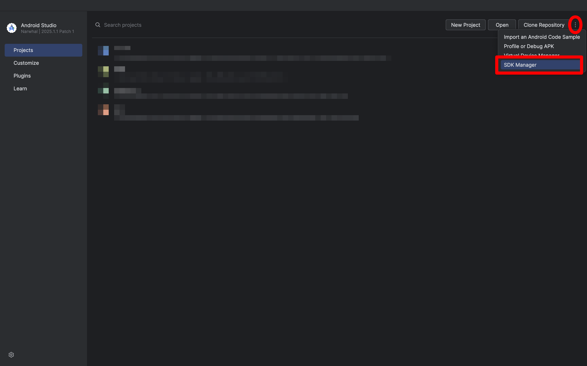

# Setting Up Your Development Environment

Before we start coding, we need to prepare a **development environment**.  This ensures everyone works with the same tools and avoids setup issues later in the bootcamp.

We’ll focus on **Android app development**, using the following tools:

| Purpose              | Tool                |
|----------------------|---------------------|
| Programming language | **Kotlin**          |
| IDE                  | **Android Studio**  |
| Testing              | **Espresso**        |
| CI                   | **GitHub Actions**  |
| Design mockups       | **Figma**           |

You don’t need to master these all at once — we’ll introduce each tool when you first need it.  For example, you’ll use Kotlin and Android Studio right away, but Espresso (testing) and Figma (design) will come later in the bootcamp.
  
> [!IMPORTANT]  
> Some parts of the tech stack can be changed if you really want to, but you must first check with the staff to ensure compatibility.  
> If you choose a different setup, be aware that we may not be able to help you troubleshoot problems.

We recommend [Android Studio](https://developer.android.com/studio) as your IDE (Integrated Development Environment).  It is the official tool for Android apps and runs on **Windows, macOS, and Linux**. 
> [!IMPORTANT]  
> Your computer should have at least **16 GB RAM** and a recent CPU.  
> If your computer cannot handle Android Studio smoothly, please use [EPFL VDI](https://support.epfl.ch/epfl?id=epfl_kb_article_view&sysparm_article=KB0017020).  
> See [this tutorial](../../../tutorials/VDIGuide.md) for setup instructions.


## Cloning the Repository

Let's start by cloning the **template repository** for the bootcamp, which already has the necessary dependencies & configuration configured.

1. **Check Git**:  
   Make sure Git is installed on your system:  
   ```bash
   git --version
   ```

   If it's not installed, [download and install Git](https://git-scm.com/downloads).

2. **Choose a Directory**:  
   Navigate to the directory where you want to place the repository:

   ```bash
   cd path/to/your/directory
   ```

3. **Clone the Repository**

You can connect to GitHub in two ways:

**Option A: SSH (Recommended)**

If you already use SSH keys for GitHub, you can clone via SSH instead:

```bash
git clone git@github.com:swent-epfl/bootcamp-25-<GitHub username>.git
```

If you’ve never set up SSH keys before, follow [this guide](https://docs.github.com/en/authentication/connecting-to-github-with-ssh/adding-a-new-ssh-key-to-your-github-account).

**Option B: HTTPS + Personal Access Token**

Run:

```bash
git clone https://github.com/swent-epfl/bootcamp-25-<GitHub username>.git
```

When prompted for a password, enter your **Personal Access Token** (not your GitHub password). Create a token here: [Generate new token](https://github.com/settings/tokens). See [GitHub’s guide](https://docs.github.com/en/authentication/keeping-your-account-and-data-secure/managing-your-personal-access-tokens) for details.


## Set Up Android Studio

Download and install [Android Studio](https://developer.android.com/studio).  If you already have it installed, update to the latest version.  For detailed steps, see the [official installation guide](https://developer.android.com/studio/install.html).

During installation and the first-run setup wizard, choose the **default options**.


### Open the SDK Manager

When Android Studio launches:

- If you are on the **Welcome screen**, click **More Actions → SDK Manager**.  
  

- If you already have a project open, go to **File → Settings → SDK Manager**.  
  


### Install the Required SDK

In the **SDK Platforms** tab:

- Check **Android 14.0 (API Level 34.0)**.  If you see versions like `34-ext12`, the `ext` means *extension level* (monthly patches). Always install the **latest ext** available.
- Click **Apply** to install


In the **SDK Tools** tab:

1. Enable **Show Package Details** (bottom right)  
2. Under **Android SDK Build Tools**, select version **34.0.0**. 
3. Click **Apply** to install (if not already installed)


### (Optional) GitHub Copilot

You may install [GitHub Copilot](https://github.com/features/copilot) if you'd like AI code suggestions in Android Studio.  This is **optional** — it can help with writing boilerplate, but is not mandatory for the bootcamp.


### Open the Project

Finally, open the cloned repository in Android Studio.  It should load as an Android app project (with the Android logo).

## Managing Project Dependencies and Build Scripts with Gradle

Android projects use [Gradle](https://docs.gradle.org/current/userguide/userguide.html), a popular build system in the Java ecosystem.  Gradle takes care of tasks like compilation, dependency management, and testing.  
Each project is described by one or more `build.gradle` files, which define how the project should be built.

> [!NOTE]  
> Gradle build files can be written in two different syntaxes:  
> 
> - **`build.gradle` (Groovy DSL)** — the original style, based on the Groovy language.  
> - **`build.gradle.kts` (Kotlin DSL)** — a newer style, based on Kotlin. It provides better IDE support (code completion, error checking) and is the default in Android Studio.  
> 
> In this bootcamp, you will work with the **Kotlin DSL** (`.kts` files).

In Android Studio, you may see different **views** in the file explorer:  
- **Project view** shows the complete folder structure.  
- **Android view** simplifies the structure and only shows commonly used files.  

This can make Gradle files look a bit confusing at first. Under **Android view → Gradle Scripts**, you will typically find:  
- **`build.gradle` (Project: …)** — the *top-level* Gradle file, which defines settings and dependencies for the whole project.  
- **`build.gradle` (Module: …)** — the *module-level* Gradle file (for us: `app/build.gradle.kts`), which defines settings and dependencies for the app itself.  

<p align="center"></p>

Now, open **`app/build.gradle.kts`**. This file defines the **build configuration** of your app — for example, which Android version it targets, which Java version it uses, and which libraries it depends on.

Check that you have these values for the SDK (software development kit):

- `compileSdk = 34` → the Android version your app is compiled against.  
- `minSdk = 29` → the lowest Android version your app can run on.  

Also check that the `compileOptions` section sets both `sourceCompatibility` and `targetCompatibility` to `JavaVersion.VERSION_11`. This ensures your code is compiled with Java 11 features.

##  The Bootcamp Dependencies
In Gradle, there are two important concepts:

- A [**plugin**](https://docs.gradle.org/current/userguide/plugins.html) extends Gradle with new functionality.  
  Example: `ktfmt` adds automatic code formatting tasks.  

- A [**dependency**](https://docs.gradle.org/current/userguide/getting_started_dep_man.html) is an external library your app can use.  
  Example: Firestore provides ready-made functionality for cloud storage.


To manage versions, we use the Gradle **version catalog** file: `gradle/libs.versions.toml`.  
This file centralizes plugin and dependency versions used in the bootcamp. Instead of hardcoding versions everywhere, you can change them in one place.

As your project grows, version conflicts between libraries are common. Using a version catalog makes it easier to update or align versions.  

You may also add dependencies directly in `app/build.gradle.kts` under the `dependencies` section, for example:

```kotlin
implementation("androidx.core:core-ktx:1.13.1")
```

> [!IMPORTANT]  
> Whenever you edit a `build.gradle.kts` file, Android Studio will prompt you to **Sync Now** at the top of the editor. Always sync so your changes take effect. You can also sync manually with the “Sync Project with Gradle Files” button (elephant icon with a downward arrow) in the toolbar.
> 
> Tip for Windows users: if you encounter a *Gradle Sync Error*, try running Android Studio in Administrator mode.


## Create an Emulator to Run the App

Before running your app, you need an emulator (an Android Virtual Device, AVD).  

1. In Android Studio, go to **Tools → Device Manager**.  
2. Click **Create Device** and keep the default phone profile (e.g., Pixel 8).  
3. Select the system image (**API 34.0 UpsideDownCake; Andriod 14**) and download it if needed.  
4. Keep the default system configuration and finish setup.  

Your new emulator should appear in the Device Manager. You can now close the manager.

To run your app, go to **Run → Run 'app'**.  
It will take a few moments to boot the emulator, then Android will start and launch your app.

You can also run the app on a physical Android phone. This is often faster than the emulator. See the [official guide](https://developer.android.com/codelabs/basic-android-kotlin-compose-connect-device#0) for setup instructions.


### Troubleshooting with the Command Line

If the emulator does not start correctly, try launching it from the command line. This often shows logs or errors that Android Studio hides.  

The emulator tools are bundled with Android Studio, or you can install them separately. See the [official CLI documentation](https://developer.android.com/studio/run/emulator-commandline) for details.


> [!WARNING]  
> **Linux users**: you may need to enable hardware acceleration (KVM). Follow the [official instructions](https://developer.android.com/studio/run/emulator-acceleration#vm-linux).  
> If you encounter `/dev/kvm device permission denied`, this [StackOverflow post](https://stackoverflow.com/questions/37300811/android-studio-dev-kvm-device-permission-denied/45749003) can help.

# Managing Your Version Control System (VCS)

## Commit messages

We will review and grade the commit messages you push.  
Make sure to follow the guidelines from lecture and the [commit message document](/bootcamp/docs/CommitMessages.md).

## What to commit

Not all files should be committed to GitHub.  
We provide a `.gitignore` that excludes build outputs and local configs.  

You should commit:  
- `src/main/java` — your app’s source code  
- `src/main/res` — resources such as strings and images  
- `src/test` — your unit tests  
- `src/androidTest` — your UI tests  

## Pre-commit hooks (optional but recommended)

A **pre-commit hook** is a small script that runs automatically before each commit.  It helps catch issues early, instead of waiting for CI to fail.

In this bootcamp, we provide a hook that checks if your code is properly formatted with `ktfmt`.  

To enable it:  
1. Go to your `.git/hooks` directory (Note: the `.git` folder is hidden by default. Look up how to show hidden files on your operating system if you don’t see it right away.).  
2. Rename `pre-commit.sample` to `pre-commit`.  
3. Replace its content with the script below:  

```bash
#!/bin/sh
echo "[pre-commit] Checking formatting with ktfmt..."

./gradlew ktfmtCheck --quiet
RESULT=$?

if [ $RESULT -ne 0 ]; then
  echo "[pre-commit] Some files are not properly formatted."
  exit 1
fi

exit 0
```

4. Make the file executable if needed:  
```bash
chmod +x .git/hooks/pre-commit
```

## Java version note

Pre-commit hooks run with your local Java installation. If you see errors, make sure your `JAVA_HOME` or default Java version matches the one used by Android Studio.

You're done. Congrats!

> [Next step: Get started with Android](2-GettingStartedWithAndroid.md)
