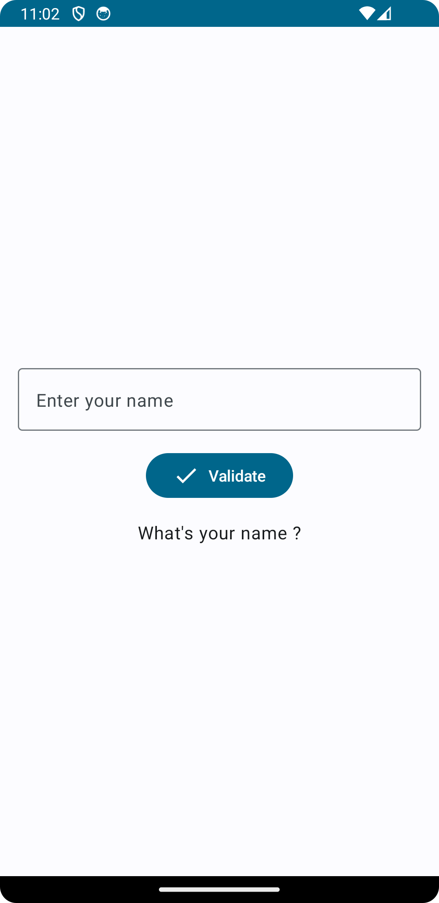
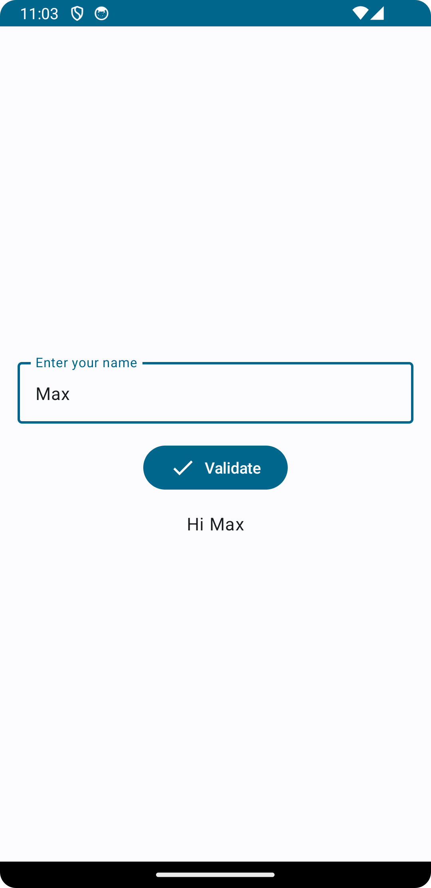
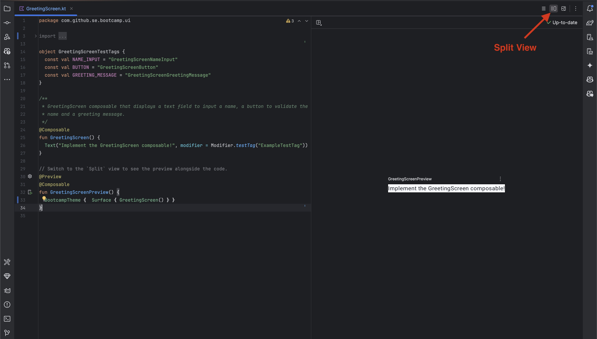
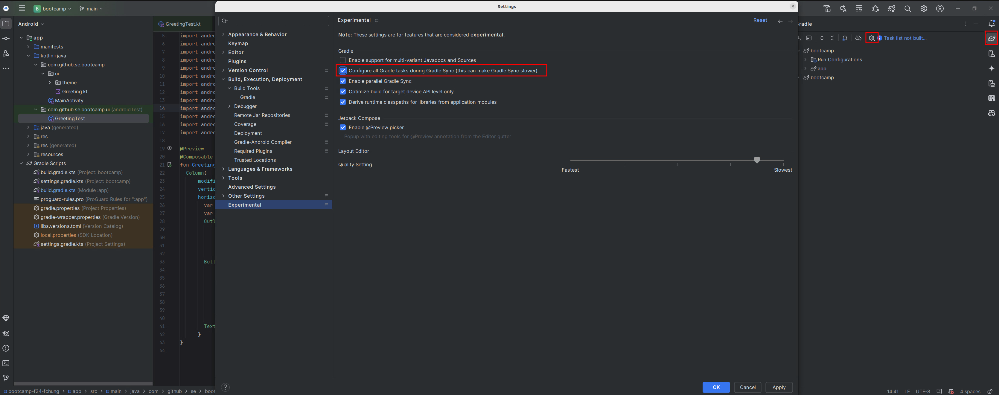
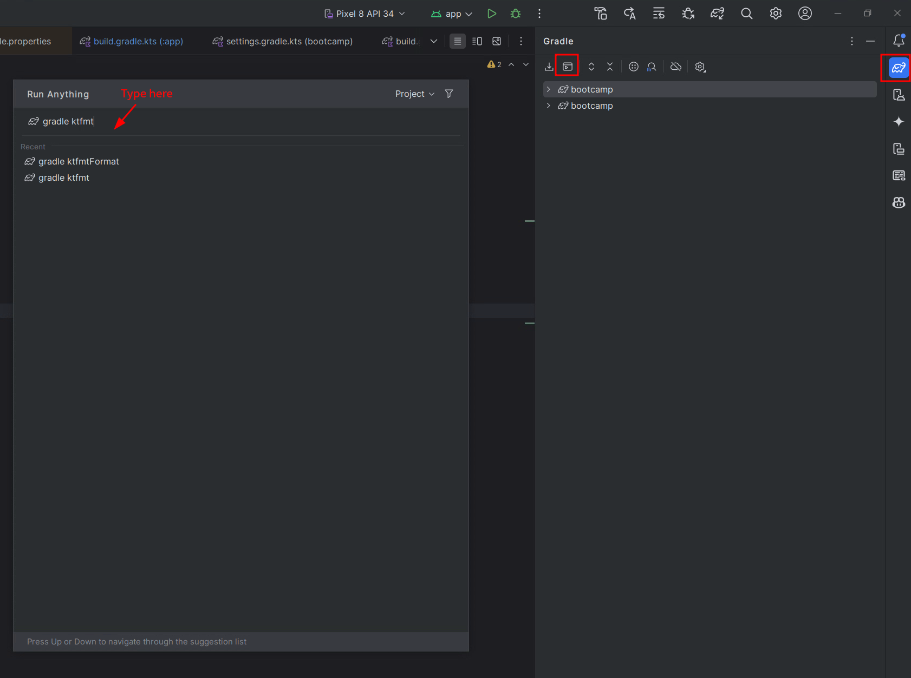
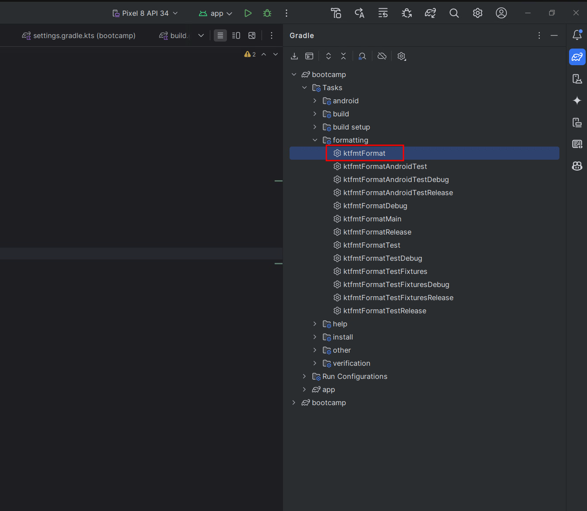

# Getting Started with Android Application Development

We're going to kickstart your career as an Android software engineer by creating a user-friendly greeting application. In this step, you'll build a *Greeting App*: the user types their name and the app displays a greeting.

## Greeting App

The Greeting App is the first step of the bootcamp, and its objective is to help you discover the Android ecosystem. This app has only one feature: when the user enters their name, a greeting message is displayed.

At the end of this step, your app should look like this:

<p align="center"> </p>

In the following sections we will describe how to build and test the app. If you get stuck:
- Follow the Android documentation links.
- Look up your question in a search engine (e.g., Stack Overflow).
- Ask a question in the course forum.

## Jetpack Compose

We use Jetpack Compose to create UIs, which allows you to build them entirely in Kotlin code.  It is fully declarative, meaning you describe your UI by calling a series of functions that transform data into a UI hierarchy. When the underlying data changes, the framework automatically re-executes these functions, updating the UI hierarchy for you.

To get started with Jetpack Compose, please go through [this Android codelab](https://developer.android.com/codelabs/jetpack-compose-basics#0), focusing only on steps 1 to 7. Later steps go beyond what you need for this step, so you can skip them for now. Codelabs are helpful because they explain concepts with working code examples and usually link to a GitHub repository containing demonstration code. We encourage you to explore the provided code while following the codelab.

> [!IMPORTANT]
> Throughout the bootcamp, we will give you various kinds of resources: Android documentation, codelabs, lecture videos, etc. We *strongly* advise you to read them, as we will not cover everything in the handouts.

Now you should have a basic understanding of what a Composable is, what `MainActivity` is, how to create Composables for UIs, and how to use `@Preview` to speed up development. If not, please review the codelab.

Now, open file `MainActivity.kt`. Inside the `onCreate` function, the first Compose element you will see is named `BootcampTheme`; it is a composable that defines the theme of our Bootcamp app. You will also see `BootcampApp`, where you will implement your greeting logic.

```kotlin
class MainActivity : ComponentActivity() {

  override fun onCreate(savedInstanceState: Bundle?) {
    super.onCreate(savedInstanceState)
    setContent {
      BootcampTheme {
        Surface(modifier = Modifier.fillMaxSize()) {
          BootcampApp()
        }
      }
    }
  }
}
```

### Implementing the App

Now, try to complete `GreetingScreen()` Composable in `GreetingScreen.kt`. `GreetingScreen()` should display:

- A text field to input a name
- A button to validate the name
- A greeting message

Initially, the greeting message should be set to `"What's your name ?"`. When the user enters their name in the textbox and clicks the button, the greeting message should update to show `"Hi, <your name>"`.

> [!TIP]
> When you build Composables, it is helpful to use the `@Preview` annotation to see how they look without running the app on an emulator or device.
> In the *Split* view of Android Studio, you can see the code on one side and the preview on the other, and the preview updates automatically as you edit the code!
> You can find examples of `@Preview` in the `GreetingScreen.kt` file.

<p align="center"></p>

After completing `GreetingScreen`, remember to modify `BootcampApp()` in `MainActivity.kt` to call your `GreetingScreen`.

> [!NOTE]
> You should not change the signature of the provided functions.
> 
> - Do not change the name of existing arguments.
> - You may only add arguments with default values.
>
> To enforce this, we provide a signature check file `sigchecks/GreetingSigchecks.kt`.
> Your build will fail if any non-optional argument is modified.
> Always make sure your app builds successfully with this file included.

### Building the App

Before building your app, make sure you can see all Gradle tasks in Android Studio.  

> [!NOTE]  
> If your Gradle task list is empty or nearly empty, please do the following:
>
> - In the Gradle menu, click the gear icon → **Gradle Settings**.
> - In the new window, go to the **Experimental** tab and enable *“Configure all Gradle tasks …”*.  
> - Resync and rebuild your project afterward if needed.  

<p align="center"></p>

Now you can build your app. In Android Studio, go to **Build**, or run the following command on the command line:

```bash
./gradlew build
```

If the code is not properly formatted, the build will fail. To format the code, you can use [KTFMT](https://github.com/facebook/ktfmt) (already available in the Gradle build). You can run it either through the Gradle Tool (see images below) or on the command line:

```bash
./gradlew ktfmtFormat
```

<p align="center"></p>
<p align="center"></p>

### Testing Your Implementation

Now, it's time to test your implementation! We provide the `GreetingScreenTest` suite for this purpose.

Before running tests, you must add *test tags* to your Composables so the automated tests can find UI elements.

- Add test tags using `modifier = Modifier.testTag("TAG_NAME")`.
- The available tags are defined in `GreetingScreenTestTags` in the `GreetingScreen.kt` file.
- You can see how the test tags are used in `GreetingScreenTest.kt`.

To run the UI tests, set up an Android emulator or a physical device. You can find setup instructions in [this tutorial](/bootcamp/docs/AndroidTesting.md#configuring-the-emulator).

Once ready, open `GreetingScreenTest.kt` and click the green ▶▶ button next to `class GreetingScreenTest {`. If the tests pass, you will see green check marks in the test panel, or "BUILD SUCCESSFUL" in the console.

Alternatively, run the tests via command line:

```bash
./gradlew connectedAndroidTest   \
-Pandroid.testInstrumentationRunnerArguments.class=com.github.se.bootcamp.ui.GreetingScreenTest
```


> [!NOTE]
> We only check whether your User Interface (UI) meets the required functionality, not whether it looks exactly like our mockups or screenshots.
> For example, you can use any color scheme you like, as long as the required elements (such as the button) are present and usable.

## Additional Resources

### Material Components

Material is a catalog of components that allow you to quickly build your UI (e.g., search bar, time picker, etc.).

For understanding which component to use for which element, refer to the [Material Design Guidelines](https://m3.material.io/components). This site explains how to design Android apps and choose components.

Jetpack Compose also provides the `MaterialTheme` composable, which defines the app's colors, typography, and shapes, based on Material Design. All Composables inside it automatically use these styles, ensuring the app has a consistent look.

In the bootcamp, we provide the `BootcampTheme` composable (defined in `Theme.kt`), which wraps `MaterialTheme`. You can tweak it as explained in Step 12 of the Jetpack Compose Basics Codelab.

You can read more here:
- [Material Components Guidelines](https://m3.material.io/components)
- [Material Components in Compose](https://developer.android.com/develop/ui/compose/components/scaffold)

---

You're done. Congrats!

> [Next step: ToDo List](3-TodoList.md)
