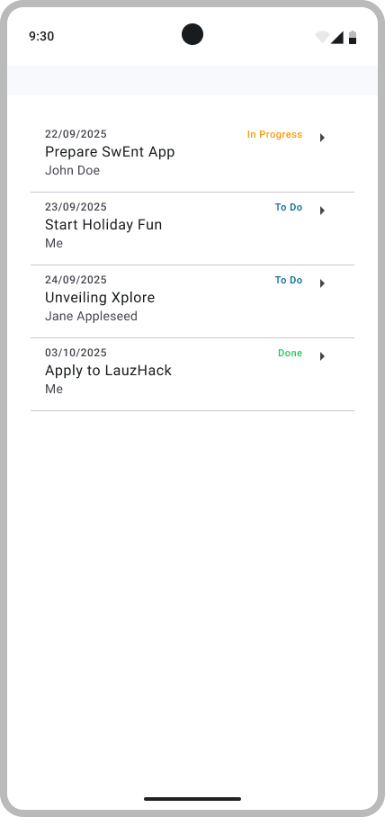

# Let's Start the Todo App

Now that you are familiar with the Android ecosystem, it is time to start building the *Todo App*. In this step, you will implement your first feature: a **Todo list** that the user can see.

For now, this will be an **offline version**, meaning the list will not be saved if you quit the application. The **online version** (using a backend database) will follow in the second milestone.

To guide your implementation, we provide this [Figma Mockup](https://www.figma.com/design/IDm3NGS988Myo01P0Wa0Cr/TO-DO-APP-Mockup-FALL?node-id=435-3350). It contains three pages — *Wireframe*, *Mockup*, and *Testing* — each serving a different purpose. Within each page, frames are tagged with the corresponding milestone text (B1, B2, B3). Read the descriptions on each page, and explore them as you progress in the bootcamp.

> [!NOTE]
> The instructions for this milestone are deliberately detailed, since Android is still new to you.
> Later milestones will be shorter and focus mainly on requirements.

---

## Overview of the Todo List

We describe features using the **user story** concept (introduced in the lecture). The starting **user story** is:

> As a user, I want to view a list of my Todos, so that I can easily see all my pending tasks at once.

From this, we define the following **acceptance criteria**:

- The list of Todos must be scrollable to accommodate a large number of items.
- If the list is empty, a text message must indicate that the Todo list is empty.
- Each Todo item must display the title, status, assignee name, and due date. The due date should use the format `dd/MM/yyyy`.
- The list of Todos must be sorted by creation date, with the oldest items first.

At the end of this step, your app should look like this (with 4 sample Todos previously added to the repository):

<p align="center">
   
</p>

## Implementing the Todo List

Your implementation should follow the **MVVM (Model–View–ViewModel) pattern**, a common way to structure Android apps. This pattern separates concerns:

- The **Model** manages the data and logic.
- The **View** displays the data on screen.
- The **ViewModel** connects the two, exposing state to the UI in a lifecycle-aware way.

See the [MVVM pattern guide](/bootcamp/docs/MVVM.md) for a deeper introduction with diagrams and examples.

We advise you to read the [ViewModel and State in Compose](https://developer.android.com/codelabs/basic-android-kotlin-compose-viewmodel-and-state) codelab to understand how to implement the MVVM pattern in Jetpack Compose.
This codelab covers:

- **App architecture**: how the app is structured into layers.
- **Data Layer (Model)** — data classes and repositories.
- **UI Layer** —
  - **UI elements  (View)**: components that render the data on the screen, built with Jetpack Compose.
  - **ViewModel**: holds and exposes the state consumed by the UI.

We provide three skeleton files to help you get started:

- `ToDosRepositoryLocal.kt`: the offline implementation of the Todos repository.
- `OverviewScreen.kt`: contains the View (the `Composable` functions for the Todo List).
- `OverviewViewModel.kt`: the ViewModel for the overview screen (manages the UI state).

### Local Repository

Start by implementing the `ToDosRepositoryLocal` class. This class should maintain a local list of `ToDo` objects (defined in `ToDo.kt`). The repository is in memory only: its data is lost when the app is closed.

> [!NOTE]
> This repository is offline but not persisted on the device. The list remains available while the app is running but resets once the app is closed.

> [!NOTE]
> `ToDosRepository` declares **suspending functions**.
> A suspending function is a Kotlin function that can pause execution without blocking a thread, typically used for asynchronous I/O.
> They require a `CoroutineScope` (*an environment for launching coroutines*) to be called.
> Learn more in the [Kotlin Coroutine Guide](https://developer.android.com/kotlin/coroutines).

To test your implementation, you can run the provided unit tests in `ToDosRepositoryLocalTest.kt`. Note that unit tests are different from UI tests: they do not require an emulator or device, and they run much faster. They are also located in the `test` folder instead of `androidTest`.

### Overview Screen

Once the implementation of the repository is done, you can focus on the UI. To implement the `OverviewScreen` composable, you will need:

- **`LazyColumn`**: a Jetpack Compose layout that efficiently renders only the list items that are visible, instead of all items at once.
- **`Card`**: a Material Design component that provides a container for displaying a single Todo with its details.

Refer back to [Jetpack Compose Basics](https://developer.android.com/codelabs/jetpack-compose-basics) for examples.

You will also need to implement the `OverviewViewModel` class.
You should persist UI state using **`StateFlow`** inside the `OverviewViewModel` class, just as shown in the [ViewModel and State in Compose](https://developer.android.com/codelabs/basic-android-kotlin-compose-viewmodel-and-state#4) codelab.
This ensures data survives recompositions (e.g., when the device is rotated).

To test your UI, add the `OverviewScreen` inside the `BootcampApp` composable and run the app.

> [!NOTE]
> You can populate the repository with your own sample data in `ToDosRepositoryProvider.kt` (e.g., a few hard-coded Todo items for testing).
> During tests, this property will be overridden. You can submit with any value, but only modify this property in `ToDosRepositoryProvider.kt`.

## Testing your implementation

For this step, we provide you two *public* test suites:

- `ToDosRepositoryLocalTest.kt`: unit tests for the `ToDosRepositoryLocal` class.
- `OverviewScreenB1Test.kt`: UI tests for the `OverviewScreen` composable

Before running tests, you must add *test tags* to your Composables so the automated tests can find UI elements.

- Add test tags using `modifier = Modifier.testTag(TAG_NAME)`.
- The available tags are defined in `OverviewScreenTestTags` in the `OverviewScreen.kt` file.
- You can see where to assign each tag in the [Figma Testing mockup](https://www.figma.com/design/IDm3NGS988Myo01P0Wa0Cr/TO-DO-APP-Mockup-FALL?node-id=435-3350&p=f&t=VbXKEsgCqvAUcbgW-0)

To run the tests, open `OverviewScreenB1Test.kt` (resp. `ToDosRepositoryLocalTest.kt`) and click the green ▶▶ button next to `class OverviewScreenB1Test` (resp. `class ToDosRepositoryLocalTest`). If the tests pass, you will see green check marks in the test panel, or "BUILD SUCCESSFUL" in the console.

Alternatively, you can run the tests via command line:

```bash
# Run UI tests
./gradlew connectedAndroidTest   \
-Pandroid.testInstrumentationRunnerArguments.class=com.github.se.bootcamp.ui.overview.OverviewScreenB1Test

# Run unit tests
./gradlew testDebugUnitTest --tests "com.github.se.bootcamp.model.todo.ToDosRepositoryLocalTest"
```

---

## Hints

### Creating Todo Items

How can you avoid repeating code for each Todo item?

<details>
  <summary>Answer</summary>
  Instead of writing the UI for each Todo inline, create a reusable composable function for a single item.

  ```kotlin
  @Composable
  fun TodoListItem(todo: Todo, onClick: () -> Unit) { ... }
  ```

</details>

How should you display these items in a list?

<details>
  <summary>Answer</summary>

  Use the `Card` composable from Jetpack Compose.
</details>

---

### Calling a `suspend` function

During this step, you will need to call suspending functions. You can use the `viewModelScope` provided by your `ViewModel`:

```kotlin
val viewModel: OverviewViewModel = viewModel()

viewModelScope.launch {
    mySuspendFunction()
}
```

This ensures the coroutine runs on the correct thread.

## Additional Resources

Useful links:

- [Figma mockup](https://www.figma.com/design/IDm3NGS988Myo01P0Wa0Cr/TO-DO-APP-Mockup-FALL?node-id=435-3350) of the Todo App
- [Figma Testing mockup](https://www.figma.com/design/IDm3NGS988Myo01P0Wa0Cr/TO-DO-APP-Mockup-FALL?node-id=435-3350&p=f&t=VbXKEsgCqvAUcbgW-0) for the test tags
- [MVVM pattern guide](/bootcamp/docs/MVVM.md)
- [Jetpack Compose Basics](https://developer.android.com/codelabs/jetpack-compose-basics) codelab
- [Viewmodel and State](https://developer.android.com/codelabs/basic-android-kotlin-compose-viewmodel-and-state) codelab
- [Kotlin Coroutines Guide](https://developer.android.com/kotlin/coroutines)

---

> [Next step: Navigation](4-Navigation.md)
