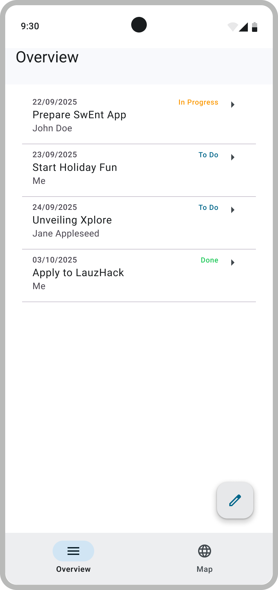
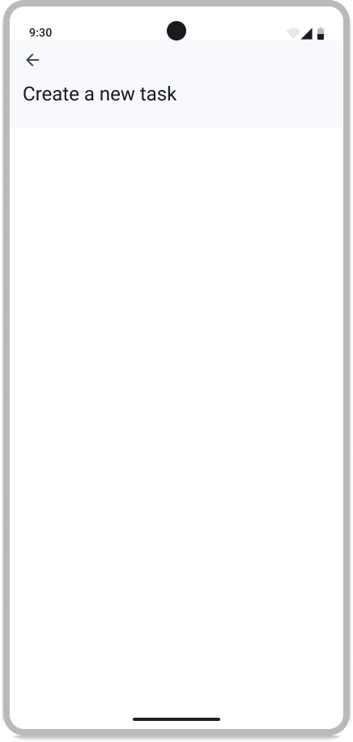
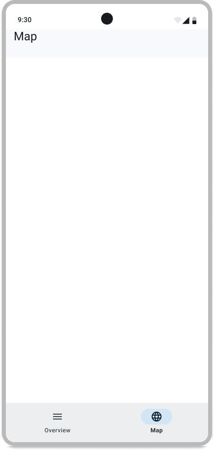

# Navigating Between Different Screens

In the previous steps of the bootcamp, you implemented two UI components. Currently, you cannot start the app and see both screens at the same time. In this step, you'll implement the app's navigation system.

## Implementing the Navigation

In B1 so far, you have only implemented one view of the Todo App. To proceed with navigation, we will use **placeholders for the other screens**. By the end of this step, you should be able to navigate between these three screens:

  
  
  

We suggest you read the following resources to implement the navigation system:

- [Navigate Between Screens in Compose](https://developer.android.com/codelabs/basic-android-kotlin-compose-navigation?hl=en#0) codelab to understand how the navigation system works in Jetpack Compose
- [Create a home screen Scaffold](https://developer.android.com/develop/ui/compose/quick-guides/collections/create-a-home-screen-scaffold) for the top bar and the bottom bar.

As usual, you can add any parameters to the provided signatures, as long as they have a default value.

### Requirements

As the navigation system is a core component of a mobile application, it does not have any associated user stories. The requirements for the navigation system of the Todo App are the following:

- The top bar displays the name of the screen:
  - `OverviewScreen` → **"Overview"**
  - `AddTodoScreen` → **"Create a new task"**
  - `MapScreen` → **"Map"**
- The bottom bar displays two tabs, one for the Overview screen and one for the Map screen.
  When the user clicks on a tab, the app should display the corresponding screen.
- On the Overview screen, there is a button to add a new Todo.
  When the user clicks on it, it should navigate to the `AddTodoScreen`.
- The top bar of the `AddTodoScreen` should have a back arrow.
  When the user clicks on it, it should navigate back to the `OverviewScreen`.
- `MapScreen` and `AddTodoScreen` are placeholders for now. There is no need to implement their content yet.
- Back navigation (system **Back** button) should be handled properly:
  - From `AddTodoScreen`, it should navigate back to the `OverviewScreen`.
  - From `OverviewScreen`, it should close the app.
  - From the Map tab, it should navigate back to the `OverviewScreen`.
  - Back navigation must **restore the previous state of the screen**.
    For example: if the user scrolls down the list of todos, navigates to AddTodo, and then goes back, the list should still be scrolled down.
- Forward navigation should **not restore** the previous state of the screen.
  Switching tabs is considered forward navigation.
  For example: if the user scrolls down on Overview, switches to Map, and then returns to Overview via the tab, the list should be back at the top.
- When the user is in a tab and clicks on the same tab icon again, it should not reset the screen.
  For example: if the user clicks on the Overview tab, scrolls down, and clicks Overview again, the list should still be scrolled down.

### Test your implementation

Once you are done with your implementation, build and run the app to see if it works as expected.
Make sure to modify the content of the `BootcampApp` composable in the `MainActivity.kt` file with your implementation.

To check that your implementation satisfies the requirements, run the `NavigationB1Test` suite.

As usual, you will need to attach *test tags* to your UI components to pass our tests. All the required test tags are provided in the `OverviewScreenTestTags`, `MapScreenTestTags`, and `NavigationTestTags` objects. Please have a look at the [Figma Testing mockup](https://www.figma.com/design/IDm3NGS988Myo01P0Wa0Cr/TO-DO-APP-Mockup-FALL?node-id=435-3350) mockup to see where to place each tag.

Also, make sure that your app builds the signature check files.

## Additional resources

Useful Links:
- [Navigation Component](https://developer.android.com/guide/navigation/principles) guide
- [Navigate Between Screens in Compose](https://developer.android.com/codelabs/basic-android-kotlin-compose-navigation?hl=en#0) codelab
- [Create a home screen Scaffold](https://developer.android.com/develop/ui/compose/quick-guides/collections/create-a-home-screen-scaffold)

Here are collected links we used so far:

- [Figma mockup](https://www.figma.com/design/IDm3NGS988Myo01P0Wa0Cr/TO-DO-APP-Mockup-FALL?node-id=435-3350) of the Todo App
- [Jetpack Compose Basics](https://developer.android.com/codelabs/jetpack-compose-basics) codelab
- [Viewmodel and State](https://developer.android.com/codelabs/basic-android-kotlin-compose-viewmodel-and-state) codelab

Congrats! You are done with the navigation system.

> [Next step: Continuous Integration](5-ContinuousIntegration.md)
