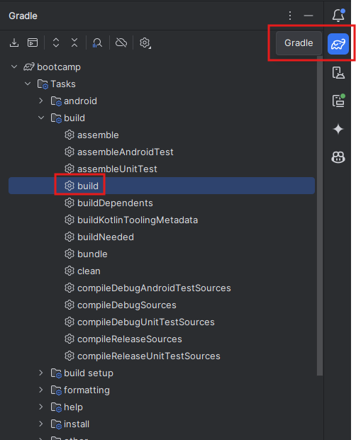
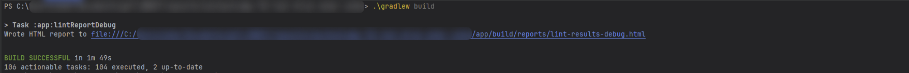

# Building An APK

During the bootcamp and throughout the semester, you will have to ship regularly some APK build in order to showcase your new features.

In this tutorial, you will learn how to create an APK file and how to install it on your phone.
We recommend running `gradle ktfmtFormat` and optimize your import before building too (on `app/src/main` folder > right-click > analyze > Code Cleanup).

## How To Generate an APK File

Generating an APK is quite an easy task with Gradle.

### With Android Studio

On the right side of your IDE, simply click on the Gradle logo (same menu as for `ktfmt`). Then search for the build section and run the build command.

> [!NOTE]
> If your tasks list is (almost) empty, it means you need to change how Android Studio syncs gradle. See [here](2-GettingStartedWithAndroid.md#building-the-app).

Once the build is finished, you can find the built APK file in the following directory: `app/build/outputs/apk/debug`.

### Without Android Studio

Without Android Studio, simply execute the following command at the root of your project:
`./gradlew build`.

Once the build is finished, you can find the built APK file in the following directory: `app/build/outputs/apk/debug`.

## How To Install the APK on Your Phone

You will need to transfer the APK to your phone's storage, then open your phone file manager, find the APK and tap on it. Follow the prompts that will ask for permission to install the app.

## Additional resources

Useful links:

- [Diawi](https://www.diawi.com/) to wirelessly share APK to anyone. Great to avoid file size restrictions on messaging apps.
- [Installing on the emulator](https://developer.android.com/studio/run/emulator-install-add-files)

---
You now have an APK. Congrats!

> Next step: [Write user stories](7-UserStories.md)
