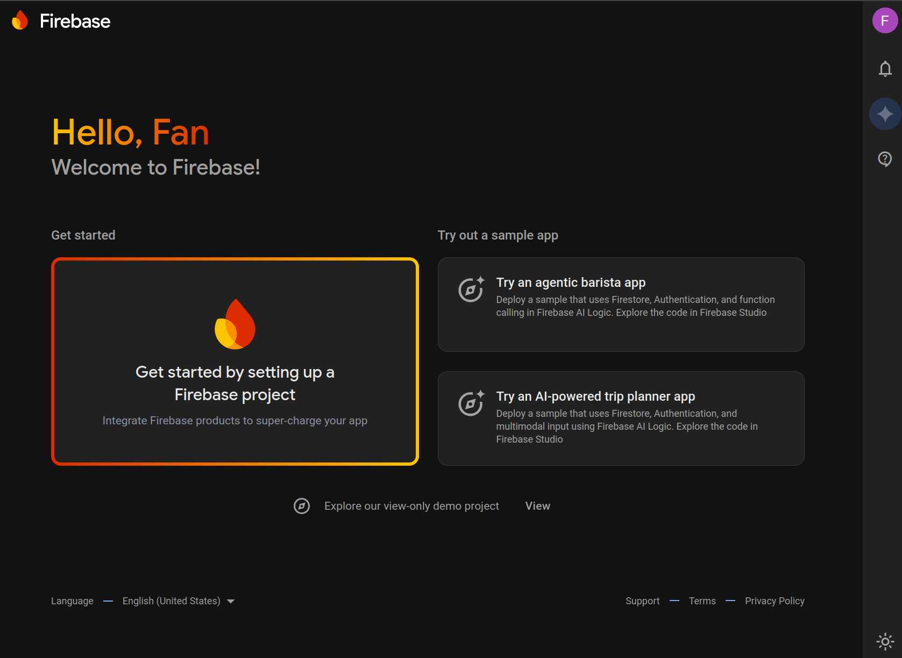

# Setup Backend

## Introduction
*Firebase* is a backend platform developed by Google that's popular for building Android apps. It includes tools like a real-time database, a newer database service called *Firestore*, user authentication, and many other APIs you can explore on their website[^1].

*Firestore* is a NoSQL cloud database that follows a key-value store model. For a detailed overview of its features, please see the official documentation[^2].

In this milesone, we will use Firebase/Firestore and the *Firebase Emulator Suite*, which allows you to test your app locally without making live network calls or modifying production data. This enables more robust testing and simplifies debugging.

## Objective

This section of the bootcamp will get you started with Firebase's Firestore database and introduce the Firebase Emulator Suite for testing your app's Firebase logic locally.

We'll walk you through setting up your account and preparing your app for both online and local (emulated) backend operations.

> [!NOTE]
> All the required libraries **are already in the provided repository**.
> For compatibility reasons, we deactivated the Google services plugin in the `app/build.gradle.kts` file.
> You can reactivate it by removing the comment on the line `// alias(libs.plugins.gms)` in the plugins section of the file.
>
> Please use only the provided versions of the libraries, as other versions may cause compatibility issues.

## 1 - Setting Up Firestore for our App

> [!TIP]
> Make sure you are using a personal Google account (not your EPFL account) when working with Firebase.


First, go to the Firebase console: <https://console.firebase.google.com>. On the main page, click 'Get started by setting up a Firebase project'. In the project setup wizard, name the project "bootcamp", and disable both Analytics and AI assistance.

<p align="center"></p>


Once the project is created, go to its 'Overview' page. You can access it via the console (link above) by clicking on the project panel with your project's name.

We need to add the Android app to the project. On top of the 'Overview' panel, below the name, click on the 'Add app' button. Then click on the Android button (a little Android logo, the robot one). Follow the instructions as needed on the page (shown in the picture below).

<p align="center"></p>

Under **Android package name**, enter `com.github.se.bootcamp`.

Next, you will need to put the `google-services.json` in your project **under the `app` folder**.  

> [!WARNING]
> Do not commit the file to your repository, as it contains sensitive IDs. Later we will see how we can safely add it to
> GitHub.
  
<p align="center"></p>

If you forgot to download the JSON file :

- Go back to the Firebase console.
- Go to the settings of the project (top left of the webpage).
- Under the 'General' tab, go to the bottom and under 'Your apps' you will find the json file.

> [!NOTE]
> Regarding the 'Adding the SDK of Firebase' you may ignore it as it is already present in the project template.

To add **Firestore**, the database, to the project, go to 'Product categories' (on the left side of the website). Click on 'Build'  and find 'Firestore Database'. Then click on 'Create database'.

<p align="center"></p>

Select "eur3" for the database location. Click "next" and select 'Start in test mode', which temporarily enables read and write access requiring security configuration.
Finally, click 'Create'. You now have your Firestore database ready to go!

### GitHub Secret : encoding the file

Next, we need to setup the secrets in the GitHub action.

The file we want to upload that way is the `google-services.json`. If you have committed it, [remove it from the repository](https://stackoverflow.com/questions/1143796/remove-a-file-from-a-git-repository-without-deleting-it-from-the-local-filesyste).

First, we must convert the file to a string. In this case we could simply open it as a text file, but this is not the case for every file you may have to manage, so we'll do the complete operation.
We will use [Base 64 encoding](https://en.wikipedia.org/wiki/Base64), which encodes any sequence of bytes into a string of printable characters, exactly what we need since GitHub only allows text for the secrets.

- **`google-services.json`**:

  On Linux (in the terminal):

  ```sh
  base64 path/to/google-services.json > base64_google_services.txt
  ```
  
  On MacOS (in the terminal):

  ```sh
  base64 -i path/to/google-services.json -o base64_google_services.txt
  ```

  On Windows (**in the powershell**):

  ```powershell
  [Convert]::ToBase64String([IO.File]::ReadAllBytes("path/to/google-services.json")) > base64_google_services.txt
  ```

>[!NOTE]
> The output file is created in the directory from which the command is run.

#### Uploading on GitHub

Follow this [tutorial](https://docs.github.com/en/actions/security-for-github-actions/security-guides/using-secrets-in-github-actions#creating-secrets-for-a-repository) to add the file you created in the previous step as a GitHub secret, and name the secret `GOOGLE_SERVICES`.

#### Using the secret

The final step is to retrieve the secret in the CI so the testing jobs can run correctly. This is already implemented in the bootcamp workflow.
<details>
<summary><span style="font-size:1.25em; font-weight:bold;">Libraries (Optional)</span></summary>
<br/>

The libraries required for Firebase <span style="color:red">**are already in the provided template**</span>.
However, it's useful to understand how they are managed, as you will add more libraries by yourself in your project.

1. `libs.versions.toml`  

   ```toml
   # gradle/libs.versions.toml

   [versions]
   gms = "4.4.2"

   # Firebase Libraries
   firebaseAuth = "23.0.0"
   firebaseAuthKtx = "23.0.0"
   firebaseDatabaseKtx = "21.0.0"
   firebaseFirestore = "25.1.0"
   firebaseUiAuth = "8.0.0"

   [libraries]
   # Firebase Libraries
   firebase-auth = { module = "com.google.firebase:firebase-auth", version.ref = "firebaseAuth" }
   firebase-auth-ktx = { module = "com.google.firebase:firebase-auth-ktx", version.ref = "firebaseAuthKtx" }
   firebase-database-ktx = { module = "com.google.firebase:firebase-database-ktx", version.ref = "firebaseDatabaseKtx" }
   firebase-firestore = { module = "com.google.firebase:firebase-firestore", version.ref = "firebaseFirestore" }
   firebase-ui-auth = { module = "com.firebaseui:firebase-ui-auth", version.ref = "firebaseUiAuth" }
   ```

2. Top-level `build.gradle.kts`:

   ```kotlin
   # build.gradle.kts
   plugins {
       alias(libs.plugins.gms) apply false
       ...
   }
   ```

3. `app/build.gradle.kts`:

   ```kotlin
   # app/build.gradle.kts
    dependencies {
        // Firebase
        implementation(libs.firebase.database.ktx)
        implementation(libs.firebase.firestore)
        implementation(libs.firebase.ui.auth)
        implementation(libs.firebase.auth.ktx)
        implementation(libs.firebase.auth)
        ...
   }
   ```

4. **Sync your Gradle project**

### Summary

By defining the Firebase and Google Play services libraries in `libs.versions.toml`, you centralize the management of library versions, making it easier to update and maintain dependencies across your project. This approach keeps your `build.gradle.kts` files clean and focused on their specific configuration needs.

</details>

### Tutorials

You can find many resources online about Firebase's Firestore database.

Again, you can refer to its official documentation[^2].

Feel free to explore online for videos, forums, and other websites explaining the core functionalities of Firebase.
> [!TIP]
> The best way to practice is to start with simple functions and gradually move to more complex ones.

### Remarks

Below are three important points that you may need in your database at a later date.

- Firebase provides *event listeners* that automatically trigger when the value at a specific key changes. For more information, see [this official FireBase documentation](https://firebase.google.com/docs/reference/android/com/google/firebase/firestore/EventListener) on `EventListener`
 
- In this bootcamp, we don't use Firebase's transaction feature, so concurrent updates aren't supported. You would need transactions[^3] to handle that.

- Values are automatically serialized to strings when stored in Firebase. This is particularly useful as it allows you to store Kotlin objects directly in your database.

## 2 - Setting up Firebase Emulation

Firebase Emulators[^4] simulate Firebase services locally on your machine. This enables you to test without having to manually mock every Firestore interaction in your app. They are also useful for collaborative development. For example, if a feature requires a schema change, using the emulators prevents backend conflicts with other features being developed in parallel.

### Installation

To install the Firebase Emulator Suite, you will need the following:

- [Node.js](https://nodejs.org/en/download) version 16.0 or higher
- [Java JDK](https://jdk.java.net/) version 11 or higher
- [The Firebase CLI](https://firebase.google.com/docs/cli)

Once everything is installed, run `firebase login` and set the credentials to the account you used to create your Firebase project. After signing in, you should be able to see your Firebase projects by running `firebase projects:list`.

Next, run `firebase init` from the root directory of your application. You will be prompted with the following:

- Firebase features: select **Emulators**.
- Project Setup: select **Use an existing project** and choose the bootcamp project.
- Emulators Setup
  - Emulators: choose the **Authentication Emulator** and **Firestore Emulator**. You can later add more emulators if needed.
  - Ports: choose the default values.
  - Emulator UI: select yes.
  - Download the emulators: select yes.

At this point, you should be all set and can begin testing with the emulators.

> [!WARNING]  
> After installation, make sure that the project defined in `app/google-services.json` is the same as the one defined in `./firebaserc`. If not, run `firebase use --add` and select the correct Firebase project.

### Usage

The Firebase emulators can be started by running `firebase emulators:start`. After they're running, open the dashboard at `http://localhost:4000/`.

To connect your app to the emulators, call the following methods **before making any other Firebase API calls**.

```kotlin
Firebase.firestore.useEmulator("10.0.2.2", 8080)
Firebase.auth.useEmulator("10.0.2.2", 9099)
```

Make sure to pass the correct port numbers as arguments if you're not using the default ones.

Since Android does not allow cleartext traffic (HTTP, plaintext) to `10.0.2.2` by default, add the following configuration into your `AndroidManifest.xml` file to enable communication between the emulator and your app.

```xml
<application
    ...
    android:usesCleartextTraffic="true"
    ...
</application>
```

### Usage in Android tests

To use the Firebase Emulators in Android tests, we provide you the `FirebaseEmulatedTest` class. Extend your test classes from it, for example:

```kotlin
class LoginTest : FirebaseEmulatedTest() {
  ...
}
```

Next, launch the emulators with `firebase emulators:start` to run the Android tests. The tests will automatically connect to the emulators, so you don't have to call `.useEmulator` manually.

> [!NOTE]  
> For each test, the accounts and documents it creates in Firestore are cleared afterward, ensuring that tests run independently.

For advanced usage such as state import/export or CI integration, refer to the [Firebase documentation](https://firebase.google.com/docs/emulator-suite/install_and_configure).

[^1]: <https://firebase.google.com/products-build>
[^2]: <https://firebase.google.com/docs/firestore>
[^3]: <https://firebase.google.com/docs/firestore/manage-data/transactions>
[^4]: <https://firebase.google.com/docs/emulator-suite>

---

Congrats, you're done!

> [Next Step: Create A Todo](2-CreateAToDo.md)
