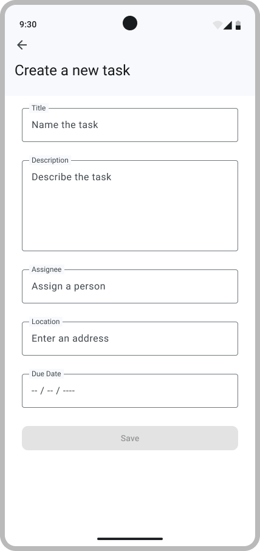
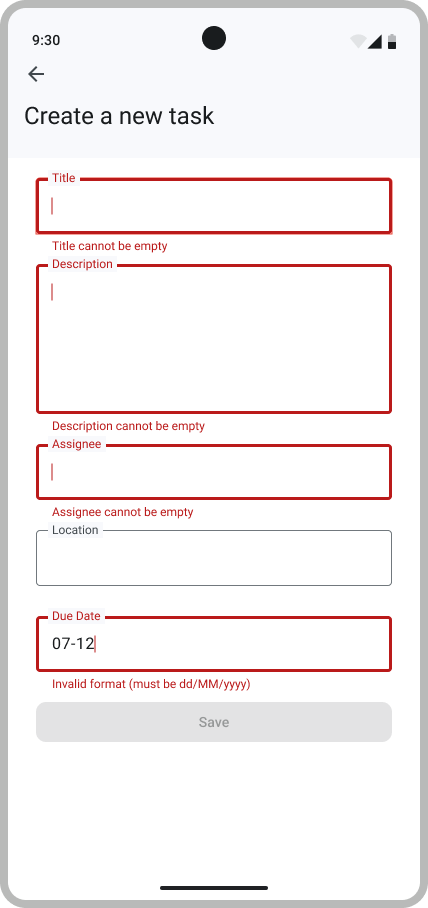

# Create A Todo

## Model for the Todo

In the previous milestone, B1, you already set up the model layer of the app and got familiar with the MVVM architecture.

Recall:
- *The Model* is the data of the app, and it defines the type of data that will be used by the app.
- *The Repository* is where the data comes from.
- *The View* is the UI of the app, this is what the user sees.
- *The ViewModel* manages the UI state of the app (i.e., the displayed data); it reacts to user actions and updates the content of View accordingly.

In B1, you have also set up an offline repository to work with your todos.
With Firestore as the backend, the next step is to implement a concrete repository that the ViewModels can rely on.

In addition, you will implement a feature that lets users create new todos. The user story for this feature is:

> As a user, I want to create a new Todo with details like title, description, assignee, location, and due date, so that I can organize and track my tasks efficiently.

### Implementing the Firestore Repository

In this step, you will implement the `ToDosRepositoryFirestore` class.
This class serves as the bridge between the database, [Firestore](https://firebase.google.com/bootcamp/docs/firestore), and the rest of the app.

Firestore works with objects in the form of `Map<String,Any>`, so converting objects from and to `Map`s is necessary.
You can do it manually or use a [JSON library](https://kotlinlang.org/api/kotlinx.serialization/kotlinx-serialization-json/kotlinx.serialization.json/-json/)

Each method of the class `ToDosRepositoryFirestore` should perform its Firestore operations using **suspend functions**.
This is important because database operations are asynchronous: using suspend functions ensures that they run without blocking the main thread, and errors can be handled properly within a coroutine context. If you're not familiar with coroutines, check the official [Kotlin coroutines documentation](https://developer.android.com/kotlin/coroutines).

For helper methods, if they fail to perform their intended task, log the error using `Log.e()`.
For database operation failures, make exceptions to propagate to the ViewModel so it can handle them and notify the user of the Firestore error.

> [!TIP]
>
> - Use `document.get("fieldName")` to retrieve data fields from a Firestore document.
> You can also directly use the getter method for the data type, such as `getString()`.
> - Create a helper method to convert a `DocumentSnapshot` from Firestore into your `ToDo` data class.
> You may not need the inverse.
> - Use `await()` from `kotlinx.coroutines.tasks` to suspend execution until a Firestore operation completes.
> - Catch exceptions only within helper methods; let all other Firestore errors propagate to be handled by the caller.
> - If you are still not sure how to use the `Task` type, explore the examples in the Firestore code.
>   Links you might find useful:
>   - <https://firebase.google.com/docs/firestore>
>   - <https://firebase.google.com/docs/firestore/query-data/get-data>
>   - <https://firebase.google.com/docs/firestore/manage-data/add-data>

> [!NOTE]  
> Remember that Firestore stores your data as **documents** inside collections. In our case, each todo will be stored as a
> single document inside the "todos" collection. When you call `addTodo`, you are essentially creating a new document with
> the fields from your ToDo data class. When you call `getAllTodos`, you are retrieving all documents from this collection
> and converting them back into Kotlin objects.

## Add a Todo Screen

When creating a new todo, a simple form appears with fields for the task's title, description, assignee, location, and due date. Each field maps directly to a property of the todo model. At the bottom of the screen, a Save button lets the user submit the task. Pressing it creates and stores a new todo in Firestore.

<p align="center"> </p>

Remember the `Greeting` composable from B1? This one is very similar.

Entering a date can be tricky, so for simplicity we'll use strings in the format `DD/MM/YYYY`. 
When the user saves a Todo, you can convert the string to a `Timestamp` using the [`SimpleDateFormat`](https://docs.oracle.com/en/java/javase/24/docs/api/java.base/java/text/SimpleDateFormat.html) class.

> [!NOTE]
> For the moment:
>
> - Hard-code a `val Location` for editing a todo and use a placeholder `OutlinedTextField`.
> - Hard-code an `ownerId` value (e.g., empty string) but do not create a text field for it.
>
> These will be implemented properly in **B3**.

### Error handling

If a Firestore operation fails (due to a network error, permission issue, etc.), the UI needs to know so it can notify the user. Silently catching and ignoring the exception in the repository could make the app appear to save a todo when it actually hasn’t.

Providing immediate feedback helps prevent frustration and ensures users understand what went wrong and how to fix it.

To implement this, use `OutlinedTextField` components to handle user input validation and to display error messages. See [official documentation](https://developer.android.com/develop/ui/compose/quick-guides/content/validate-input#validate_input_as_the_user_types_2) for more details.

## Requirements

Here are the requirements for the `AddTodoScreen`:

- The screen must display the following input fields, each showing the text entered by the user:
  - Title
  - Description (with sufficient height to span multiple lines of text)
  - Assignee
  - Location
  - Due Date in the following format: *dd/MM/yyyy* (every other format should be considered invalid), which can be converted to `Timestamp` when the todo is saved.
- Input fields must be validated as follows:
  - Title, Description, Assignee and Date are mandatory fields: they cannot be empty, or blank.
  - The Date must be in the format *dd/MM/yyyy* (e.g., 25/12/2023).
  - Location is optional for B2. It can be left empty or blank.
- An error message should appear when a field contains invalid input, before the user move focus away or click "Save".
- User should only be able to add todos with valid data. Adding a todo is done by pressing the Save button.
- When the user clicks on the Save button, they should be redirected to the Overview screen. The newly added Todo must be present in the list. No additional action is required from the user to see the new todo.
- Redirection is considered as forward navigation.
- All the requirements from B1 must still be satisfied.
- All UI elements for `AddToDo` screen must be visible on a 1080x2400 screen (Medium phone on Android Studio), as this screen size is used in the automated tests.

## Test your implementation

Once you're done with your implementation, build and run the app to check that everything works as expected. Don’t forget to update the `BootcampApp` composable in `MainActivity.kt` with your code.

We provide you a test suite `AddToDoScreenTest` to help you perform some basic checks on your implementation. Since the tests may use the Firebase emulator, start it first with:

```bash
firebase emulators:start
```

Some requirements are not covered by the provided tests. You will have to write your own tests.

As in B1, you will need to attach test tags to your UI components to pass our tests. All required test tags are defined in the `AddToDoScreenTestTags`, `EditToDoScreenTestTags` and `OverviewScreenTestTags` objects. Check [Figma Testing mockup](https://www.figma.com/design/IDm3NGS988Myo01P0Wa0Cr/TO-DO-APP-Mockup-FALL?node-id=435-3350) to see where each tag should be placed.

Finally, make sure that your app builds the signature check files.

## Additional resources

Useful Links:

- Firestore:
  - [General documentation](https://firebase.google.com/docs/firestore)
  - [Getting data](https://firebase.google.com/docs/firestore/query-data/get-data)
  - [Adding data](https://firebase.google.com/docs/firestore/manage-data/add-data)
- [Kotlin Coroutine Implementation](https://developer.android.com/kotlin/coroutines)

---

Congrats, you're done!

> [Next Step: List of ToDos](3-TodoList.md)
