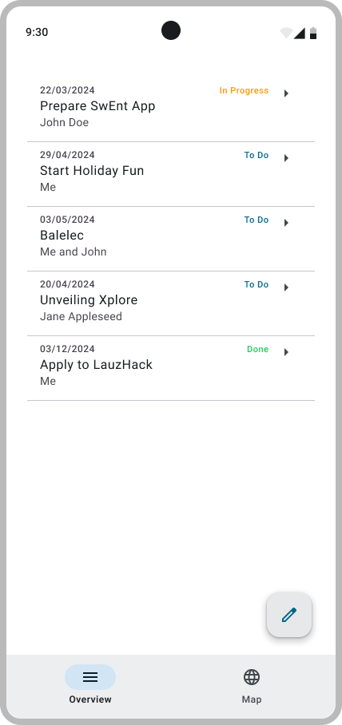

# List of ToDos

Now that you can create todos and store them in Firestore, the next step is to display a list of todos from the database in your app. Instead of a hard-coded list, now we want to see the actual list of todos coming from Firestore. The goal here is to connect the `OverviewScreen` to the repository via the `OverviewViewModel`.

<p align="center">
   
   
</p>

Since you already implemented the ViewModel in B1 and have now added the Firestore repository, there isn't much to change here. Simply make sure the ViewModel is using the correct repository implementation (`ToDosRepositoryFirestore` instead of `ToDosRepositoryLocal`).
> [!NOTE]  
> To enable this, update the `repository` variable in  
> `ToDosRepositoryProvider.kt` so that it points to `ToDosRepositoryFirestore`.  

## Test your implementation

Once you're done with your implementation, build and run the app to check that everything works as expected. Don’t forget to update the `BootcampApp` composable in `MainActivity.kt` with your code.

Similarly, we provide you a test suite, `AddToDoViewModelEmulatedTest`, to help you perform some basic checks on your implementation. Since the tests may use the Firebase emulator, start it first with:

```bash
firebase emulators:start
```

As usual, you'll need to attach test tags to your UI components to pass our tests. All the required tags are in the `AddToDoScreenTestTags`, `EditToDoScreenTestTags`, and `OverviewScreenTestTags` objects. Check the [Figma testing mockup](https://www.figma.com/design/IDm3NGS988Myo01P0Wa0Cr/TO-DO-APP-Mockup-FALL?node-id=435-3350) to see where to put each tag.

Finally, make sure your app builds the signature check files.

---

Congrats, you're done!

> [Next Step: Edit a Todo](4-EditATodo.md)
