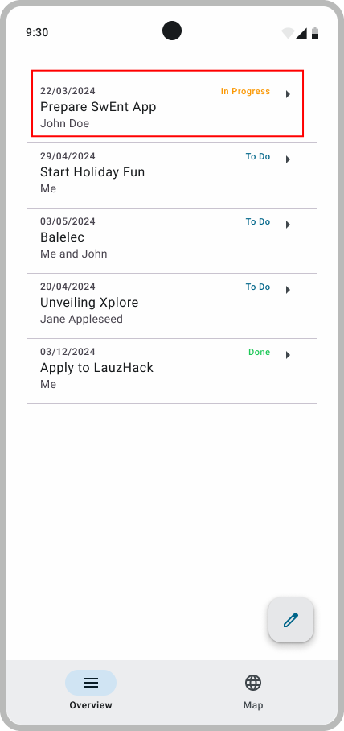
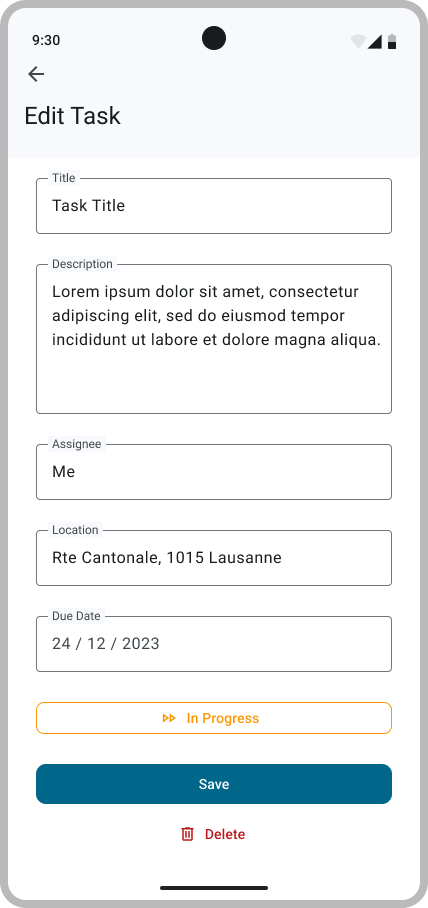
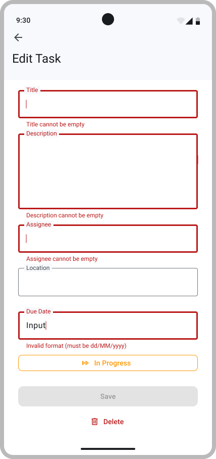

# Edit a Todo

In this step, you will implement a feature that lets users edit their existing todos.

The user story for this feature is:

> As a user, I want to view, modify, and delete an existing Todo, so that I can keep my task list accurate and up to date.

As with the AddTodo feature, this can be implemented using a dedicated ViewModel to manage state and interact with the repository.

## Implementing the Edit ToDo Screen

The Overview screen displays the list of todos.
When the user clicks on a todo, should be directed to a second screen where they can both view and edit it.

This new screen (Edit ToDo) is similar to the screen used to create a todo, with two additional elements: a **delete button** and a **status button** that cycles through the todo's state.  
It mirrors the AddToDo interface but have these extra features.

   
   
   

### Requirements

Here are the requirements for the `EditToDoScreen`:

- When the user clicks on a ToDo in the Overview screen, they should be navigated to the Edit ToDo screen for that specific todo.
  The input fields must be pre-filled with the current values of the selected todo.
- The user can edit the following fields: Title, Description, Assignee, Location, Due Date, and Status.
  They follow the same validation rules as in `AddToDoScreen` (title is mandatory, date format must be `dd/mm/yyyy`, etc.).
- The user can change the status of the todo by clicking the Status button, which cycles through the enum values in order (`CREATED` → `STARTED` → `ENDED` → `ARCHIVED` → `CREATED` → …).
- The user can delete a todo by clicking the Delete button.
- The user can save changes by clicking the Save button only if all inputs are valid.
- When the user saves valid changes or deletes the todo, they should be redirected to the Overview screen. The updated list of todos must be displayed and it should reflect the changes made. As usual, redirection is considered as forward navigation (state is *not* restored).
- The user can navigate back to the Overview screen using the system back button or the top app bar back button. In this case, any unsaved changes should be discarded, and the Overview screen should display the list of todos as it was before navigating to the Edit ToDo screen.
- All UI elements must be visible on a 1080x2400 screen (Medium phone on Android Studio), as this screen size is used in the automated tests.

> [!NOTE]  
> For the moment:  
>
> - Hard-code a `val Location` for editing a todo and use a placeholder `OutlinedTextField`.  
> - Hard-code an `ownerId` value (e.g., empty string) but do not create a text field for it.  
>
> These will be implemented properly in **B3**.

---

## Test your implementation

Once you're done with your implementation, build and run the app to check that everything works as expected. Don't forget to update the `BootcampApp` composable in `MainActivity.kt` with your code.

For this step, we provide you with two test suites: `EditToDoScreenTest` and `EditToDoFirestoreEmulatedTest`. At this point, you can also use the `NavigationB2Test` test suite, which includes navigation tests for both the AddToDo and EditToDo screens.

> [!NOTE]
>
> Some tests use the Firebase emulator.
> Make sure to start it first by running `firebase emulators:start` in your terminal.

As usual, you'll need to attach test tags to your UI components to pass our tests. All the required tags are in the `AddToDoScreenTestTags`, `EditToDoScreenTestTags`, `NavigationTestTags`, and `OverviewScreenTestTags` objects. Check the [Figma testing mockup](https://www.figma.com/design/IDm3NGS988Myo01P0Wa0Cr/TO-DO-APP-Mockup-FALL?node-id=435-3350) to see where to put each tag.

Finally, make sure your app builds the signature check files.

---

Congratulations! You have completed the second deliverable of the bootcamp. Don’t forget to check that your Continuous Integration (CI) pipeline is passing before moving on.
