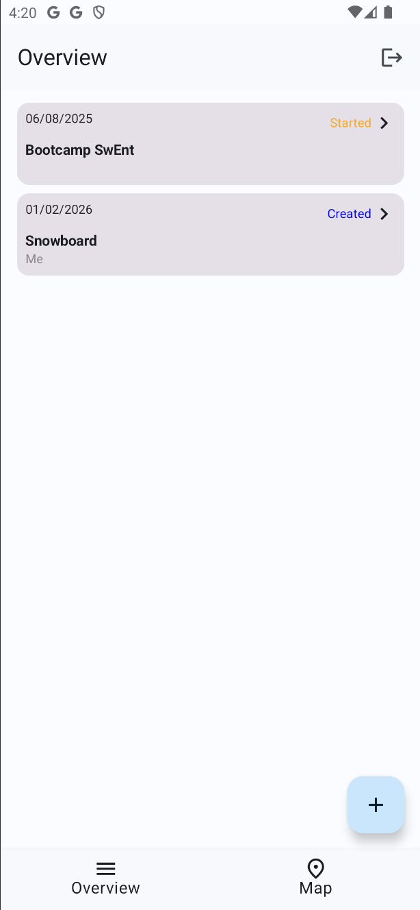

# Authentication

Now that you have a working ToDo application, it’s time to switch it into a user-based application.
Each user will have their own account, and their own set of ToDos.

  
  

In this section, you will use **Google Sign-In** to authenticate users.

## Google Credential Setup

To implement the Google Sign-In feature, you will use the [Credential Manager API](https://developers.google.com/identity/android-credential-manager) and [Firebase Authentication](https://firebase.google.com/docs/auth/android/google-signin).
The required libraries have already been added to your project.
You can verify that in the `build.gradle` file of your app module.

You will need to add your SHA fingerprints to Firebase so it can use it to verify that sign-in requests really come from your signed app and not from someone else.

To do this run `./gradlew signingReport`, you can also run it from the gradle interface in Android Studio.

To add your SHA-1 fingerprint into your Firebase console, go to **Project Settings** → **General** → **Your apps** → **Add fingerprint**.

You need to enable Google as a sign-in method in the Firebase console: go to **Project console** → **Authentication** → **Sign-in method** → **Google**.

After enabling Google Sign-in, you must download an updated `google-services.json` file from Firebase, as enabling this authentication method generates additional configuration data that your app needs.

You will also use the MVVM architecture that you already used for the todos and the map.
You can take a look at [this lecture](https://github.com/swent-epfl/public/blob/main/bootcamp/docs/MVVM.md) for a quick refresh on the MVVM pattern.

## Sign-In With Google

The Sign-In With Google feature is described by the following user stories:

> As a user, I want to sign up and log into the app, so that my ToDos are kept across devices.
> As a user, I want to sign in with my Google account, so that I can securely access my personal ToDos.

From these user stories, we define the following acceptance criteria:

- The user can sign in with their Google account.
- The user can sign out from their account.
- The user can only see and modify their own ToDos.
- If a user logs out and logs back in with the same account, they can see their previously created ToDos.

You can start by implementing the UI for the sign-in screen.
You can find a mockup of the screen on [Figma](https://www.figma.com/design/IDm3NGS988Myo01P0Wa0Cr/TO-DO-APP-Mockup-FALL?node-id=435-3350)

> [!NOTE]
>
> You should use the provided `credentialManager` default instance in `BootcampApp`.
> You will probably need to pass it down to your `SignInScreen` composable.
> To do that, you can add a new parameter with default value to the `SignInScreen` function.
> Then, you can compose the SignInScreen in `BootcampApp` by passing the `credentialManager` instance, obtained from the parameters of `BootcampApp`.

Once you are done with the screen, you can implement the sign-in logic.
We recommend you to read [Authenticate users with Google on Android](https://firebase.google.com/docs/auth/android/google-signin).
They explain the core concepts to implement the sign-in feature.

> [!NOTE]
>
> The Credential Manager allows you to obtain credentials from a user.
> You can then use these credentials to authenticate the user with Firebase Authentication.

The *requirements* for the Sign-In feature are the following:

- Users can sign-in using their Google account.
  When the sign-in process completes successfully, they should be redirected to the Overview screen.
- Users can log out by pressing the log out button on the Overview screen.
  If the log out is successful, they should be redirected to the Sign-in screen.
- Users can sign-in with any Google account. The account does not need to be the device's account and should allow users to enter a new Google account.

You will also need to update your `BootcampApp` composable to satisfy the following requirements:

- If the user is not signed in, the app starts on the `SignInScreen`.
- If the user is signed in, the app starts on the `OverviewScreen`.
- There is not explicit requirement on how to handle the case where the user exits the app while signed in.
  In other words, you can choose to resume existing sessions or to require the user to sign in again.

> [!NOTE]
>
> The same credential manager instance should be used for both sign-in and sign-out.

### Test your implementation

Once you're done with your implementation, build and run the app to check that everything works as expected.
We provide you with the `AuthenticationB3Test` test suite for this step.
It does not check the requirements in depth.
You should write your own tests to ensure that your implementation is correct.

> [!NOTE]
> Some tests use the Firebase emulator.
> Make sure to start it first by running `firebase emulators:start` in your terminal.

As in B1, you will need to attach test tags to your UI components to pass our tests. All required test tags are defined in the `SignInScreenTestTags` and `OverviewScreenTestTags` objects. Check [Figma Testing mockup](https://www.figma.com/design/IDm3NGS988Myo01P0Wa0Cr/TO-DO-APP-Mockup-FALL?node-id=435-3350&p=f) to see where each tag should be placed.

Finally, make sure that your app builds the signature check files.
