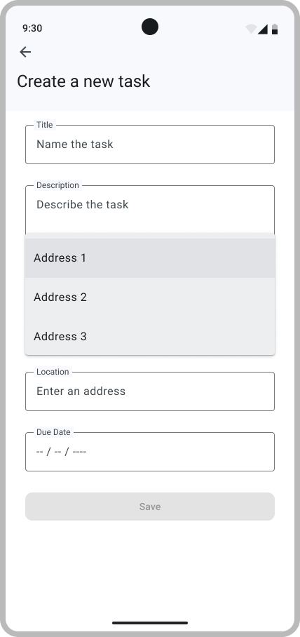
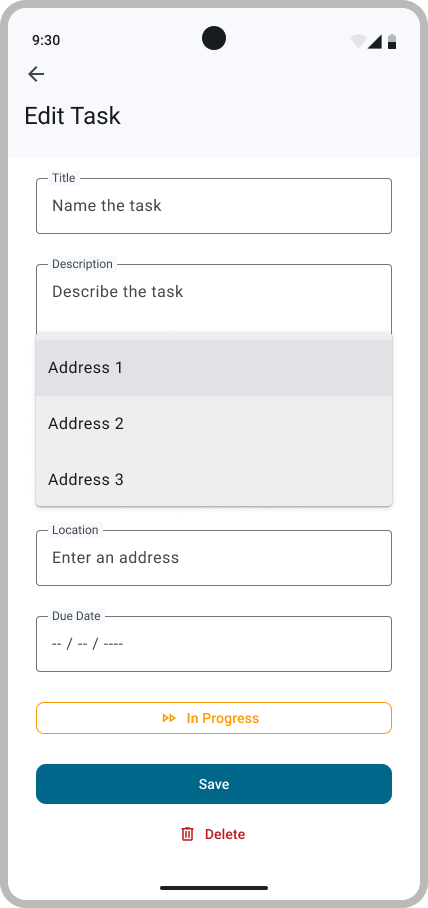

# Location-based To-Dos

## Geo-Coding - Nominatim

When a user is creating a new to-do, entering GPS coordinates for the location may not be very user-friendly. This is where Geocoding comes in handy. It allows the user to input text, which will then be converted into GPS coordinates. This is similar to how Google Maps works — you enter text and it provides a precise location on the map. Since the geocoding feature in the Google Maps API is not free, we will be using Nominatim[^1]. To query the API, we will use OkHTTP.

### OkHTTP

OkHTTP[^2] is a powerful and efficient HTTP client for Android that simplifies the process of making network requests in your app. With a clean and easy-to-use API, OkHttp handles tasks like connection pooling, request/response compression, and even supports asynchronous requests. It's built on top of the robust Okio library, making it efficient for reading and writing data. OkHttp is widely used in Android development to perform network operations, fetching data from servers, and interacting with APIs. Its simplicity and reliability make it a popular choice for developers when dealing with network communication in Android applications.

> [!WARNING]
> To test a Web Request API, we advise you to mock it in order to have idempotent tests (tests that can be run multiple times without changing the system's state after the first run).

## Model for the Nominatim API

To guide you, we have provided the class signatures, but you will need to fully implement the functionality. If you have any doubts about whether your interface is compatible with ours, remember to consult the sigcheck file. We recommend checking the sigcheck before fully implementing everything to ensure you're using the correct interface.

In the `model/map` directory, add the following files :

- a file `LocationRepository.kt`.

  ```kotlin
  interface LocationRepository {
    suspend fun search(query: String): List<Location>
  }
  ```

- a file `NominatimLocationRepository.kt` :

    ```kotlin
    class NominatimLocationRepository(val client: OkHttpClient) : LocationRepository {...}
    ```

To begin, try accessing the Nominatim Search API by constructing the appropriate API call in your browser, using query parameters. The documentation is available [here](https://nominatim.org/release-docs/develop/api/Search/).

To make your API request, use the `HttpClientProvider.client` object provided in main.

Make sure to include `format=json` in the URL to receive the response in JSON format.

> [!WARNING]
> Nominatim has several requirements they define in their Usage Policy, that you should read [here](https://operations.osmfoundation.org/policies/nominatim/). You must adapt your code accordingly.

Next, implement the `NominatimLocationRepository` class to automatically make the request and parse the resulting JSON response. To make asynchronous API calls, we’ll use the OkHTTP library. You can find the relevant documentation [here](https://square.github.io/okhttp/recipes/).

> [!TIP]
> It's a good practice to create a helper function to handle JSON decoding. There are various ways to decode JSON in Kotlin. We recommend using [org.json](https://developer.android.com/reference/kotlin/org/json/JSONArray).

Once everything is implemented, the query response should have multiple suggestions that we will now display in a dropdown menu !

## Update AddToDo and EditToDo Screen

After having implemented the logic, we can now finally input addresses in the Location placeholder. To improve consistency and reduce duplication across screens, consider defining a reusable composable component for selecting a location that can be used in multiple places, such as AddToDo and EditToDo. This aligns with best practices in Android Compose and promotes clean, maintainable code. While we won’t be testing whether you've created a component, it's essential to develop good habits in structuring your code. Be sure to include the necessary test tags for future testing.

For the dropdown menu, use a `DropDownMenu`[^3] along with several `DropdownMenuItem`.

<p align="center">
    
    
</p>

---

## Requirement

Your implementation should ensure that:

- The user can input a location as text when creating or editing a to-do.
  The text is then converted into GPS coordinates using the Nominatim API.
- The user can select one of the suggestions from a dropdown menu.
  The dropdown menu should not contain more than 5 suggestions.
- All queries to the Nominatim API must comply with the Nominatim usage policy.

## Test your implementation

Once you're done with your implementation, build and run the app to check that everything works as expected.

We provide you with the `LocationBasedTodosB3Test` test suite for this step.
It does not check the requirements in depth.
You should write your own tests to ensure that your implementation is correct.

> [!NOTE]
> Some tests use the Firebase emulator.
> Make sure to start it first by running `firebase emulators:start` in your terminal.

As in B1, you will need to attach test tags to your UI components to pass our tests. All required test tags are defined in the `AddToDoScreenTestTags` and `EditToDoScreenTestTags` objects. Check [Figma Testing mockup](https://www.figma.com/design/IDm3NGS988Myo01P0Wa0Cr/TO-DO-APP-Mockup-FALL?node-id=435-3541) to see where each tag should be placed.

Finally, make sure that your app builds the signature check files.

---

> [!NOTE]  
> Please click [here](./4-GoogleMaps.md) to proceed to the next step.

[^1]: <https://nominatim.org/>
[^2]: <https://square.github.io/okhttp/>
[^3]: <https://composables.com/docs/androidx.compose.material3/material3/1.5.0-alpha01/components/DropdownMenu>
