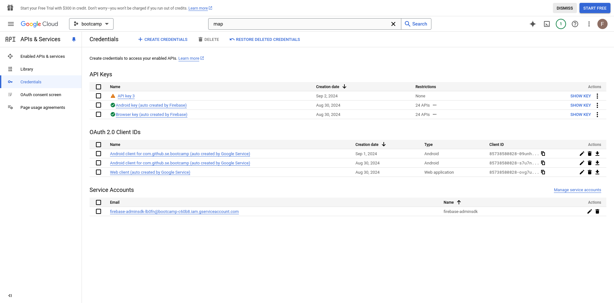
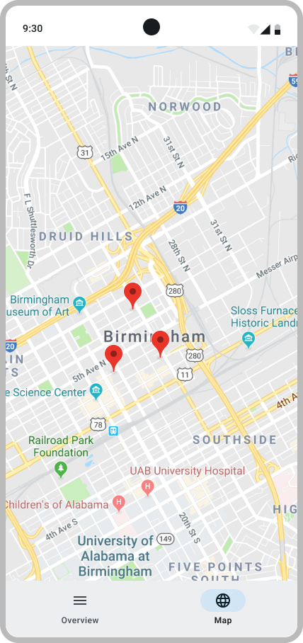

# Google Maps - Introduction

Google Maps is an API that you are likely to use in your application. It can be used in many ways: to indicate the position of certain elements on the map, indicate areas of interest or to guide you to a certain point using GPS.

## API Key

Before being able to use Google Maps in your application, you will need to create an API key for Google Maps[^1].

Unfortunately, Google asks for billing information to generate this API key, but there is a workaround:

First, go to your project's webpage and get its ID (either select the correct project, or create one):

`https://console.cloud.google.com/welcome`

Then, go to the following page (by replacing "YOUR-PROJECT-ID" with the correct id) and click "ENABLE".

`https://console.cloud.google.com/marketplace/product/google/maps-android-backend.googleapis.com?project=YOUR-PROJECT-ID`

This will load a page asking you to turn on billing. Don't answer it and instead skip it by going to the following page (still replacing "YOUR-PROJECT-ID" with the correct id):

`https://console.cloud.google.com/apis/credentials?project=YOUR-PROJECT-ID`

And then click **CREATE CREDENTIALS**, then select **API key**.

This will generate an API key that you can now use without needing to give Google your billing information:

The newly generated API key should appear on this same page with an orange triangle as it is unrestricted.

<p align="center"></p>

> [!NOTE]
> To verify that the Maps SDK for Android is correctly enabled, browse again to the second link, or restrict your api key and see all the service available with it directly (click on the key>API restrictions).

## Setting the key in your project

To avoid publishing your key, we will store it in a local file: `local.properties`.

In `local.properties`, paste your key

```properties
MAPS_API_KEY=xyz

// Do NOT use quotation marks around xyz
```
Make sure you don't upload `local.properties` to your repository. Add `local.properties` to your `.gitignore`  file to prevent it from being tracked by Git.

## Map Screen

### Checking if it works

To test that your API key is working, you can simply create a composable as in the following example. It should display San Francisco.

```kotlin
@Composable
fun SimpleMap() {
    // Create a CameraPositionState to control the camera position
    val cameraPositionState = rememberCameraPositionState {
        position = CameraPosition.fromLatLngZoom(LatLng(37.7749, -122.4194), 10f) // San Francisco
    }

    // Display the Google Map
    GoogleMap(
        modifier = Modifier.fillMaxSize(),
        cameraPositionState = cameraPositionState
    )
}
```

Below you can see examples and tutorials on how to use features of Google Maps.

- [Setup of a map with markers](https://developers.google.com/maps/documentation/android-sdk/map-with-marker)
- [Working with lines and shapes](https://developers.google.com/maps/documentation/android-sdk/polygon-tutorial)
- [Set current place](https://developers.google.com/maps/documentation/android-sdk/current-place-tutorial)

> [!WARNING]
> If your map does not display anything except the Google layout, this is likely because your key is set up incorrectly. You may have missed a [step](#api-key).

### Implementing it in your app

By this point, you have already implemented Nominatim to associate coordinates with a ToDo. You can now update your `MapScreen` composable to display the map, with markers for each todo.

The final result should be something like this:

<p align="center"></p>

To help you in the implementation, you can find more information in the [documentation](https://developers.google.com/codelabs/maps-platform/maps-platform-101-compose#0) or the [Google Map Compose Sample](https://github.com/googlemaps/android-maps-compose).

> [!NOTE]
> Make sure your UI matches the provided design mockups. Check
[the Figma design](https://www.figma.com/design/IDm3NGS988Myo01P0Wa0Cr/TO-DO-APP-Mockup-FALL?node-id=435-3350&node-type=CANVAS&t=G6De7qCsUE3haq35-0) and ensure that all relevant UI components are correctly tagged for testing and match the design specifications.

## Cool features

Google Maps has many more advanced features that might interest you. Here are some examples.

The markers are fully customizable, you can modify the icon of the marker and all its properties (e.g. the opacity).

It is possible to add layers above the map. For instance, [here](https://developers.google.com/maps/documentation/android-sdk/utility/heatmap) is how to create a heatmap of the density of points that have been added on top of the map.

Geocoder[^2] lets you convert longitude and latitude coordinates to an address, and the other way around.

You will find everything you need to know in the Google Maps documentation[^3] and the API reference[^4].

## Testing

To test your code for Google Maps, you will have to write unit tests, but they will cause you trouble as all classes in the Google Maps SDK are final, meaning you cannot mock them.
You will have to write UI tests, but since you cannot set the inputs, it will be difficult to achieve 100% coverage.

Therefore, we advise you to write code that is independent from map components, so that you can easily test it as much as possible.

### Setting the key in the CI

Your Maps API key is confidential and should not be uploaded to GitHub (even in a private repository). Thus, to keep the CI functioning, the API key must be uploaded to GitHub as a _secret_[^5]. This allows you to safely upload the key without exposing it.

We want to upload the secrets of `local.properties`. However, GitHub only allows text for secrets, so we will first convert it to a string. We will use Base 64 encoding[^6], which encodes any sequence of bytes into a string of printable characters.

The `local.properties` you upload must only contain the `MAPS_API_KEY`. Encode it as follows:

- On Linux (in the terminal):

  ```shell
  base64 path/to/local.properties > base64_local_properties.txt
  ```

- On MacOS (in the terminal):

  ```shell
  base64 -i path/to/local.properties -o base64_local_properties.txt
  ```

- On Windows (in Powershell)

  ```powershell
  [Convert]::ToBase64String([IO.File]::ReadAllBytes("path/to/local.properties")) > base64_local_properties.txt
  ```

The above commands will create a file `base64_local_properties.txt` whose contents you can upload as explained below.

> [!WARNING]
> The `local.properties` file must **not** be uploaded unencrypted to GitHub.

<details>
<summary>Why is it important to do this ? Here is an explanation.</summary>  
  
To avoid publishing your key on GitHub, we use a gradle script that injects the locally stored key when running the app.

In your `AndroidManifest.xml` file, in the `<application>` tag, we usually directly define the key, but instead here we used a variable `${MAPS_API_KEY}`.

```xml
<meta-data
    android:name="com.google.android.geo.API_KEY"
    android:value="${MAPS_API_KEY}" />
```

Then in `app/build.gradle.kts` in the section `android` we added the following :

```kts
import org.jetbrains.kotlin.util.capitalizeDecapitalize.toLowerCaseAsciiOnly
import java.io.FileInputStream
import java.util.Properties

android {
    // Load the API key from local.properties
    val localProperties = Properties()
    val localPropertiesFile = rootProject.file("local.properties")
    if (localPropertiesFile.exists()) {
        localProperties.load(FileInputStream(localPropertiesFile))
    }

    val mapsApiKey: String = localProperties.getProperty("MAPS_API_KEY") ?: ""

    defaultConfig {
        ...
        manifestPlaceholders["MAPS_API_KEY"] = mapsApiKey
  }
}  
```

</details>

#### Uploading to GitHub and usage

Follow [this tutorial](https://docs.github.com/en/actions/how-tos/write-workflows/choose-what-workflows-do/use-secrets#creating-secrets-for-a-repository) to upload the API key to your repository, and name it `LOCAL_PROPERTIES`. Your key is now ready to be retrieved in the CI, enabling the tests to run properly.

## Warning

You may want to draw lines and shapes on the map, compute line intersections or project the current position of the user on a certain road. Don't forget that the longitude latitude coordinates are **NOT** cartesian, it is spherical. So if you want to compute line intersections, projections, etc. you will have results that may surprise you. When working on small areas, you can change coordinate space before and after computations, but due to its nature, the result will always be an approximation.

### Requirement

Here is the list of requirements your implementation should satisfy:

- When the user opens the Map screen, they should see a map centered on the location of the first ToDo (if any), or a default location (e.g., EPFL) if no ToDos exist.
- All ToDos with a location should be displayed as markers on the map.

### Test your implementation

Once you're done with your implementation, build and run the app to check that everything works as expected.

We provide you with the `GoogleMapsB3Test` test suite for this step.
It does not check the requirements in depth.
You should write your own tests to ensure that your implementation is correct.

> [!NOTE]
> Some tests use the Firebase emulator.
> Make sure to start it first by running `firebase emulators:start` in your terminal.

As in B1, you will need to attach test tags to your UI components to pass our tests. All required test tags are defined in the `MapScreenTestTags` objects. Check [Figma Testing mockup](https://www.figma.com/design/IDm3NGS988Myo01P0Wa0Cr/TO-DO-APP-Mockup-FALL?node-id=11716-2639) to see where each tag should be placed.

Finally, make sure that your app builds the signature check files.

---

Congrats, you're done!

> [Return to the Table of Contents](./README.md)

[^1]: <https://developers.google.com/maps/documentation/android-sdk/get-api-key>
[^2]: <https://developer.android.com/reference/android/location/Geocoder>
[^3]: <https://developers.google.com/maps/documentation/android-sdk/overview>
[^4]: <https://developers.google.com/android/reference/com/google/android/gms/maps/package-summary>
[^5]: <https://docs.github.com/en/actions/concepts/security/secrets>
[^6]: <https://en.wikipedia.org/wiki/Base64>
