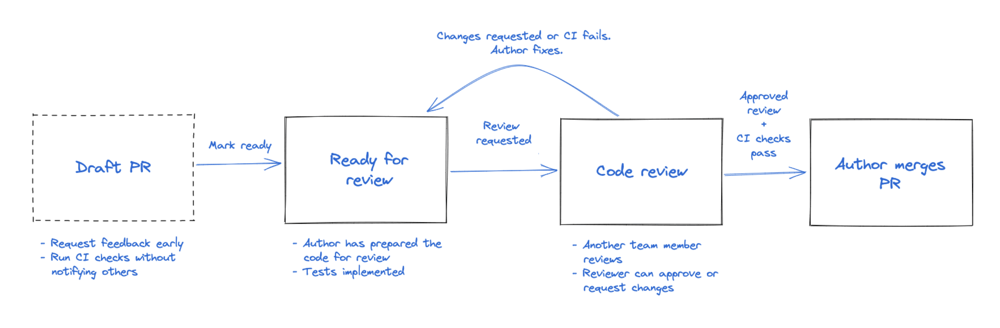
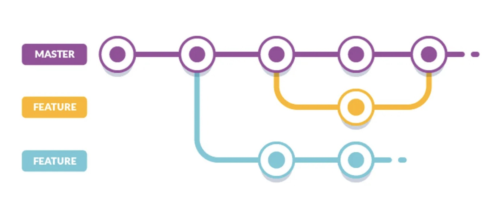

# Collaborative Development

We covered collaborative development in lecture [[slides](https://github.com/swent-epfl/public/blob/main/lectures/Wk3.A%20-%20Collaborative%20Software%20Development.pdf) \| [videos](https://www.youtube.com/watch?v=Lnu1rsIjtk4&list=PLr41P4J9F0ZOs2o4OGpMvKeBipnklTyWi)], and here is a refresher.

## Collaborative workflow

*How do you manage the codebase as a team ?*

Updating the `main` branch directly doesn't work well in a team setting. Even if everyone is working on their own branches, the code needs to be merged eventually. But what if a merge introduces broken code? This is where **Pull Requests (PRs)** come in.

PRs are formal requests to merge changes into a branch. They allow you to document, review, and discuss changes in a structured way. Here's an overview of the PR lifecycle:



## *Feature Branch* Workflow

When multiple developers work on the same codebase, each one creates a **dedicated branch** for their work. These branches are often related to a specific issue (feature or bug fix). The steps for managing a branch are:

1. **Create a new branch** for each feature or bug fix. Use a descriptive name like `edit-todo-screen`, `fix-map-display`, or `issue-#84`.
2. **Commit related code** to this branch.
3. **Test the branch** thoroughly. Once tested and approved, the branch is merged into `main`.
4. **Delete the branch** after merging to keep the repository clean.



> [!TIP]
> Regularly sync your feature branch with `main` to avoid large, difficult merges later on. Small, frequent changes are easier to manage.

### Discuss changes with *Pull Request*

Once your feature is ready for review, open a **Pull Request**. Other contributors will review, discuss, and request changes if needed. Once everyone agrees, you can merge and close the PR.

Successful PRs typically have:

- **Clear context**: Explain the purpose of the PR, link related issues, and describe how you solved the problem.
- **Small changes**: Smaller, focused changes lead to better code quality, easier reviews, and fewer merge conflicts.

> [!NOTE]
> Choose a reviewer familiar with the code or someone who worked on a similar feature. Be clear about the goals of the review (e.g., functionality, performance, security).

You can also open **Draft PRs** for early feedback or help. Draft PRs don't request a formal review and let you continue working on the code freely.

## Improve quality with *code reviews*

Even if code reviews take time, you must take them seriously, as it increases your code quality! In the development lifecycle, reviewing code consists of two parts: the automated code review and the peer code review (i.e., one or more developer examines the code).

**Automated Code Review**: Use linting tools and static analyzers to catch syntax errors, logic issues, and code style violations. Automating this process saves time and ensures consistency.

**Peer Code Review**: Other developers read your code to:

- Share knowledge.
- Catch bugs missed by automated tools.
- Ensure adherence to coding standards.
- Increase collaboration and improve overall code quality.

To be effective in your code reviews, you can:

- **Develop a checklist**: Ask yourself key questions like, Is it functional? Is the design efficient? Does it have low complexity? Does it follow naming conventions? Is there proper documentation?
- **Stick to a review rate**: Aim to review 200-500 lines of code (LOC) per hour. This helps to stay focused and avoid missing issues.
- **Be rational, clear, and explicit**: Ensure feedback is constructive, backed by reasoning, and easy to understand.
- **Point out opportunities for improvement**: Highlight areas where the code could be optimized or improved.

## The PR lifecycle illustrated

Let’s walk through an example: You are developping the ToDo App as a team, and you are working on the feature that allows users to edit a to-do in the app.

1. **Create a feature branch**:

```bash
git branch feature/edit-todo
git checkout feature/edit-todo
```

2. **Write the code**, and once it's ready for review, go to your GitHub repository, and open a **Pull Request**. Set the base branch to `main` and compare it with your branch `feature/edit-todo`.

    A good PR title might be:  `Add feature to edit to-dos`,

   and a clear description might look like this:

    >
    > **What?**  
    > This PR adds a feature that allows users to edit to-do items. Users can change the title, description, assignee, location, and due date.
    >
    > **Why?**  
    > To improve user control and flexibility when managing to-dos.
    >
    > **How?**  
    > The feature is implemented using `EditToDo.kt` for the UI and `EditToDoViewModel` for handling logic and repository interactions.

3. **Include any additional information** such as dependencies, how you tested the code, or screenshots/recordings of the feature in action.

4. After the PR is reviewed, and requested changes are made, **merge** it.
