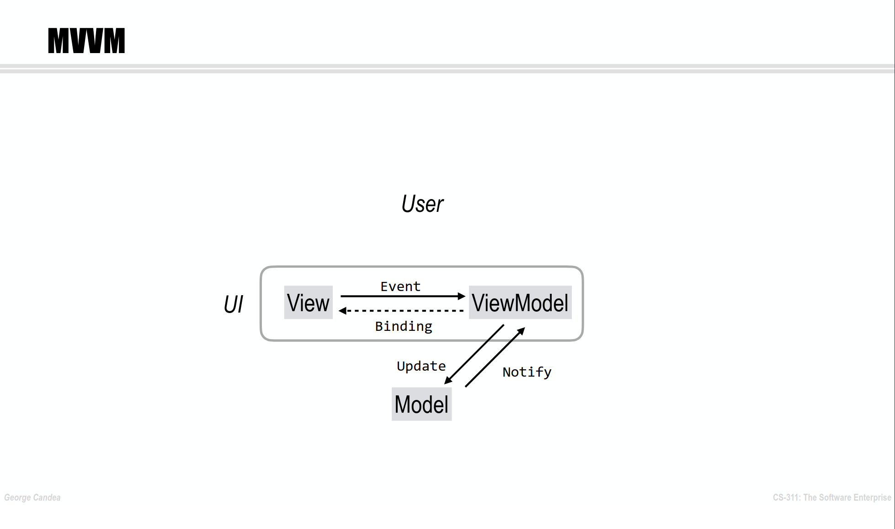
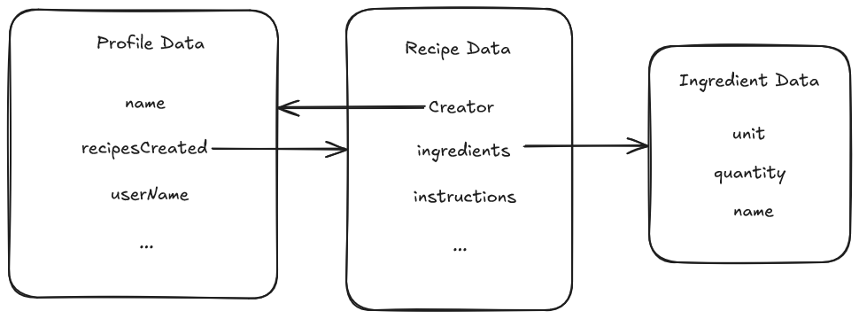

# Implementing the MVVM Pattern

The MVVM design pattern was covered in lecture [[slides](lectures/Wk1.B%20-%20The%20Mobile%20Platform.pdf) | [video](https://www.youtube.com/watch?v=WpmptzLYQkU)] at a high level, and here we explain how to implement it and how data flows between the different layers.
In the bootcamp, you will implement various features using the MVVM pattern.

## App Structure Overview

An app that uses the MVVM design pattern is structured into three main components:

- **Model**: This component is responsible for handling the business logic of your app and managing application data. It consists of models (data classes) and repositories that provide a clean API for data access.

- **View:** This component is responsible for displaying the application data on the screen and handling user interactions. It consists of composable functions that define the user interface and respond to changes in the data provided by the ViewModel.

- **ViewModel**: This component acts as a bridge between the UI and the data layer. It manages UI-related data in a lifecycle-aware manner and exposes this data to the UI using observable data holders like `StateFlow`.

Here is the diagram we showed in lecture:


### Data Layer

#### Data Class

To get started with implementing an app, we need to define what objects it needs to manipulate. Reading the user stories helps identify what they are.

Writing down a schema is a good way to get started. Here is a simplified example that you can use as inspiration:



>[!TIP]  
>The model does not have to be complete from the start.
> Start with one user story and, once it's implemented, adapt your model to fit your next user story.

To define an object in Kotlin, you can create a data class as follows:

```kotlin
data class Profile(
   val name: String = "NAME_DEFAULT",
   val userName: String,
   var recipesCreated: List<Recipe>, 
   ...
)
```

#### Repository

The Repository acts as an _abstraction layer_ between the ViewModel and data sources (see [Using Modularity and Abstraction](ModularityAndAbstraction.md)). This ensures that the ViewModel does not need to know where the data comes from. The Repository consolidates data access logic and provides clean APIs to the ViewModel.

A Repository interface defines the methods needed to interact with data sources. For the Profile example above, it could look like this:

```kotlin
interface ProfileRepository {
    suspend fun getProfile(userId: String): Profile

    suspend fun updateProfile(profile: Profile)

    suspend fun deleteProfile(userId: String)
}
```

>[!NOTE]
> To manage asynchronous behavior, we use `suspend` functions.
> This allows the caller to wait for the operation to complete without blocking the main thread, using Kotlin's coroutines. Error handling is managed with standard `try-catch` blocks.
---

### UI Layer : View

The View in Jetpack Compose is defined using composable functions, which describe how the UI should look based on the current state provided by the ViewModel. The View should:

- Observe changes from the ViewModel and update the UI accordingly; and
- Respond to user interactions and delegate actions back to the ViewModel to update the state or trigger business logic.

A basic Profile view without styling could look like this:

```kotlin
@Composable
fun ProfileScreen(viewModel: ProfileViewModel) {
    val profileState = viewModel.profile.collectAsState()

    Column() {
        Text(text = "Profile")
      
        profileState.value?.let { profile ->
            Text(text = "Name: ${profile.name}")
            Text(text = "Username: ${profile.userName}")
      
            Button(onClick = { 
                // Handle edit profile action
                viewModel.updateProfile(profile.copy(name = "New Name"))
            }) {
                // This is the text inside the button!
                Text(text = "Edit Profile")
            }

            Button(onClick = { viewModel.deleteProfile(profile.userName) }) {
                Text(text = "Delete Profile")
            }
        }
    }
}

```

### ViewModel

The ViewModel is responsible for:

- Managing UI-related data in a lifecycle-aware way
- Exposing state to the UI using `StateFlow` or similar observable data holders
- Interacting with the Model to fetch, update, or delete data.
- Handling logic that transforms data for display in the View

```kotlin

class ProfileViewModel(private val repository: ProfileRepository) : ViewModel() {

   private val profile_ = MutableStateFlow<Profile?>(null)
   val profile: StateFlow<Profile?> get() = profile_

   fun loadProfile(userId: String) {
      viewModelScope.launch {
         try {
            val userProfile = repository.getProfile(userId)
            profile_.value = userProfile
         } catch (e: Exception) {
            // Handle error (e.g., show a toast or log the error)
            profile_.value = null
         }
      }
   }

   fun updateProfile(profile: Profile) {
      viewModelScope.launch {
         try {
            repository.updateProfile(profile)
            loadProfile(profile.userName)
         } catch (e: Exception) {
            // Handle error
         }
      }
   }

   fun deleteProfile(userId: String) {
      viewModelScope.launch {
         try {
            repository.deleteProfile(userId)
            profile_.value = null // Clear profile state after deletion
         } catch (e: Exception) {
            // Handle error
         }
      }
   }
}
```

---

## MVVM Workflow

Generally, we recommend the following approach when implementing a user story:

1. Read the user story and understand it
1. Think about what you need to add to the...
   - Data class
   - ViewModel
   - Interfaces to external APIs (e.g. a Repository using Firestore)
   - UI (also have a look at the Figma)
1. Create the required classes/functions (without implementing them!)
1. For the bootcamp, add the sigcheck for this user story, and check that it matches your code
1. Implement the classes/functions
1. Write tests
