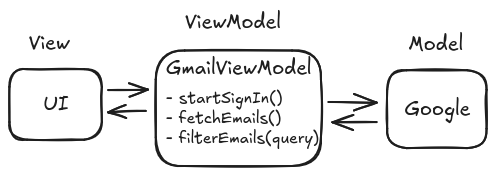

# Using Modularity and Abstraction

When building an app, or any piece of software, we first split it into distinct components.
This is because humans cannot reliably remember many details, so we need to compartmentalize.
So we collect into  "boxes" things that are related and provide a specific service or function.
We can then treat the software as a collection of interacting "black boxes" without worrying about what is inside these boxes.
We call these boxes _modules_.

In order to know how these boxes are to be used, we need to put labels on them&mdash;these are _interfaces_.
An interface defines a "contract" for how a module interacts with the modules around it and its environment.
An interface specifies methods, arguments, and properties.

When you combine a module with an interface, you get an _abstraction_.
Developing and using abstractions is a fundamental technique for dealing with complexity in software development.

By encapsulating program behavior inside a module, we can now think about, test, debug, and configure each of these modules separately from the rest.
We can swap one version of a module for another with more features.

## Example: Gmail Client

To illustrate this process, let's create an email client to use with Gmail accounts.
We will employ the MVVM design pattern, but for now you don't need to understand it thoroughly.



We develop a ViewModel that is specific for Gmail, called  `GmailViewModel`:

```kotlin
data class Email(val sender: String, val subject: String, val content: String)

class GmailViewModel : ViewModel() {
    
    var account: GoogleAccount? = null
        private set

    fun startSignIn() {
        account = Google.openLoginDialog()
    }

    fun fetchEmails(): List<Email> {
        val response = http.get("https://google.com/mail/mails?id=${account?.id}")

        if (!response.ok) {
            return emptyList()
        }

        val body = Json.decodeFromString<List<Map<String, String>>>(response.body?.string() ?: "")

        return body.map { element ->
            Email(
                sender = element["sender"] ?: "",
                subject = element["subject"] ?: "",
                content = element["content"] ?: ""
            )
        }
    }

    fun filterEmails(query: String): List<Email> {
        return fetchEmails().filter { it.content.contains(query) }
    }
}
```

## Abstracting the Mail Server

Now let's say we want to support Outlook email accounts as well.
We cannot simply reuse the Gmail code, because:

- there is no `Outlook.openLoginDialog()` function, instead we need to provide `email` and `password` to an HTTP endpoint
- in the returned JSON, the content of the email is in the key `body`, instead of `content`
- the account is not a `GoogleAccount`
- the endpoint to get the emails is not the same

One workaround would be to augment the code with `enum` and `switch` cases and `if` statements, but that could get messy.
Plus, in the long term, it is likely that we will need to support other mail servers as well, and the code would become riddled with special cases and be a nightmare to maintain.

The better approach is to abstract the mail server behind an interface `MailRepository` that represents a generic email service.
We then use a server-agnostic `MailViewModel` that talks to the email service through this interface.
The `MailRepository` interface defines a "contract" in the form of standard interactions between a ViewModel and an email Model, and then it is up to the implementations of the interface (`GoogleMailRepository` and `OutlookMailRepository`) to do the specifics.


Here is the new code:

```kotlin
interface MailRepository {
    fun startSignIn()
    fun fetchEmails(): List<Email>
}

class MailViewModel(private val repository: MailRepository) : ViewModel(){

    fun startSignIn() {
        repository.startSignIn()
    }

    fun fetchEmails(): List<Email> {
        return repository.fetchEmails()
    }

    fun filterEmails(query: String): List<Email> {
        return fetchEmails().filter { it.content.contains(query) }
    }
}

class GoogleMailRepository : MailRepository {
    private var account: GoogleAccount? = null

    override fun startSignIn() {
        account = Google.openLoginDialog()
    }

    override fun fetchEmails(): List<Email> {
        val response = http.get("https://google.com/mail/mails?id=${account?.id}")

        if (!response.ok) {
            return emptyList()
        }

        val body = Json.decodeFromString<List<Map<String, String>>>(response.body?.string() ?: "")

        return body.map { element ->
            Email(
                sender = element["sender"] ?: "",
                subject = element["subject"] ?: "",
                content = element["content"] ?: ""
            )
        }
    }
}

class OutlookMailRepository : MailRepository {
    private var account: OutlookAccount? = null

    override fun startSignIn() {
        val credentials = Dialog.askFields(listOf("email", "password"))
        val response = http.get("https://outlook.com/login?email=${credentials["email"]}&password=${credentials["password"]}")

        if (!response.ok) {
            return
        }

        account = Json.decodeFromString(response.body?.string() ?: "")
    }

    override fun fetchEmails(): List<Email> {
        val response = http.get("https://outlook.com/mails?user_id=${account?.userId}")

        if (!response.ok) {
            return emptyList()
        }

        val body = Json.decodeFromString<List<Map<String, String>>>(response.body?.string() ?: "")

        return body.map { element ->
            Email(
                sender = element["sender"] ?: "",
                subject = element["subject"] ?: "",
                content = element["body"] ?: ""
            )
        }
    }
}
```

By using modularity and abstraction, we now have a UI and ViewModel that are independent of the mail server we use.
To extend support to other email services we simply provide an additional implementation of the `MailRepository` interface.
We can also replace or upgrade these implementations unbeknownst to the ViewModel and UI.
And we can test the UI, the ViewModel, and the different implementations of the interface independently, as you will see later.
