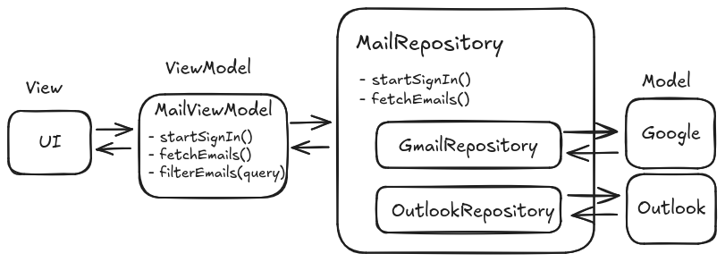
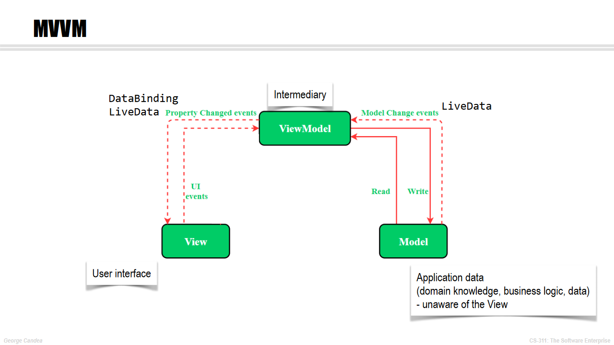
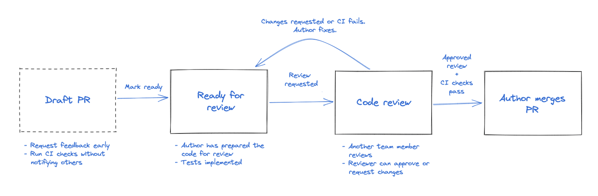

# Theory

This document recaps some of the concepts that were covered in lecture, to give you a quick reference during the bootcamp:

1. [User Stories](#1-user-stories)
2. [Commit Messages](#2-commit-messages)
3. [Using Modularity and Abstraction](#3-using-modularity-and-abstraction)
4. [Implementing the MVVM Design Pattern](#4-implementing-the-mvvm-pattern)
5. [Collaborative Development](#5-collaborative-development)

## 1. User Stories

> [!TIP]
> You can also review the lecture [slides](https://moodle.epfl.ch/pluginfile.php/3317323/mod_resource/content/4/Wk1.A.pdf) and the following related lecture videos:
[Requirements Overview](https://mediaspace.epfl.ch/playlist/dedicated/60382/0_orzu1on2/0_18p5vaz4) |
[Personas](https://mediaspace.epfl.ch/playlist/dedicated/60382/0_orzu1on2/0_15cl28jy) |
[User Stories](https://mediaspace.epfl.ch/playlist/dedicated/60382/0_orzu1on2/0_rukisjsw) |
[Requirements Validation](https://mediaspace.epfl.ch/playlist/dedicated/60382/0_orzu1on2/0_lnk2499i) |
[Epics & Story Mapping](https://mediaspace.epfl.ch/playlist/dedicated/60382/0_orzu1on2/0_9bglhde9).

A user story must follow the structure:

```txt
As a [type of user], I want [an action] so that [a benefit/value].
```

- Identify the specific user or role who will benefit from the feature. This can be a real user, like a customer or admin, or an abstract user, like a bot.
- Describe the action or task the user wants to perform. This should be clear and specific.
- Explain why the user wants to perform this action. What value or benefit will it provide them? This part ensures that the user story aligns with business goals.
- (Optional) Define conditions that must be met for the story to be considered complete. This can include specific functionality, performance metrics, or user experience details.

### Best Practices

- Keep It User-Centric. Focus on the user's needs rather than technical tasks. The goal is to ensure the development team understands the value from the user's perspective.
- Be Concise but Clear. The story should be brief but informative enough to guide development. Avoid ambiguous language.
- Avoid Technical Jargon. Use language that the user would understand. This ensures that all team members can grasp the story's intent.
- Include Acceptance Criteria. Clearly outline the conditions that will make the story complete. This helps avoid misunderstandings and ensures that the development meets expectations.
- Make It Negotiable. User stories are not contracts but conversation starters. They should be flexible enough to adapt during discussions between team members.

### Examples

#### Good User Stories

```markdown
As a returning customer, I want to view my previous orders so that I can quickly reorder items I liked.
```

---

```markdown
As an admin, I want to generate a monthly sales report so that I can track our store's performance.

Acceptance Criteria:

- The report includes total sales, number of transactions, and top-selling products.
- The admin can select a date range for the report.
- The report is exportable as a CSV or PDF file.
```

#### Bad User Stories

```markdown
As a user, I want to log in.
```

This story lacks context about why the user wants to log in and what value this provides. A better story might specify the purpose of logging in, such as accessing personalized content or account settings.

---

```markdown
As a developer, I want to refactor the authentication module.
```

This story is developer-centric rather than user-centric. User stories should focus on the user's needs. A better story might be: "As a user, I want to log in securely so that my personal information is protected," with the refactoring work addressed as part of the implementation plan.

---

```markdown
As a customer, I want better search functionality.
```

This story is too vague. It doesn't specify what "better" means or how the user experience should improve. A more precise story could be: "As a customer, I want to filter search results by price, rating, and category so that I can find products that meet my specific needs."

### Recap of the INVEST Criteria for User Stories

To ensure your user stories are of high quality, you can follow the **INVEST** acronym:

- Independent: Each story should be self-contained and not depend on other stories.
- Negotiable: Stories should be flexible to allow for collaboration and refinement.
- Valuable: The story should deliver value to the user.
- Estimable: The team should be able to estimate the effort required to complete the story.
- Small: Stories should be small enough to be completed within a single iteration.
- Testable: The story should be clear enough to define tests that confirm the feature works as intended.

### Further Reading

- [Mountain Goat Software's Guide to User Stories](https://www.mountaingoatsoftware.com/agile/user-stories)

<!-- ============================================================================================================ -->

## 2. Commit Messages

Commit messages are essential to work efficiently with other persons. They provide context for why a change was made, facilitate code review, and improve the overall maintainability of a project. Well-written commit messages make it easier for teams to understand the history of a project and to pinpoint issues when bugs arise.

### Best Practices

1. Write Clear and Descriptive Messages\
   A commit message should describe the **what** and **why** of the change. A good message gives an overview of the work and its purpose, making it easier for others to understand the change.
   Avoid generic messages like "fix" or "update" as they do not provide enough context.

2. Use the Imperative Mood\
   The convention is to write the message in the imperative mood, as if you are giving an order or command. For example, use "Fix bug in user login" instead of "Fixed bug in user login." This follows the style used by Git itself when creating commits (e.g., "Merge branch...").

3. Keep the Message Short and Focused\
   Limit the subject line (the first line of the commit message) to 50 characters or less.
   If more detail is needed, include a blank line after the subject line, followed by a more detailed explanation in the body. This body can include reasoning, background information, or links to related resources.

4. Capitalize the First Letter of the Subject\
   This improves readability and follows general writing conventions.

5. Use the Body to Explain What and Why (optional)\
   If the subject line is not enough to fully convey the change, add more details in the body of the commit. The body should be wrapped at 72 characters per line to ensure readability.

6. Reference Issues or Tickets (optional)\
   If your commit relates to a specific issue, reference it in the commit message by including a ticket number or issue ID. This helps track the commit back to the specific requirement or bug report it addresses.

### Examples

#### Good Commit Messages

```markdown
Add user authentication feature

Add a new authentication system using JWT to handle user login and session management.
This update includes token generation, middleware for protecting routes, and unit tests.

Related to #42
```

```markdown
Fix typo in the README file
```

```markdown
refactor: extract API request logic into a service class

Moved repetitive API request logic from controllers to a dedicated service class.
This improves maintainability and adheres to the DRY principle.
```

#### Bad Commit Messages

```markdown
fix
```

```markdown
Changes to the login feature
```

```markdown
Fixed bug in code
```

### Advanced: Understanding Conventional Commits

The [Conventional Commits](https://www.conventionalcommits.org/en/v1.0.0/) specification is a standardized format for commit messages. This convention adds a type and optional scope to your commit message, making it easier to understand the purpose of the commit at a glance.

Over the years, this practice has gained popularity, more and more developers and enterprise are using this convention. It increases the clarity of each commit, and the standardized format for the message allows scripts to classify commits, for example to automatically generate a changelog or trigger specific job in the CI/CD (release a patch on a `fix`, etc.).

Structure of a Conventional Commit:

```markdown
<type>[optional scope]: <description>

[optional body]

[optional footer(s)]
```

- **Type**: Describes the category of change (e.g., `feat`, `fix`, `docs`, `style`, `refactor`, `test`, `chore`).
- **Scope** (Optional): A noun describing a section of the codebase affected (e.g., `auth`, `api`, `ui`).
- **Description**: A brief summary of the changes made.
- **Body** (Optional): Explains the motivation behind the change and what was done.
- **Footer** (Optional): Contains any references to issues or breaking changes.

Examples of Conventional Commits

```markdown
feat(api): add user registration endpoint

Added a new endpoint for user registration, including validation and database persistence.
```

```markdown
fix(auth): resolve password reset issue

Fixed an issue where users were unable to reset their passwords due to incorrect token validation.
Closes #56
```

> [!WARNING]
> When writing commit messages using this convention, the description of the change is **not** capitalized.

### Further Reading

- [Chris Beams' guide on writing good commit messages](https://chris.beams.io/posts/git-commit/)
- [Conventional Commits specification](https://www.conventionalcommits.org/en/v1.0.0/)

<!-- ============================================================================================================ -->

## 3. Using Modularity and Abstraction

When building an app, or any piece of software, we first split it into distinct components.
This is because humans cannot reliably remember many details, so we need to compartmentalize.
So we collect into  "boxes" things that are related and provide a specific service or function.
We can then treat the software as a collection of interacting "black boxes" without worrying about what is inside these boxes.
We call these boxes _modules_.

In order to know how these boxes are to be used, we need to put labels on them&mdash;these are _interfaces_. 
An interface defines a "contract" for how a module interacts with the modules around it and its environment.
An interface specifies methods, arguments, and properties.

When you combine a module with an interface, you get an _abstraction_.
Developing and using abstractions is a fundamental technique for dealing with complexity in software development.

By encapsulating program behavior inside a module, we can now think about, test, debug, and configure each of these modules separately from the rest.
We can swap one version of a module for another with more features.

### Example: Gmail Client

To illustrate this process, let's create an email client to use with Gmail accounts.
We will employ the MVVM design pattern, but for now you don't need to understand it thoroughly.


We develop a ViewModel that is specific for Gmail, called  `GmailViewModel`:

```kotlin
data class Email(val sender: String, val subject: String, val content: String)

class GmailViewModel : ViewModel() {
    
    var account: GoogleAccount? = null
        private set

    fun startSignIn() {
        account = Google.openLoginDialog()
    }

    fun fetchEmails(): List<Email> {
        val response = http.get("https://google.com/mail/mails?id=${account?.id}")

        if (!response.ok) {
            return emptyList()
        }

        val body = Json.decodeFromString<List<Map<String, String>>>(response.body?.string() ?: "")

        return body.map { element ->
            Email(
                sender = element["sender"] ?: "",
                subject = element["subject"] ?: "",
                content = element["content"] ?: ""
            )
        }
    }

    fun filterEmails(query: String): List<Email> {
        return fetchEmails().filter { it.content.contains(query) }
    }
}
```

### Abstracting the Mail Server

Now let's say we want to support Outlook email accounts as well.
We cannot simply reuse the Gmail code, because:

- there is no `Outlook.openLoginDialog()` function, instead we need to provide `email` and `password` to an HTTP endpoint
- in the returned JSON, the content of the email is in the key `body`, instead of `content`
- the account is not a `GoogleAccount`
- the endpoint to get the emails is not the same

One workaround would be to augment the code with `enum` and `switch` cases and `if` statements, but that could get messy.
Plus, in the long term, it is likely that we will need to support other mail servers as well, and the code would become riddled with special cases and be a nightmare to maintain.

The better approach is to abstract the mail server behind an interface `MailRepository` that represents a generic email service.
We then use a server-agnostic `MailViewModel` that talks to the email service through this interface.
The `MailRepository` interface defines a "contract" in the form of standard interactions between a ViewModel and an email Model, and then it is up to the implementations of the interface (`GoogleMailRepository` and `OutlookMailRepository`) to do the specifics.



Here is the new code:

```kotlin
interface MailRepository {
    fun startSignIn()
    fun fetchEmails(): List<Email>
}

class MailViewModel(private val repository: MailRepository) : ViewModel(){

    fun startSignIn() {
        repository.startSignIn()
    }

    fun fetchEmails(): List<Email> {
        return repository.fetchEmails()
    }

    fun filterEmails(query: String): List<Email> {
        return fetchEmails().filter { it.content.contains(query) }
    }
}

class GoogleMailRepository : MailRepository {
    private var account: GoogleAccount? = null

    override fun startSignIn() {
        account = Google.openLoginDialog()
    }

    override fun fetchEmails(): List<Email> {
        val response = http.get("https://google.com/mail/mails?id=${account?.id}")

        if (!response.ok) {
            return emptyList()
        }

        val body = Json.decodeFromString<List<Map<String, String>>>(response.body?.string() ?: "")

        return body.map { element ->
            Email(
                sender = element["sender"] ?: "",
                subject = element["subject"] ?: "",
                content = element["content"] ?: ""
            )
        }
    }
}

class OutlookMailRepository : MailRepository {
    private var account: OutlookAccount? = null

    override fun startSignIn() {
        val credentials = Dialog.askFields(listOf("email", "password"))
        val response = http.get("https://outlook.com/login?email=${credentials["email"]}&password=${credentials["password"]}")

        if (!response.ok) {
            return
        }

        account = Json.decodeFromString(response.body?.string() ?: "")
    }

    override fun fetchEmails(): List<Email> {
        val response = http.get("https://outlook.com/mails?user_id=${account?.userId}")

        if (!response.ok) {
            return emptyList()
        }

        val body = Json.decodeFromString<List<Map<String, String>>>(response.body?.string() ?: "")

        return body.map { element ->
            Email(
                sender = element["sender"] ?: "",
                subject = element["subject"] ?: "",
                content = element["body"] ?: ""
            )
        }
    }
}
```

By using modularity and abstraction, we now have a UI and ViewModel that are independent of the mail server we use.
To extend support to other email services we simply provide an additional implementation of the `MailRepository` interface.
We can also replace or upgrade these implementations unbeknownst to the ViewModel and UI.
And we can test the UI, the ViewModel, and the different implementations of the interface independently, as you will see later.

<!-- ============================================================================================================ -->

## 4. Implementing the MVVM Pattern

The MVVM design pattern was covered in lecture [[slides](lectures/Wk1.B%20-%20The%20Mobile%20Platform.pdf) | [video](https://www.youtube.com/watch?v=WpmptzLYQkU)] at a high level, and here we explain how to implement it and how data flows between the different layers.
In the bootcamp, you will implement various features using the MVVM pattern.

### App Structure Overview

An app that uses the MVVM design pattern is structured into three main layers:

- **UI Layer:** This layer is responsible for displaying the application data on the screen and handling user interactions. It consists of composable functions that define the user interface and respond to changes in the data provided by the ViewModel.

- **ViewModel Layer**: This layer acts as a bridge between the UI and the data layer. It manages UI-related data in a lifecycle-aware manner and exposes this data to the UI using observable data holders like `StateFlow`.

- **Data Layer**: This layer is responsible for handling the business logic of your app and managing application data. It consists of models (data classes) and repositories that provide a clean API for data access.

Here is the diagram we showed in lecture:


#### Data Layer

##### Data Class

To get started with implementing an app, we need to define what objects it needs to manipulate. Reading the user stories helps identify what they are.

Writing down a schema is a good way to get started. Here is a simplified example that you can use as inspiration: 


>[!TIP]  
>The model does not have to be complete from the start.
> Start with one user story and, once it's implemented, adapt your model to fit your next user story.

To define an object in Kotlin, you can create a data class as follows:

```kotlin
data class Profile(
   val name: String = "NAME_DEFAULT",
   val userName: String,
   var recipesCreated: List<Recipe>, 
   ...
)
```

##### Repository

The Repository acts as an _abstraction layer_ between the ViewModel and data sources (see [Using Modularity and Abstraction](#3-using-modularity-and-abstraction)). This ensures that the ViewModel does not need to know where the data comes from. The Repository consolidates data access logic and provides clean APIs to the ViewModel.

A Repository interface defines the methods needed to interact with data sources. For the Profile example above, it could look like this:

```kotlin
interface ProfileRepository {
    fun getProfile(
        userId: String,
        onSuccess: (Profile) -> Unit,
        onFailure: (Exception) -> Unit
    )

    fun updateProfile(
        profile: Profile,
        onSuccess: () -> Unit,
        onFailure: (Exception) -> Unit
    )

    fun deleteProfile(
        userId: String,
        onSuccess: () -> Unit,
        onFailure: (Exception) -> Unit
    )
}
```

>[!NOTE]  
> To manage asynchronous behavior, we use callback functions such as `onSuccess` and `onFailure`.  
> This allows the callee to define the behavior to adopt, such as display an error message or update the UI.
---

#### UI Layer : View

The View in Jetpack Compose is defined using composable functions, which describe how the UI should look based on the current state provided by the ViewModel. The View should:

- Observe changes from the ViewModel and update the UI accordingly; and
- Respond to user interactions and delegate actions back to the ViewModel to update the state or trigger business logic.

A basic Profile view without styling could look like this:

```kotlin
@Composable
fun ProfileScreen(viewModel: ProfileViewModel) {
    val profileState = viewModel.profile.collectAsState()

    Column() {
        Text(text = "Profile")
      
        profileState.value?.let { profile ->
            Text(text = "Name: ${profile.name}")
            Text(text = "Username: ${profile.userName}")
      
            Button(onClick = { 
                // Handle edit profile action
                viewModel.updateProfile(profile.copy(name = "New Name"))
            }) {
                // This is the text inside the button!
                Text(text = "Edit Profile")
            }

            Button(onClick = { viewModel.deleteProfile(profile.userName) }) {
                Text(text = "Delete Profile")
            }
        }
    }
}

```

#### ViewModel

The ViewModel is responsible for:

- Managing UI-related data in a lifecycle-aware way
- Exposing state to the UI using `StateFlow` or similar observable data holders
- Interacting with the Model to fetch, update, or delete data.
- Handling logic that transforms data for display in the View

```kotlin

class ProfileViewModel(private val repository: ProfileRepository) : ViewModel() {

   private val profile_ = MutableStateFlow<Profile?>(null)
   val profile: StateFlow<Profile?> get() = profile_

   fun loadProfile(userId: String) {
      repository.getProfile(userId,
         onSuccess = { profile ->
            profile_.value = profile
         },
         onFailure = { exception ->
            // Handle error (e.g., show a toast or log the error)
            profile_.value = null
         }
      )
   }

   fun updateProfile(profile: Profile) {
      repository.updateProfile(profile,
         onSuccess = {
            loadProfile(profile.userName) 
         },
         onFailure = { exception ->
            // Handle error
         }
      )
   }

   fun deleteProfile(userId: String) {
      repository.deleteProfile(userId,
         onSuccess = {
            profile_.value = null // Clear profile state after deletion
         },
         onFailure = { exception ->
            // Handle error
         }
      )
   }
}
```

---

### MVVM Workflow

Generally, we recommend the following approach when implementing a user story:

1. Read the user story and understand it
1. Think about what you need to add to the...
   - Data class
   - iewModel
   - interfaces to external APIs (e.g. a Repository using Firestore)
   - UI (also have a look at the Figma)
1. Create the required classes/functions (without implementing them!)
1. For the bootcamp, add the sigcheck for this user story, and check that it matches your code
1. Implement the classes/functions
1. Write tests

<!-- ============================================================================================================ -->

## 5. Collaborative Development

We covered collaborative development in lecture [[slides](lectures/Wk3.A%20-%20Collaborative%20Software%20Development.pdf) \| [videos](https://www.youtube.com/watch?v=Lnu1rsIjtk4&list=PLr41P4J9F0ZOs2o4OGpMvKeBipnklTyWi)], and here is a refresher.

### Collaborative workflow

*How do you manage the codebase as a team ?* 

Updating the `main` branch directly doesn't work well in a team setting. Even if everyone is working on their own branches, the code needs to be merged eventually. But what if a merge introduces broken code? This is where **Pull Requests (PRs)** come in.

PRs are formal requests to merge changes into a branch. They allow you to document, review, and discuss changes in a structured way. Here's an overview of the PR lifecycle:




### *Feature Branch* Workflow

When multiple developers work on the same codebase, each one creates a **dedicated branch** for their work. These branches are often related to a specific issue (feature or bug fix). The steps for managing a branch are:

1. **Create a new branch** for each feature or bug fix. Use a descriptive name like `edit-todo-screen`, `fix-map-display`, or `issue-#84`.
2. **Commit related code** to this branch.
3. **Test the branch** thoroughly. Once tested and approved, the branch is merged into `main`.
4. **Delete the branch** after merging to keep the repository clean.


> [!TIP] 
> Regularly sync your feature branch with `main` to avoid large, difficult merges later on. Small, frequent changes are easier to manage.

#### Discuss changes with *Pull Request*

Once your feature is ready for review, open a **Pull Request**. Other contributors will review, discuss, and request changes if needed. Once everyone agrees, you can merge and close the PR.

Successful PRs typically have:

- **Clear context**: Explain the purpose of the PR, link related issues, and describe how you solved the problem.
- **Small changes**: Smaller, focused changes lead to better code quality, easier reviews, and fewer merge conflicts.

> [!NOTE] 
> Choose a reviewer familiar with the code or someone who worked on a similar feature. Be clear about the goals of the review (e.g., functionality, performance, security).

You can also open **Draft PRs** for early feedback or help. Draft PRs don't request a formal review and let you continue working on the code freely.


### Improve quality with *code reviews*

Even if code reviews take time, you must take them seriously, as it increases your code quality! In the development lifecycle, reviewing code consists of two parts: the automated code review and the peer code review (i.e., one or more developer examines the code). 

**Automated Code Review**: Use linting tools and static analyzers to catch syntax errors, logic issues, and code style violations. Automating this process saves time and ensures consistency.
   
**Peer Code Review**: Other developers read your code to:
   - Share knowledge.
   - Catch bugs missed by automated tools.
   - Ensure adherence to coding standards.
   - Increase collaboration and improve overall code quality.

To be effective in your code reviews, you can:

- **Develop a checklist**: Ask yourself key questions like, Is it functional? Is the design efficient? Does it have low complexity? Does it follow naming conventions? Is there proper documentation?
- **Stick to a review rate**: Aim to review 200-500 lines of code (LOC) per hour. This helps to stay focused and avoid missing issues.
- **Be rational, clear, and explicit**: Ensure feedback is constructive, backed by reasoning, and easy to understand.
- **Point out opportunities for improvement**: Highlight areas where the code could be optimized or improved.

### The PR lifecycle illustrated

Let’s walk through an example: You are developping the ToDo App as a team, and you are working on the feature that allows users to edit a to-do in the app.

1. **Create a feature branch**:
    ```bash
    git branch feature/edit-todo
    git checkout feature/edit-todo
    ```
2. **Write the code**, and once it's ready for review, go to your GitHub repository, and open a **Pull Request**. Set the base branch to `main` and compare it with your branch `feature/edit-todo`. 


    A good PR title might be:  `Add feature to edit to-dos`,
   
   and a clear description might look like this:

    >
    > **What?**  
    This PR adds a feature that allows users to edit to-do items. Users can change the title, description, assignee, location, and due date.
    >
    >   **Why?**  
    To improve user control and flexibility when managing to-dos.
    >
    >   **How?**  
    The feature is implemented using `EditToDo.kt` for the UI and `EditToDoViewModel` for handling logic and repository interactions.
    

3. **Include any additional information** such as dependencies, how you tested the code, or screenshots/recordings of the feature in action.

4. After the PR is reviewed, and requested changes are made, **merge** it and **delete the branch**.