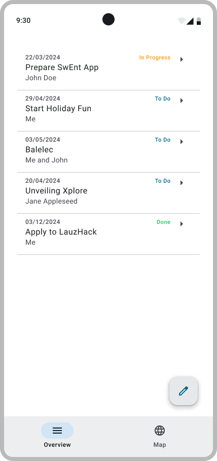

# SwEnt Bootcamp: ToDo App

- [A simple to-do list app](#todo-application)
- [Grading information](#grading-information)
- [Tracking time and tasks](#tracking-time-and-tasks)
- [Deliverables](Deliverables.md)
  - [Milestone B1](Deliverables.md#milestone-b1) due on Tuesday, 17.09.2024
  - [Milestone B2](Deliverables.md#milestone-b2) due on Monday, 23.09.2024
  - [Milestone B3](Deliverables.md#milestone-b3) due on Monday, 30.09.2024

## ToDo Application

  

The app you develop in the bootcamp is a to-do list utility that includes the following functionality:

- Google authentication
- cloud-based backend (Firebase database)
- use of the current location and the Google Maps API
- use of the Nominatim API for geocoding and location-based information

## Grading Information

You will submit your bootcamp by committing to this repository (i.e., `https://github.com/swent-epfl/bootcamp-f24-<your GitHubID>/README.md`).
We will grade your bootcamp by analyzing and testing the code in this repository.

In order to enable you to plan your week relative to your objectives, we split the grading into three tiers:

- Completing the _Bronze_ requirement will earn you the minimum passing grade (4.0)
- Completing the _Gold_ requirements will earn you a very good grade (5.5)
- Completing the _Platinum_ requirements will earn you an exceptional grade (6.0)

For each milestone, we identify the requirements that fall into the Bronze, Gold, and Platinum tiers, respectively.

> [!NOTE]
> We will grade the _Gold_ requirements only if your submission fully satisfies the _Bronze_ requirements, and we will grade the _Platinum_ tier only if your submissions gets full score on the _Gold_ requirements.

We will provide you with _public_ tests as part of the CI, which you can use to sanity-check your deliverables.
There will also be a suite of _private_ tests that we will run against your code during grading.

## Tracking Time and Tasks

To help you learn task estimation and planning, we provide with each milestone a table of the form:

| Status | Task  | Estimated Time   | Actual Time |
| ------ | ----- | ---------------- | ----------- |
| ☐      | Setup | 1 hour           | -           |
| ☐      | ...   | ...              | ...         |

In the _Estimated Time_ column we give you an approximate idea of how long each task should take.
Once you complete a task, replace ☐ with ✅ in the _Status_ column and record how much time you truly spent in the _Actual Time_ column.
Tracking your development activities in this way is good practice and will be crucial during your project, so develop this habit early.

> [!CAUTION]
> There will of course be variance in the amount of time you take relative to our estimates.
> However, do your best to stick to the estimates.
> If you fall too far behind, you will encounter difficulties in finishing the bootcamp before starting your project.
> If you get stuck, follow the advice give in the first lecture on how to get unstuck.

Now proceed to the [deliverables](Deliverables.md). Good luck!

> [!CAUTION]
> Do not modify this file in your repo.
