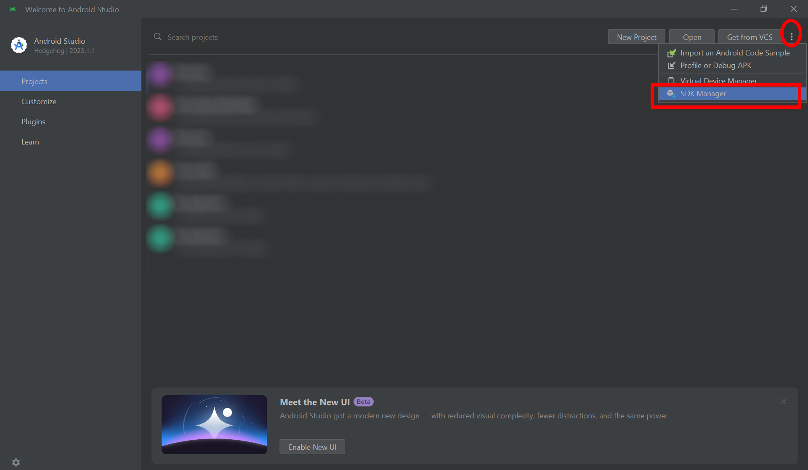
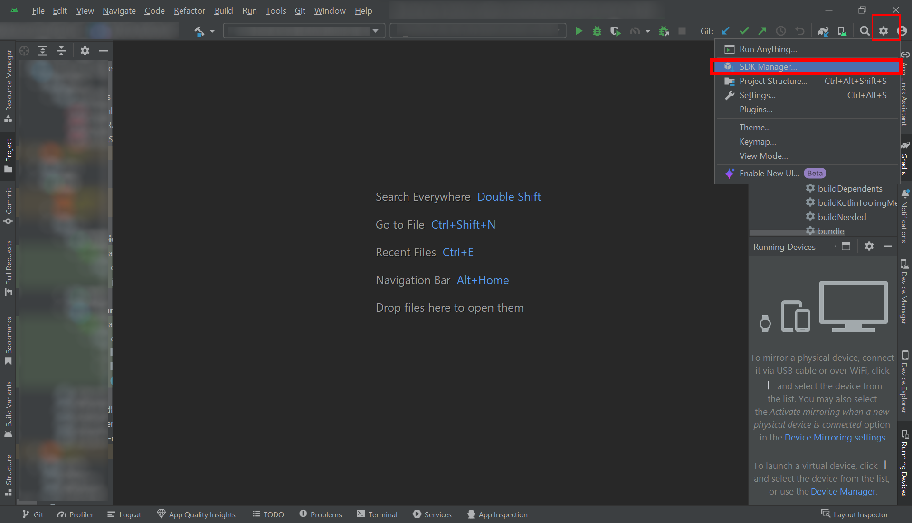
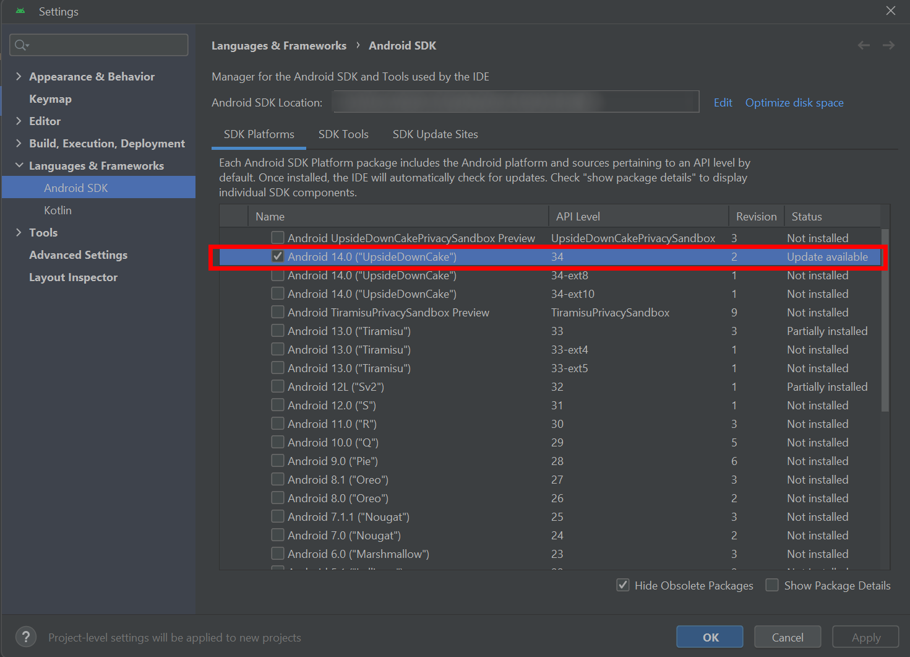
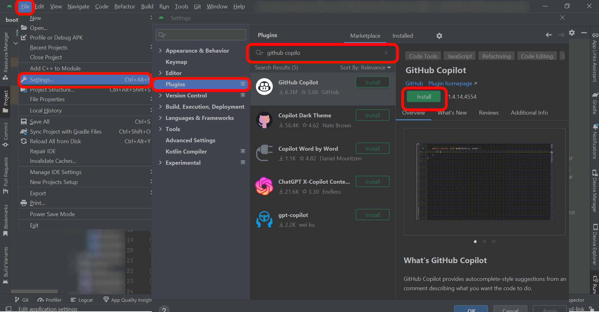
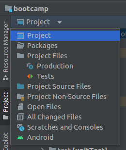
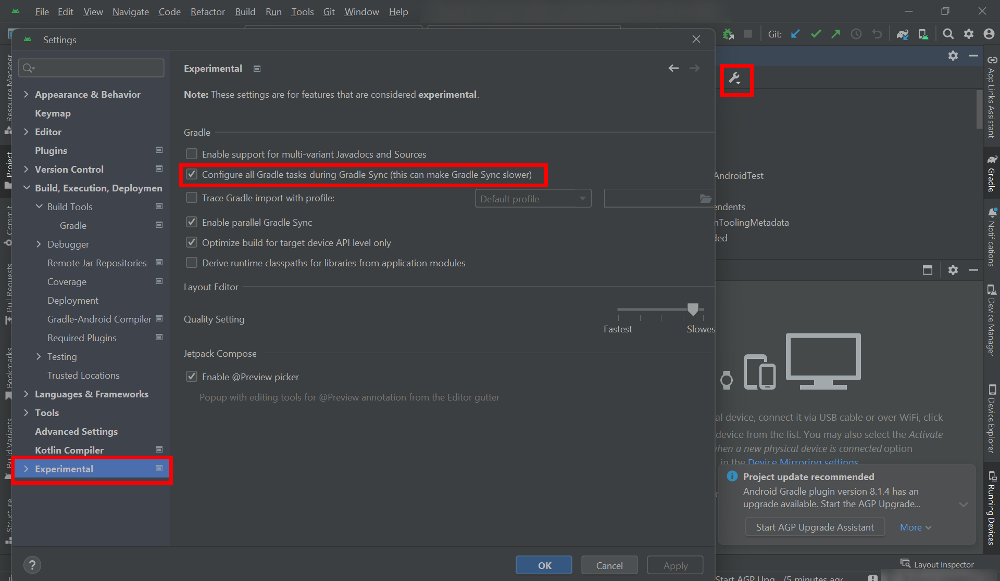
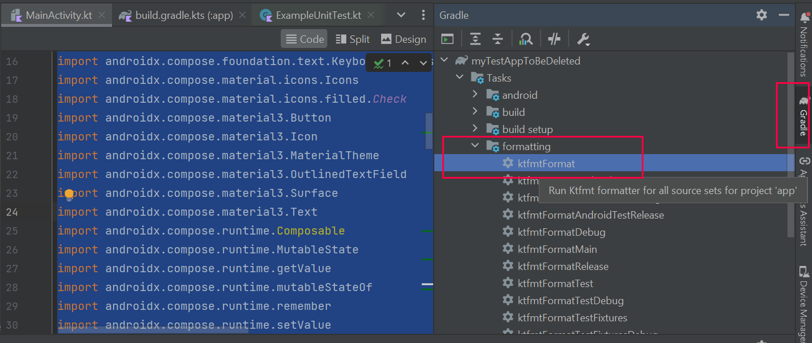
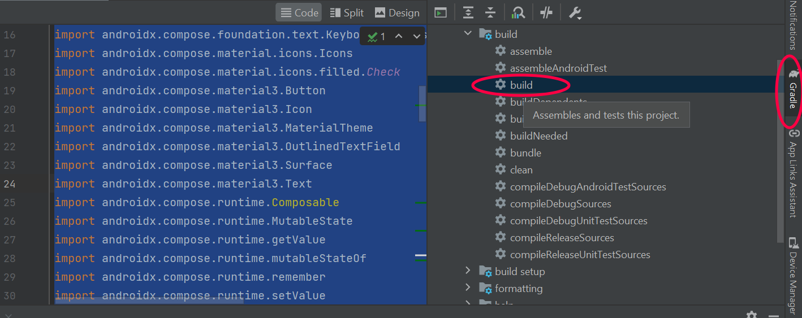
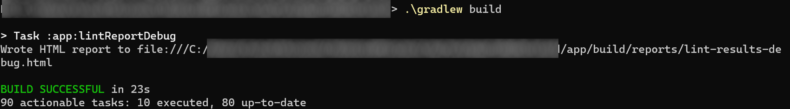

# Setting Up Your Development Environment

## Introduction

We will introduce you to the following tech stack that we **highly recommend** for use throughout the semester:

- Language: Kotlin

- Testing:

  - Espresso - UI Testing

- CI Tools:

  - Github Actions

- Design Tools:

  - Figma - Drafting the UI

> [!IMPORTANT]  
> Certain elements of the tech stack can be modified, but it's crucial to consult with the teaching team to ensure compatibility. Moreover, in case of any issues, we may not be able to provide assistance.

We highly recommend Android Studio as an IDE which is the official recommended one for developers wishing to develop Android apps. You are free to use other tools if you want, but we will not provide support for them.

> [!NOTE]  
> Android Studio supports all mainstream operating systems; you can work on Windows, Mac, or Linux.  
> However, be sure to have at least 16 GB of RAM and a recent CPU, otherwise use [EPFL VDI](https://www.epfl.ch/campus/services/wp-content/uploads/2020/09/Livret_Accueil_VDI_v2.docx)

## Cloning the Repo

Let's start by cloning the **template repository** for the bootcamp, which already has the necessary dependencies & configuration configured.

1. **Install Git**:  
   First, ensure that Git is installed on your system. You can check if Git is installed by running:

   ```bash
   git --version
   ```

   If Git is not installed, please install it.

2. **Navigate to the Desired Directory**:  
   Use the `cd` command to navigate to the directory where you want to clone the repository.

   ```bash
   cd path/to/your/directory
   ```

3. **Clone the Repository**:  
   Use the `git clone` command followed by the repository URL.

   ```bash
   git clone https://github.com/swent-epfl/bootcamp-f24-<GitHub ID>.git
   ```

   or with ssh, [here](https://docs.github.com/en/authentication/connecting-to-github-with-ssh/adding-a-new-ssh-key-to-your-github-account) is guide to set it up

   ```bash
   git clone git@github.com:swent-epfl/bootcamp-f24-<GitHub ID>.git
   ```

## Set Up Android Studio

Download and install Android Studio from [https://developer.android.com](https://developer.android.com), or update it to the latest version if you already have it.
If you need any help, follow the [instructions](https://developer.android.com/studio/install.html).

Choose the default options during installation and during the first-run wizard.
Once you reach the welcome screen, please click on **More Actions** at the top right of the window, and select **SDK Manager**.

<p align="center"></p>

If your Android Screen is already displaying a project (see the following screenshot), then the **SDK Manager** is under the **IDE and Project Settings**

<p align="center"></p>

Then, in the **SDK Platforms** tab, tick the box for **Android 14.0** (API Level 34) and click the "Apply" button to install it.

<p align="center"></p>

After that, in the **SDK Tools** tab, first select **Show Package Details** (at the bottom right),
then tick the box for **Android SDK Build Tool 34.0.0** and click the "Apply" button to install it, if it is not installed already.

Please also feel free to install [Github Copilot](https://github.com/features/copilot)

<p align="center"></p>

Next open the cloned repository in android studio, it should appear as an app with the android logo.

## Managing Project Dependencies and Build Scripts with Gradle

First of all, Android projects use [_Gradle_](https://docs.gradle.org/current/userguide/userguide.html), a common build system in the Java ecosystem that handles compilation, dependencies, testing, and more.
In Gradle, each project is defined using a `build.gradle` file that the tool reads and understands.

> [!NOTE]
> Be aware, there are two syntaxes for the build.gradle :
>
> - `build.gradle`: This uses the Groovy DSL (Domain-Specific Language).
> - **`build.gradle.kts` : This uses the Kotlin DSL and is used by Android Studio**

An Android project actually has two **build.gradle.kts** files.
It's easy to distinguish them since one is located at the root of the project while the other one is located in the `app` folder.

> [!NOTE]
> Android Studio has different views. **Project** show you all the directories while **Android** only show you certain files.

With Android Studio, it can be a bit tricky to distinguish these files depending on the view.
In the Android view, under `Gradle Scripts` in the file explorer, you will find the following:

- **build.gradle** `(Project: ...)`: this is the top-level Gradle file.
- **build.gradle** `(Module: ...)`: this is the app-level Gradle file, i.e. **app/build.gradle.kts**.

<p align="center"></p>

Open now the **`app/build.gradle.kts`**. This file contains the configuration for our app.

In the `android/defaultConfig` section, check that you have those values for the sdk (software development kit).

- `compileSdk = 34`
- `minSdk = 29`
- `targetSdk = 34`

Then, you should also have the `compileOptions` that has both `sourceCompatibility` and `targetCompatibility` set to `JavaVersion.VERSION_11`.  

## The bootcamp dependencies

A [plugin](https://docs.gradle.org/current/userguide/plugins.html) add functionality to a gradle build such as `ktfmt` which is a code formatter.  
A [dependency](https://docs.gradle.org/current/userguide/getting_started_dep_man.html), such as Firestore provide pre-written code to implement specific functionalities more quickly.

The file `gradle/libs.versions.toml` allow us to easily manage our dependencies versions.  
We have defined the dependencies and plugins versions the bootcamp need as variable there.

As your project grows, many libraries may not be compatible and it will make it easier to quickly change versions.  
You can also directly define your libraries in `app/build.gradle.kts` under the section `dependencies` as follow `implementation("androidx.core:core-ktx:1.13.1")`

> [!NOTE]  
> You may have noticed JUnit is set to version 4, not 5.  
> This is because Google does not provide official support for the newer JUnit 5 on Android.  
> Such an incompatibility is a common issue in software engineering.
> That being said, if you're feeling adventurous, you could try [this unofficial plugin](https://github.com/mannodermaus/android-junit5) to use JUnit 5 on Android.

> [!IMPORTANT]  
> After making changes in a `build.gradle.kts` file, Android Studio will show a blue banner at the top of the editor suggesting to "Sync Now", you should do so.  
> You can also manually sync using the "Sync project with Gradle files" at the top right, which should look like an elephant with an arrow pointing downwards.

> If you have a `Gradle Sync Error` on Windows, make sure to run the app in administrator mode.

## Firebase Tutorial

Next we will set up Firebase. It allow our app to sign-in with Google and use Firestore, our database.

- [Firebase Tutorial](../Tutorials/GoogleFirestore.md)

> [!CAUTION]  
> You will need to complete the Firebase Tutorial, as the `google-service.json` is required to run your app.

## Create an Emulator to Run the App

The last thing you need to do before running your new app is to create the emulator on which your app will run.
In Android Studio, use "Tools" > "Device Manager".
A tab will open, guiding you through the creation of your virtual device.
Keep the default phone definition, but make sure you pick **UpsideDownCake** (API level 34) as system image,
which you will need to download using the little arrow next to the image name before continuing.
Keep the default system configuration.
Once done, your virtual device should appear in the Device Manager, which you can now close.

To run your app, you can now use "Run" > "Run 'app'".
It will take a few seconds to start up the emulator and then you will see Android itself start up, followed by your app.

If your emulator crash or is slow, you can use an android phone directly, [here](https://developer.android.com/codelabs/basic-android-kotlin-compose-connect-device#0) is a guide

> [!WARNING]  
> If you're running the emulator on Linux, you may need to manually configure hardware acceleration.
> Follow the [official instructions](https://developer.android.com/studio/run/emulator-acceleration#vm-linux) on how to setup KVM.  
> If you run into the error `/dev/kvm device permission denied` then [this StackOverflow post](https://stackoverflow.com/questions/37300811/android-studio-dev-kvm-device-permission-denied/45749003) will help you troubleshoot it.

## Google Map Tutorial

To be able to use Google Map, we will need an API key :

- [Maps Tutorial](../Tutorials/Maps.md)

## Managing Your Version Control System (VCS)

> [!IMPORTANT]
> We will grade the commit messages you push on your repository, so make sure to follow the guidelines. Refer back to the lecture, and see this [document](../Theory.md#2-commit-messages).

> [!WARNING]  
> Not all files should be committed to VCS!  
> We provided a `.gitignore` for you.  
> Here is what should _not_ be on your github repository:
>
> - `local.properties` : contains information specific to your local configuration
> - `.gradle` folder : [contains caching information](https://stackoverflow.com/questions/17200831/should-the-gradle-folder-be-added-to-version-control)
> - `.idea` folder : contains the settings of your IDE
> - any `.DS_Store` file if you are working on mac
>
> You should have all these files in your `.gitignore` located at the root of your project. Feel free to create this file if   you don't already have it. **Make sure** to [add all the previously mentioned files to your `.gitignore`](https://medium.com/@pouyahallaj/a-short-guide-to-gitignore-your-guide-to-streamlined-version-control-12e853ed57bf)

If you already committed/pushed some of these files, you should [remove them from your repository](https://stackoverflow.com/questions/1143796/remove-a-file-from-a-git-repository-without-deleting-it-from-the-local-filesyste)

You're done. Congrats!

> [Return to the Timeline](Deliverables.md#milestone-b1)

---

# Getting Started with Android

We're going to kickstart your career as an Android software engineer by creating a user-friendly greeting application. This application will ask the user to enter their name and then display a welcoming message.

<p align="center"> </p>

Below is a list of steps we suggest you take to build this app. In addition, you will find some hints below. Try to follow the steps as best as you can. If you get stuck, there are several options:

- Check the hints below.
- Follow the Android documentation links.
- Look up your question in a search engine, including [StackOverflow](https://stackoverflow.com/questions/tagged/android).
- Ask a question in the course forum.

## Introduction to Compose

Jetpack Compose, unlike traditional XML-based layouts, enables you to create UIs entirely in Kotlin code, which is more concise and intuitive. With its declarative syntax, you define the UI's appearance based on its current state, and Compose automatically updates the UI when the state changes. This approach not only minimizes boilerplate code but also improves readability and maintainability. Jetpack Compose allows developers to efficiently create dynamic and interactive user interfaces, enhancing the app development experience.

When a user opens the app, the first thing they see is the UI described in this `MainActivity`. Functionally, this activity will allow a user to log in with their Google Account and be authenticated in the app.

As you can see, the MainActivity already contains a lot of code. This is mostly boilerplate that Android Studio creates, let's see what it contains:

#### The `onCreate` Function

This function is called when the activity is created. It is the entry point of the activity. It is where you will initialize the activity and its components. Inside this function, you will find the function `setContent` which is used to set the content of the activity. In this case, it is set to the `MainActivityTheme` composable. This composable is the root of the UI of the activity. It is where you will define the UI of the activity.
The `setContent` function is called with all composable methods or elements that you want to display in the activity. In this case, the first compose element that you will find is named `BootcampTheme`; it is a composable that defines the theme of the app. It is used to adapt all the elements inside of it with the colors, the typography, the shapes, etc. of the app. You can find more information on how to use it in the [official documentation](https://developer.android.com/jetpack/compose/themes).
Notice that some other files were also created with the activity. These files are used to define the values for the theme of the app. To use the same colors as the mockup, we provided the `Theme.kt` and `Color.kt` files

The Theme component contains itself compose elements that describe what the app displays. The first child of the component is the `Surface` composable. It is used to define a surface that will contain the rest of the UI.

#### The Greeting Composable

The `Greeting` composable is a simple composable that displays a text, it is used to display a welcome message to the user. It is called inside the `Surface` composable. You can see that it is called with a parameter `name`. This parameter is used to display the name of the user. It is a parameter that you will need to provide when calling the composable. You can see that the `Greeting` composable is called with the parameter `name = "Android"`. You can change this parameter to display the name of the user.
This composable is a good example of how to create a simple composable. You can see that it is a function that returns a `@Composable` function. This function is the one that will be called when the composable is used. It is where you will define the UI of the composable. In this case, it is a `Text` composable that displays a text. You can find more information on how to use it in the [official documentation](https://developer.android.com/jetpack/compose/text).

This functional approach is one of the main advantages of Jetpack Compose. It enables us to separate our UI into small, reusable components. This way, we can create a complex UI by combining simple components together. This is what we will do in the next section.

#### The Preview

The last element that you will find in the activity is the `@Preview` function. This function is used to display a preview of the UI of the activity. It is used to see how the UI will look like without having to run the app. It is a very useful feature that will help you a lot during the development of your app. You can find more information on how to use it in the [official documentation](https://developer.android.com/jetpack/compose/tooling#preview).
Every composable that you will create can have a preview. We recommend you to always have one for your composable as it will help you a lot during the development of your app. Simply add the `@Preview` annotation before the composable function and Android Studio will automatically create a preview for you (we will see later how to customize the preview and handle mock data injection for Composables with parameters).

### Adding Texts and Images

In this bootcamp, you will have to follow the mockup/Figma that will define the UI. To do so, we will see relevant composable such as the `Column` or `Row`. This composable is used to display its children vertically with a default spacing between them.
Then we will add the texts and images inside the `Column` composable. To do so, we will use the `Text`, `Image` and `Button` composable. The `Text` composable is used to display a text.
You can find more information on how to implement all the components in the [official documentation](https://developer.android.com/jetpack/compose/components).

Another important composable is the [scaffold](https://developer.android.com/develop/ui/compose/components/scaffold). It allows you to easily separate your UI into sections : Top Bar, Bottom Bar, Content :

```kotlin
@Composable
fun Screen() {
    Scaffold(
        topBar = {
            TopAppBar(
                title = { Text("Greeting App") },
                backgroundColor = MaterialTheme.colors.primary
            )
        },
        floatingActionButton = {
            FloatingActionButton(onClick = { /* Handle FAB click */ }) {
                Icon(Icons.Default.Add, contentDescription = "Add")
            }
        },
        content = { paddingValues ->
            // The middle of the screen
            Column(
                  modifier = Modifier.fillMaxSize().padding(paddingValues),
                  horizontalAlignment = Alignment.CenterHorizontally,
                  verticalArrangement = Arrangement.Center,
              ) {

                GreetingContent()
                Text(text = "Hello World")
                ...
              }
        }
    )
}
```

<p align="center"></p>

### Material component

Material is a catalog of components, that allow you to quickly build your UI. For example, a search bar, Time picker and more !
You can also have a more extensive list of all the components : [Material 3 Compose Catalog](https://www.composables.com/material3).

For understanding which component to use for which element, you can refer to the [Material Design Guidelines](https://m3.material.io/components). This website contains all the guidelines for the design of Android apps. It will help you to understand how to design your app and which components to use. You can also find the Material Design Icons on [this website](https://material.io/resources/icons/?style=baseline).

### Managing the Layout

After adding all the elements of the activity, you will need to manage the layout of the activity and its style.

To do so, you will first need to use the `Modifier` composable. This composable is used to modify the layout of a composable. You can find more information on how to use it in the [official documentation](https://developer.android.com/jetpack/compose/modifiers).
Use this composable to add a padding of 15dp to the `Column` composable.

Also add parameters to the column to make sure that the elements are centered horizontally and vertically.

## Create the Main UI Component

Now, try to implement the following screen in `Greeting` using Composable:

<p align="center"> </p>

First, we want to create the UI component to display our greeting message, which Jetpack Compose component do we need?

<details>
  <summary>Answer - Spoiler warning</summary>
  
  This is a suggestion, there are other answers to this question. However, it is likely that you will use those.
  
  ```kotlin
  Column(
    ...
    OutlinedTextField() // or TextField()
    Button()
    Text()
  )
  ```
  
</details>

### Store the Data

Now that we have a basic UI, we need to store the data. Which kind of Compose Object could we use to store the data?

<details>
  <summary>Answer - Spoiler warning</summary>
  
  In this case, you will most likely use the `MutableState<>` Class from Jetpack Compose that allows the UI to update itself.
  
  You will most likely need to define two of them. One that will update the `OutlinedTextField`, and another one that will update the `Text`.
  
</details>

### App logic

To conclude our app, we need to add an `onClick` action to the button to update the UI. Can you figure out how? Try to find out by yourself.

> [!NOTE]
> The `name` parameter is now useless, you can remove it.

## Testing

Now, you need to set up a few things for the automated tests to be able to navigate your UI. You must add test tags to different components (see [this](sigcheck/README.md)):

- `greetingNameInput`: On the `TextField` where the user will type their name
- `greetingButton`: On the `Button`
- `greetingDisplay`: On the `Text` containing the welcome message

Then, copy the [GreetingTest.kt](tests/GreetingTest.kt) into `app/src/androidTest/java/com/github/se/bootcamp/ui/GreetingsTest.kt`. You can now run the test suites by clicking on the double arrow next to the class name.

## Clean up

This is a good time to clean up your code.
Make sure there are no compiler warnings.
Remove unneeded code where necessary.

Run _Code > Optimize imports_ and _Code > Reformat code_ on all your files, as well as _Code > Inspect code_ to improve the quality of your code.
Run KTFMT from your Gradle.

> [!WARNING]
> Repeat this process on a regular basis as your code base changes.  
> It's up to you to decide which warnings are important enough to address and when.

_To learn more about KTFMT click [here](https://github.com/facebook/ktfmt)_.

If your Gradle task list is empty or nearly empty, please perform the following. First, on the Gradle menu, click on the gear, then on **Gradle Settings**. It will open a new window, where you can click on the **Experimental** tab and then make sure the option "Configure all Gradle tasks ..." is enabled. You may need to resync and build your project if you changed your settings.

<p align="center"></p>

> [!TIP]  
> it is way faster to find your gradle task by typing the command directly.  
> Either in the terminal or in search function

<p align="center">
</p>

<p align="center"></p>

You're done. Congrats!

> [Return to the Table of Contents](Deliverables.md#milestone-b1)
>

---

# Setting up the Continuous Integration

During the bootcamp and throughout the semester, we will utilize GitHub along with GitHub Actions as a Continuous Integration (CI) Pipeline. It enables you to run your tests automatically on a server so that you can be confident your code works not only on your own machine.

During this phase of the bootcamp, we will provide guidance on setting up a basic CI pipeline.

## Enabling workflows

First, you need to enable the workflows on your repository. Go to `https://github.com/swent-epfl/bootcamp-f24-<GITHUB-ID>/actions`, and click on "I understand my workflows, go ahead and enable them":

<p align="center"></p>

## Code Coverage

Throughout the semester we will measure the code coverage with [JaCoCo](https://www.eclemma.org/jacoco/). It will be integrated in the Continuous Integration Script as described below.

<details>
<summary> Optional : details on how it is setup</summary>

>[!CAUTION]
> In the bootcamp, it is already installed.

In your **app/build.gradle.kts**, you have the following existing blocks:

```gradle
android {
    ...
    buildTypes {
        ...
        debug {
            enableUnitTestCoverage = true
            enableAndroidTestCoverage = true
        }
    }
}
```

And the following at the end of the file:

```gradle
tasks.register("jacocoTestReport", JacocoReport::class) {
    mustRunAfter("testDebugUnitTest", "connectedDebugAndroidTest")

    reports {
        xml.required = true
        html.required = true
    }

    val fileFilter = listOf(
            "**/R.class",
            "**/R$*.class",
            "**/BuildConfig.*",
            "**/Manifest*.*",
            "**/*Test*.*",
            "android/**/*.*",
    )
    val debugTree = fileTree("${project.buildDir}/tmp/kotlin-classes/debug") {
        exclude(fileFilter)
    }
    val mainSrc = "${project.projectDir}/src/main/java"

    sourceDirectories.setFrom(files(mainSrc))
    classDirectories.setFrom(files(debugTree))
    executionData.setFrom(fileTree(project.buildDir) {
        include("outputs/unit_test_code_coverage/debugUnitTest/testDebugUnitTest.exec")
        include("outputs/code_coverage/debugAndroidTest/connected/*/coverage.ec")
    })
}
```

> [!TIP]
> If you use tools that generate code, such as [Hilt](https://developer.android.com/training/dependency-injection/hilt-android),
> you should add exclusions for generated code (in Hilt's case, `"**/*Hilt*.*", "hilt_aggregated_deps/**", "**/*_Factory.class2", "**/*_MembersInjector.class"` should work)

Then, sync Android Studio with Gradle using either the banner that pops up at the top of the editor or the button in the top right.
</details>

Running the Gradle task `jacocoTestReport` will generate a coverage report, which will be in `app/build/reports/jacoco/jacocoTestReport/html`.
Open `index.html` with a Web browser to see the report.

> [!CAUTION]
> `jacocoTestReport` must be executed after the tasks `check` and `connectedCheck` as it needs their results.  
> `check` runs all unit tests.  
> `connectedCheck` runs the Android instrumented tests on the emulator or connected device.  
> A simple way to execute all these tasks together is by running `gradle check connectedCheck jacocoTestReport`.

## Robolectric

In Android, there are two ways to execute tests :

1. They can be executed locally, on the host computer.
2. Or they can be executed on an Android phone/emulator, these tests are called Android tests.

By design, UI tests must be executed on a phone/emulator as they need the rest of the Android environment to work. A major issue of this system is that these tests are slow.

[Robolectric](https://robolectric.org/) is a framework designed to counter that. It is basically a complete mock of the Android environment.

Using it is optional for this course, and it's not strictly identical to running the tests in Android.

<details>
<summary>
Optional :  How to Set up Robolectric
</summary>

>[!CAUTION] > In the bootcamp, it is already installed.

To install it, simply add it in the dependencies of the project :

`testImplementation("org.robolectric:robolectric:4.11.1")`

Now, in the usual check pipeline, the unit tests are executed twice, once in debug and once in release. For our project, there are close to no differences between the two and this will only lengthen the tests execution time for no good reason.
To avoid this, we can disable the release unit test task by adding this configuration at the end of our gradle file :

#### build.gradle.kts

```gradle
// Avoid redundant tests, debug is sufficient
tasks.withType<Test> {
    onlyIf {
        !name.toLowerCaseAsciiOnly().contains("release")
    }
}
```

Finally, create the file `app/src/test/resources/robolectric.properties` and add the following text in it :

```properties
sdk=34
qualifiers=w360dp-h640dp-xhdpi
```

This configures the emulated Android phone to run the sdk 34 and set the screen size to a reasonable one.

That's all, you now have robolectric in your project.

### Use Robolectric

To execute a UI test with Robolectric, simply put it inside the test sourceset (as opposed to the androidTest sourceset).

> :warning: As Robolectric executes the UI tests as unit tests and not as Android tests, you need to add the UI testing dependencies in unit test too.\
> To do that, simply duplicate every `androidTestImplementation` dependency and make them a `testImplementation` one.

A major downside of the robolectric UI tests is that there is no visual feedback. This make debugging much harder.
So we advise you to create/debug your UI tests as androidTests, and once you're done, move them in Robolectric.

> :warning: JaCoCo and Robolectric are not perfectly compatible. And while running your tests, the console will be filled with errors like this one :
> `java.lang.instrument.IllegalClassFormatException: Error while instrumenting androidx/core/R$id with JaCoCo 0.8.8`
>
> There are no simple workaround with the current Android Gradle Plugin (AGP), but it does not seem to cause any functionality issue.
</details>

## Continuous Integration with Github Actions

Continuous integration is a central part of modern development, you will see it in detail later in the course. For now, what you need to know is that a CI is basically a script that makes runs tests on your code every time you push changes, to make sure it works as intended. You just need to follow the steps defined below.

### Setting up GitHub secrets

Some of the files required to run your app contains confidential information that you do not want to upload to GitHub (even in a private repository). To avoid doing so but keeping the CI functional, you'll use GitHub secrets. This will allow you to safely upload that information without exposing it.

#### Encoding the file

The files we want to upload that way are the `google-services.json` and `local.properties`. If you have committed it, [remove it from the repository](https://stackoverflow.com/questions/1143796/remove-a-file-from-a-git-repository-without-deleting-it-from-the-local-filesyste).

First, we must convert the file to a string. In this case we could simply open it as a text file, but this is not the case for every file you may have to manage, so we'll do the complete operation.
We will use [Base 64 encoding](https://en.wikipedia.org/wiki/Base64), which encodes any sequence of bytes into a string of printable characters, exactly what we need since GitHub only allows text for the secrets.

- **`google-services.json`**:

  On Linux (in the terminal):

  ```sh
  base64 path/to/google-services.json > base64_google_services.txt
  ```
  
  On MacOS (in the terminal):

  ```sh
  base64 -i path/to/google-services.json -o base64_google_services.txt
  ```

  On Windows (**in the powershell**):

  ```powershell
  [Convert]::ToBase64String([IO.File]::ReadAllBytes("path/to/google-services.json")) > base64_google_services.txt
  ```

- **`local.properties`**:

  The `local.properties` you upload must only contain the MAPS_API_KEY. You can either create a temporary file with only that entry and use the above command, or use

  On Linux and MacOS (in the terminal):

  ```sh
  base64 <<< 'MAPS_API_KEY=<your-key>'
  ```

  On Windows (in the powershell):

  ```powershell
  [convert]::ToBase64String([Text.Encoding]::UTF8.GetBytes("<your-key>"))
  ```

#### Uploading on GitHub

Follow this [tutorial](https://docs.github.com/en/actions/security-for-github-actions/security-guides/using-secrets-in-github-actions#creating-secrets-for-a-repository) to upload the files you created in the previous step to GitHub, with the name `GOOGLE_SERVICES` and `LOCAL_PROPERTIES`.

#### Using the secret

Now, the only thing left to do is retrieve the secret in the CI, to allow the testing jobs to run properly. The step is already in the file provided below.

### Setting up the workflow

During the bootcamp, the Continuous Integration will be executed on a self-hosted machine at EPFL. 

It is defined in `.github/workflows/CI.yaml`. There you will see the script that will run on github.

> [!NOTE]
> The CI consists of two jobs. The first checks that your app compiles add passes tests, which can take some time (up to 10min). The second verifies the user stories exercises from later this week. Until you complete that exercises, **the second job will fail**.

>[!TIP]
> If you encounter the following error `Caused by: java.lang.ClassNotFoundException: org.gradle.wrapper.GradleWrapperMain`  
> Try to run  `gradle wrapper` and push the updated `gradle/wrapper/gradle-wrapper.properties` to github.

Congrats, you're done!

> [Return to the Table of Contents](Deliverables.md#milestone-b1)

---

# Building An APK

During the bootcamp and throughout the semester, you will have to ship regularly some APK build in order to showcase your new features.

In this tutorial, you will learn how to create an APK file and how to install it on your phone.
We recommend running `gradle ktfmtFormat` and optimize your import before building too (on `main` folder > right-click > analyze > code clean Cleanup).

## How To Generate an APK File

Generating an APK is quite an easy task with Gradle.

### With Android Studio

<p align="center"></p>

> [!NOTE]
> If your tasks list is (almost) empty, it means you need to change how Android Studio syncs gradle. See [here](#clean-up)

On the right side of your IDE, simply click on the Gradle logo (same menu as for KTFMT). Then search for the build section and run the build command.

<br>
Once the build is finished, go in the directory of your app in your file system and you will find your APK build in the following directory:

`%YourAppFolder%/app/build/outputs/apk/debug`

### Without Android Studio

<p align="center"></p>

Without Android Studio, simply execute the following command at the root of your project:
`./gradlew build`.

Then, you will find your built APK in the following directory:
`%YourAppFolder%/app/build/outputs/apk/debug`

## How To Install the APK on Your Phone

You can use a website such as [https://www.diawi.com/](https://www.diawi.com/) to install the app on your phone. The process is simple; you just need to upload your APK file and follow the instructions.

---
You're done. Congrats!

> [Return to the Table of Contents](Deliverables.md#milestone-b1)
