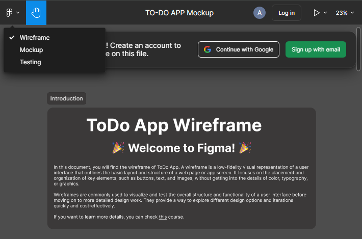
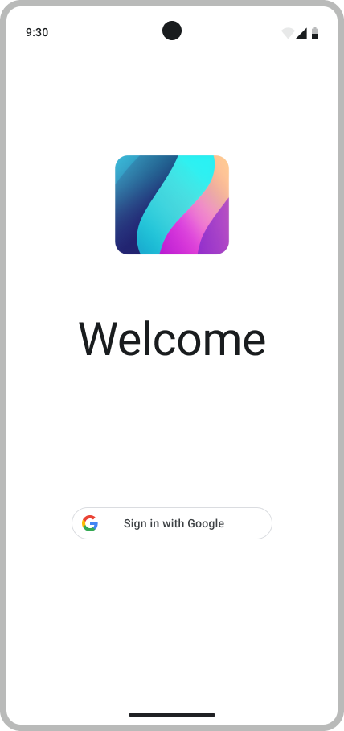
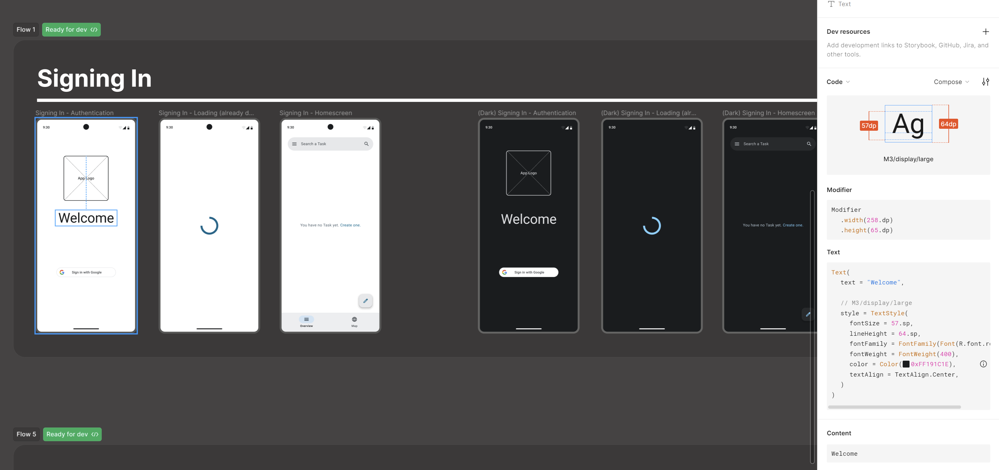
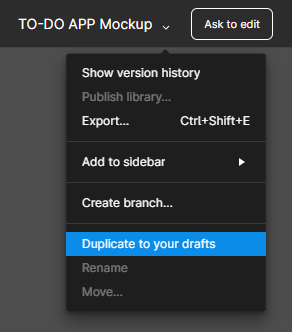

# Discovering the App

Let's start by discovering the app mockup. You can find it on [Figma](https://www.figma.com/design/IDm3NGS988Myo01P0Wa0Cr/TO-DO-APP-Mockup-FALL?node-id=435-3350&node-type=CANVAS&t=BZ8aut9M3fNlPJ8t-0).
Figma is a tool that allows you to create a visual representation of what you want your app to be. You will use it to create your own mockup in the future.
For now, you can just look at the mockup and try to understand what the app is supposed to do.

In the Figma file, you will find 2 pages (on the top left corner):

- The first one is the wireframe of the app. It shows the different screens of the app and how they are linked together. The goal of this page is to describe the elements of the app and how the user will navigate through them.
- The second one is the mockup of the app. It shows how the app will look like. The goal of this page is to describe the visual aspect of the app.

<p align="center"></p>

All the concepts are further detailed in the pages. You will also find advice on how to use Figma at its best for the implementation of your app. Refer to the design shown to recreate the app as close as possible to the mockup (some elements might however need adaptation).

For the implementation of the app's UI, we will use Jetpack Compose along with Material 3, which is the new standard of Android app development. It enables you to create your UI in a functional way, which results in a more concise code, with reusable components.
For more information on Jetpack Compose, you can refer to the [official documentation](https://developer.android.com/jetpack/compose) or you can inspect the code of the official [Jetpack Compose samples](https://github.com/android/compose-samples).

> [!CAUTION]
> Please follow the signature of the functions provided in the [<code>sigcheck</code> folder](../sigcheck/README.md) to ensure that your code is compatible with the grading. It will also help you to have a better code structure.

<p align="center"></p>

To begin our journey, we should already have a [Main Activity](../Setup.md#introduction-to-compose).

## Managing the Layout

Try to add all the basic elements to have a similar structure of the screen above.
After that, you will need to manage the layout of the activity and its style.

To do so, you will first need to use the `Modifier` composable. This composable is used to modify the layout of a composable. You can find more information on how to use it in the [official documentation](https://developer.android.com/jetpack/compose/modifiers).
Use this composable to add a padding of 15dp to the `Column` composable.

Also add parameters to the column to make sure that the elements are centered horizontally and vertically.

For the text, you can directly follow the style generated in Figma in the DevMode.

> [!NOTE]  
> To use Figma DevMode, you will need a [student license](https://www.figma.com/education/) (you will need to provide your enrollment certificate from [ISA](https://isa.epfl.ch/imoniteur_ISAP/!farforms.htm?x=impatt&ww_c_unite=EPFL&zz_loginIsaRequis=1))
> And you must clone the project by using "duplicate to your drafts."  
> If you still cannot access DevMode in your draft, it might be because the draft has been saved to one of your teams and not your personal project.

> [!IMPORTANT]
> You will not be graded on the style of your app for the bootcamp

<p align="center"></p>
<p align="center"> </p>

For the button, the style is a bit more complex. You will need to use the `shape` parameter of the `Button` composable to have a Rounded Corner Shape. You will also need to use the ButtonDefaults to change the color of the button. Moreover, add a start and end padding of 16dp to the button, and wrap its size to the content.
The content is composed of a Google logo image of size 24dp and a text with padding 6dp.

### Linking the UI to the Sign-in Feature

In order to link the UI to the sign-in feature, you will need to use the `rememberLauncherForActivityResult` function. This function is used to create a launcher for an activity result. This will enable you to launch a Google Sign-In activity and get the result of the sign in.

> [!WARNING]  
> Look at the [Google Authentication tutorial](../../Tutorials/GoogleAuthentication.md) to see how to implement it.

Once the user is signed in, you will need to navigate to the Main Activity's other screens (we will see how to create them in the next section, as well as handling the Jetpack Compose navigation). For now, you can simply show a toast, see the [documentation](https://developer.android.com/guide/topics/ui/notifiers/toasts).

In Android development, the navigation between activities is done with the `Intent` class. In this case, we will not use it to navigate to other parts of our app. However, it is useful that you understand this concept, as it is the way you can open activities from other apps and when you need another activity in your app. You can find more information on how to use it in the [official documentation](https://developer.android.com/guide/components/intents-filters?hl=en).

To inform the user whether the login is successful or has failed, we will use a [Toast](https://developer.android.com/guide/topics/ui/notifiers/toasts) to display a short notification.

The `Toast` should be invoked inside the callback of a coroutine or within a callback function, rather than directly inside a Composable, because Composables recompose and should remain side-effect-free. A similar feature exists in Jetpack Compose called a [Snackbar](https://developer.android.com/reference/com/google/android/material/snackbar/Snackbar), which is more integrated with Compose and can be controlled via state.

Here’s an example of using a `Toast`:

```kotlin
Toast.makeText(context, "Login successful!", Toast.LENGTH_LONG).show()
```

For debugging purposes, you can also use `Log.d` for informational messages and `Log.e` for error messages. These logs can be viewed using the [Logcat](https://developer.android.com/studio/debug/logcat) view in Android Studio.

## Validate your work

There are no Signature checks for this story.

[UI Test Tag](https://www.figma.com/design/IDm3NGS988Myo01P0Wa0Cr/TO-DO-APP-Mockup-FALL?node-id=435-3541&node-type=SECTION&t=G6De7qCsUE3haq35-0)

Test files:

- [`LoginTest.kt`](../tests/LoginTest.kt) -> `app/src/androidTest/java/com/github/se/bootcamp/ui/authentication/LoginTest.kt`

---

> [!NOTE]  
> Please click [here](UserStory.md#1-sign-in-and-login) to come back to the corresponding user-story.
> Remember to check the SigCheck description [here](../sigcheck/README.md) while implementing the Activity.
