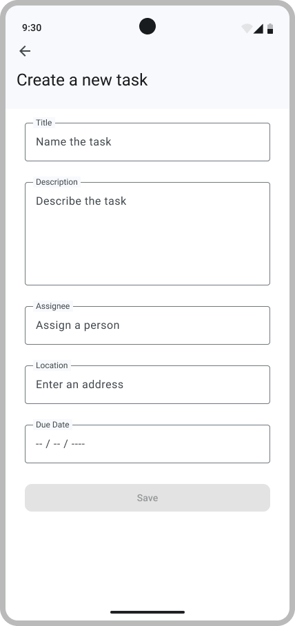
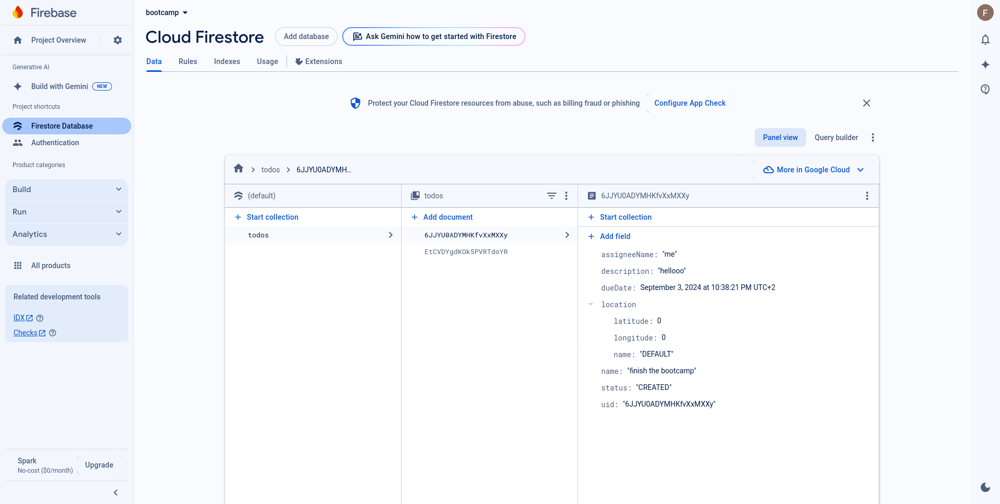

# 2. Create A ToDo

## Single vs. multiple activities

Traditionally, an Android app is composed of multiple activities, each representing a screen or UI component, and each activity is responsible for managing its own UI and user interactions (as taught in lecture [[slides](../../../../lectures/Wk1.B%20-%20The%20Mobile%20Platform.pdf) | [video](https://www.youtube.com/watch?v=mEdngNGmdIY)]). 

However, with Jetpack Compose (Android's modern UI toolkit), the design philosophy is simpler: it encourages a single-activity architecture, where the entire UI is made of composable functions inside one activity.
These functions describe how the UI should look based on the current app state.
Instead of switching between activities, Compose uses the [Navigation](https://developer.android.com/guide/navigation) component (from the Jetpack libraries) to navigate between different composable screens within the same activity&mdash;this keeps everything within a single activity, while still allowing for complex navigation. Compose is reactive, so the UI updates automatically when the app’s state changes, which simplifies managing UI state across different parts of the app.

> [!INFO]  
> You might find it used to check out the [Modern Android Development (MAD)](https://developer.android.com/modern-android-development) guidelines.

> [!WARNING]  
> Jetpack Compose is quite recent in the Android universe.
> Even though more than half of Android developers have started using Jetpack Compose in some capacity, there are still plenty of articles and tutorials that use multiple activities and UI fragments. 
> Do not let that confuse you&mdash;for the bootcamp, you will not need fragments or multiple activities.

<p align="center"> </p>

## Implement navigation

In order to display something else after you sign up, you will need a proper navigation system.

First, let's clearly define our app screens/UI :

For the previously implemented sign-in, create the directory `authentication` at `app/src/main/java/com/github/se/bootcamp/ui/`.  
Then create a Kotlin file : `authentication/SignIn.kt`.  
Inside this file, create the composable `SignInScreen` and add your sign-in implementation there.

Next, create a folder `overview` in `app/src/main/java/com/github/se/bootcamp/ui/`.  
Then create `Overview.kt` and `AddToDo.kt` there, containing respectively the `OverviewScreen` and `AddToDoScreen` composables (only containing a text with the name of the screen for now).  

Finally, create a folder `map` in `com/github/se/bootcamp/ui/`.  
Then create `Map.kt`, with the `MapScreen` composable (only containing a text with the name of the screen for now).

Now implement the [Navigation system](../../Tutorials/Navigation.md).

You will need to define the Scaffold in every screen, and you can choose to display the `BottomNavigationMenu` if it's relevant to the screen.
In `AddToDo.kt`, add a Scaffold with only a [TopAppBar](https://developer.android.com/develop/ui/compose/components/app-bars) to be able to go back to the previous visited screen.

The creation of a to-do occurs on the overview screen, so it should only consist of a Scaffold for the moment.
You will need to add a [Floating Action Button](https://developer.android.com/develop/ui/compose/components/fab) to navigate to the Add ToDo screen.

<p align="center"></p>

Before moving on, make sure that your navigation works and that you can navigate between the Map, Overview, and Add a Todo screens.
Set some Text in the content of each Scaffold to be able to see which composable is shown.

> [!TIP]  
> Your composables will need to take as parameters `navigationActions: NavigationActions`

> [!WARNING]  
> We used `Greeting.kt` for B1, but will not be using it in the rest of the bootcamp. Nevertheless, for grading purposes, you should not delete it.

## Model for the ToDo

The ToDo app follows the [MVVM architecture](../../Theory.md#4-implementing-the-mvvm-pattern) to separate the logic of the app from the UI. There are four elements:

- The Model is the data of the app, and it defines the type of data that will be used by the app.
- The Repository is where the data comes from.
- The View is the UI of the app&mdash;this is what the user sees.
- The ViewModel is the logic of the app&mdash;this is what will be executed when the user interacts with the app.

You will need to create the folder `app/src/main/java/com/github/se/bootcamp/model/todo` and a file `ToDo.kt` inside it.
Add all the following classes to this file :

- `ToDo`: This `data` class represents a to-do of the app, and contains the following properties:

  - `uid`: the unique `String` id of the to-do
  - `name`: the name of the to-do
  - `description`: the description of the to-do
  - `assigneeName`: the name of the person assigned to the to-do
  - `dueDate`: the due date of the to-do (use `com.google.firebase.Timestamp` for the format)
  - `location`: the location of the to-do
  - `status`: the status of the to-do (see the enum below)

- `ToDoStatus`: This `enum` class represents the status of a to-do, and contains the following members:

  - `CREATED`: the to-do is not done yet
  - `STARTED`: the to-do is in progress
  - `ENDED`: the to-do is done
  - `ARCHIVED`: the to-do is archived

You will need to create the folder `app/src/main/java/com/github/se/bootcamp/model/map` and a file `Location.kt` inside it.
Add all the following classes to this file :

- `Location`: This `data` class represents a location, and contains the following properties:
  - `latitude`: the latitude of the location (`double`)
  - `longitude`: the longitude of the location (`double`)
  - `name`: the name of the location

> [!NOTE]  
> Even if the location is unrelated to the current user story, to avoid future issues, we directly implement it in the model.

### Creating the Repository interface

The app will need to do the following with the database:

- obtain new UIDs
- obtain stored to-dos (one at a time, or all of them at the same time)
- update stored to-dos
- add new to-dos to the database
- remove to-dos from the database

This translates to the following interface :

```kotlin
package com.github.se.bootcamp.model.todo

interface ToDosRepository {
  fun getNewUid(): String
  fun init(onSuccess: () -> Unit)
  fun getToDos(onSuccess: (List<ToDo>) -> Unit, onFailure: (Exception) -> Unit)
  fun addToDo(toDo: ToDo, onSuccess: () -> Unit, onFailure: (Exception) -> Unit)
  fun updateToDo(toDo: ToDo, onSuccess: () -> Unit, onFailure: (Exception) -> Unit)
  fun deleteToDoById(id: String, onSuccess: () -> Unit, onFailure: (Exception) -> Unit)
}
```

In `model/todo`, create a file `ToDosRepository`, then paste the above code.

### Implementing the Firestore Repository

Now it’s time to implement the interface in a class named `ToDosRepositoryFirestore`.
This class will be the bridge between the database, [Firestore](https://firebase.google.com/docs/firestore), and the rest of the app.
Firestore manipulates objects as `Map<String,Any>`, so converting from and to Maps will be necessary.

To do so, in `model/todo` create a file `ToDosRepositoryFirestore`.

```kotlin
class ToDosRepositoryFirestore(private val db: FirebaseFirestore) : ToDosRepository {

  private val collectionPath = "todos"

  ...
}
```

All methods of the class `ToDosRepositoryFirestore` should log the error when something fails, using `Log.e()`.

Tips:

- Use `document.get("fieldName")` to retrieve data fields from a Firestore document. You can also use the getter method for the data type, such as `getString()`, directly.
- Create a helper method to convert a `DocumentSnapshot` from Firestore into your `ToDo` data class. You may not need the inverse.
- Use `addOnCompleteListener` with `result.isSuccessful` and `result.exception` to invoke the `onSuccess` and `onFailure` callbacks
- To detect failures of the FirestoreDatabase, use a `try`-`catch`, you can also look into the method `addOnFailureListener( listenerResponse : (Exception) -> Unit )`.
- If you are still not sure how to use the `Task` type, explore the examples in the Firestore code.
  Links you might find useful:
  - <https://firebase.google.com/docs/firestore>
  - <https://firebase.google.com/docs/firestore/query-data/get-data>
  - <https://firebase.google.com/docs/firestore/manage-data/add-data>

### Creating the ViewModel

For now, our viewModel will only serve to call the methods of our repository : get new uid and add to do. Place it in a new file `ListToDosViewModel` in `model/todo`.

```kotlin
package com.github.se.bootcamp.model.todo

class ListToDosViewModel(private val repository: ToDosRepository) : ViewModel() {
}
```

> [!NOTE]  
> To create a todo, you will need to generate a new uid.
> For now, upon successfully creating a to-do, you should display a [Toast](https://developer.android.com/guide/topics/ui/notifiers/toasts) to inform the user. Later, this should redirect them to the overview screen.

## Create a ToDo Screen

<p align="center"></p>

Remember the `Greeting`composable from B1?
This will be quite similar.

However, entering a Date can be quite tricky. 
For simplicity, we will use strings in the format `DD/MM/YYYY`.
When the user wants to save the ToDo, you can convert the string to a `Timestamp` by using the [`Calendar`](https://docs.oracle.com/javase/7/docs/api/java/util/Calendar.html) interface and its implementation `GregorianCalendar`.

> [!IMPORTANT]
> For compatibility with the our tests, always set the hours, minutes and seconds to 0.

> [!NOTE]  
> For the moment, hard-code a `val` `Location` for the creation of a ToDo, and have a placeholder `OutlinedTextField`. 
> In B3 you will implement the [`Nominatim API`](https://nominatim.org/).

```kotlin
@Composable
fun AddToDoScreen(listToDosViewModel: ListToDosViewModel, navigationActions: NavigationActions) {...}
```

## Error handling

There are a number of things that could fail: the date might be incorrectly formatted, the call to the repository might result in an error, etc.

There are several ways to handle these cases:

- Log the error message (using the `Log` class)
- Show a [`Toast`](https://developer.android.com/guide/topics/ui/notifiers/toasts) to the user
- Display an error message in the Composable using a state (in Jetpack Compose parlance, this means storing the error message in a mutable state and updating the UI to show that message when an error occurs)

The ideal approach is to display the error message, either reactively with a state or with a `Toast`, but in the context of this bootcamp, it's acceptable to only log the error message.

## Run it

To test your app, navigate to the Add ToDo screen, then create a ToDo.
You should see a confirmation toast.

Next, open Firebase, go under the _Firestore_ section, and you should see the following :

<p align="center"></p>

## Validate your work

Follow these steps to validate your implementation:

1. **Run the signature checks**  
   Execute the [sigcheck](../sigcheck/AddToDosSignatureChecks.kt) for this user story.
   See the [sigcheck README](../sigcheck/README.md) for details.

2. **Verify UI elements**  
   Make sure your UI matches the provided design mockups. Check [the Figma design](https://www.figma.com/design/IDm3NGS988Myo01P0Wa0Cr/TO-DO-APP-Mockup-FALL?node-id=435-3350&node-type=CANVAS&t=sv1SW1HVH5J4WQlx-0) and ensure that all relevant UI components are correctly tagged for testing and match the design specifications.

3. **Run tests**  
   Copy the following test files to the right places and run them to validate the functionality of your app:  
   **Android Test**
   - [`AddToDoScreenTest.kt`](../tests/AddToDoScreenTest.kt) to `app/src/androidTest/java/com/github/se/bootcamp/ui/overview/AddToDoScreenTest.kt`

   **Unit Test**
    - [`NavigationActionsTest.kt`](../tests/NavigationActionsTest.kt) to `app/src/test/java/com/github/se/bootcamp/ui/navigation/NavigationActionsTest.kt`
  
   - [`ListToDosViewModelTest.kt`](../tests/ListToDosViewModelTest.kt) to `app/src/test/java/com/github/se/bootcamp/model/todo/ListToDosViewModelTest.kt`
   - [`ToDosRepositoryFirestoreTest.kt`](../tests/ToDosRepositoryFirestoreTest.kt) to `app/src/test/java/com/github/se/bootcamp/model/todo/ToDosRepositoryFirestoreTest.kt`