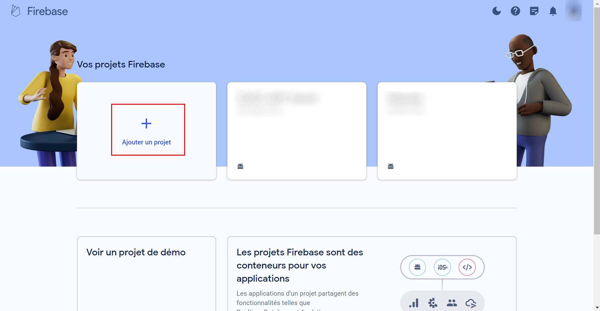
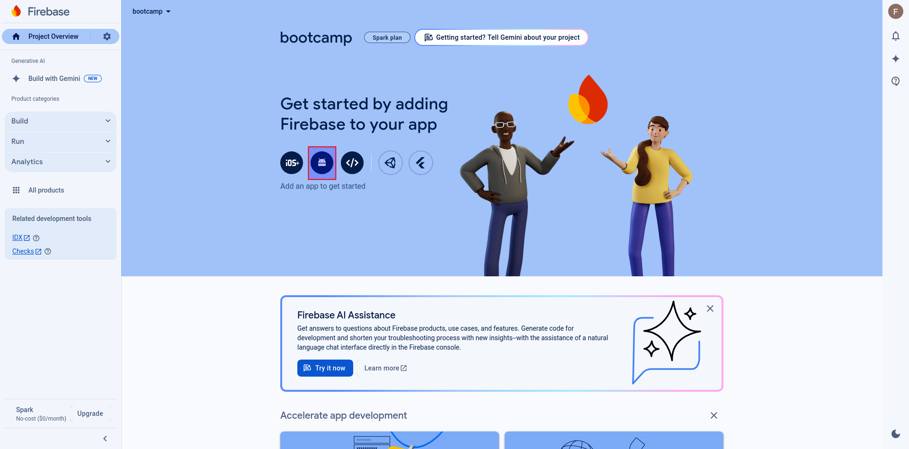
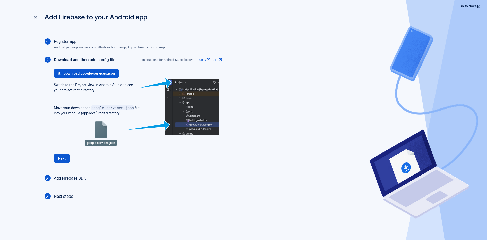
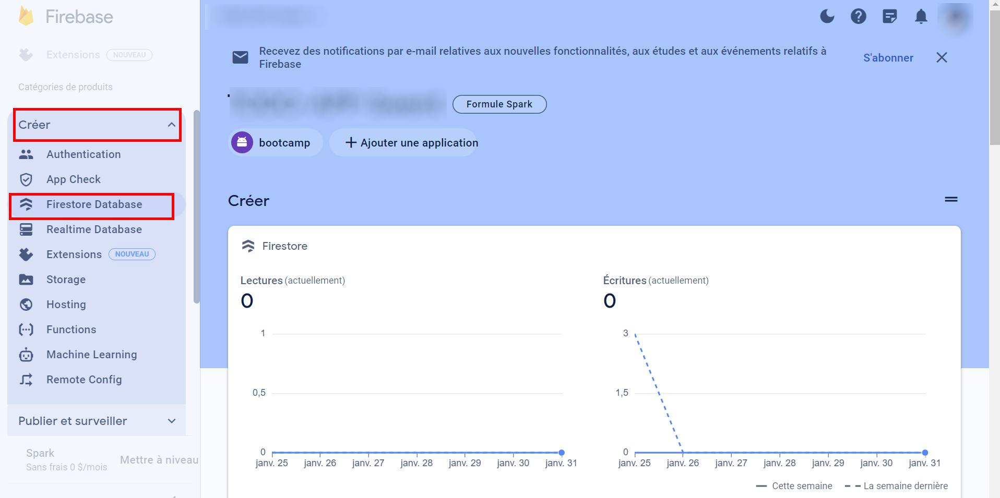

# 2 - Google Firebase - Introduction

## Introduction

Firebase is a popular backend platform developed by Google and often used for building Android applications. More specifically, it offers real-time databases and a more recent version called Firestore, authentication systems and other cool API services that you can check out on their [website](https://firebase.google.com/products-build).

Firebase's Firestore database is a NoSQL cloud database that follows a key-value store model. For a detailed overview of its features, see the official [documentation](https://firebase.google.com/docs/firestore).

## Objective

The goal of this bootcamp is to get you started using Firebase's Firestore database.

We will help you set up your account and connect it to your app.

## 1 - Setting Up Firestore for our App

<p align="center"></p>

First go to <https://console.firebase.google.com> using a Google Account (NOT EPFL). There, you will need to click on 'Create a project'. Then, you will enter the project setup, name it "bootcamp" and disable analytics.

Once the project is created, go to its 'Overview' page. You can access it via the console (link above) by clicking on the project panel with your project's name.

We need to add the Android app to the project. On top of the 'Overview' panel, below the name, click on the 'Add app' button. Then click on the Android button (a little Android logo, the robot one). Follow the instructions as needed on the page (shown in the picture below).

<p align="center"></p>

Under **package name**, enter `com.github.se.bootcamp`.

Next, you will need to put the `google-services.json` in your project **under the `app` folder**.  
Do not commit the file to your repository, as it contains sensitive IDs. Later we will see how we can safely add it to github.  
If you forgot to download the JSON file :

- Go back to the Firebase console.
- Go to the settings of the project (top left of the webpage).
- Under the 'General' tab, go to the bottom and under 'Your apps' you will find the json file.

<p align="center"></p>

Regarding the 'Adding the SDK of Firebase' you may ignore it as it is already present in the project template.

To add the **Firestore**, the database, itself to the project, go to 'All products' (on the left side of the website). Click on 'Cloud Firestore'. Then click on 'Create database'.

<p align="center"></p>

Select "eur3" for the database location. Click "next" and select 'Start in test mode', as this will allow reading and writing for enough time without concerning ourselves with security.
Then click 'Create'. You have a Firestore database ready to go!

### Libraries (Optional)

The libraries required for Firebase <span style="color:red">**are already in the provided template**</span>. Here is the list, take a look at it to understand how it is constructed as you will need to add some yourself in the project.

1. `libs.versions.toml`

   ```toml
    # gradle/libs.versions.toml

    [versions]
    gms = "4.4.2"

    # Firebase Libraries
    firebaseAuth = "23.0.0"
    firebaseAuthKtx = "23.0.0"
    firebaseDatabaseKtx = "21.0.0"
    firebaseFirestore = "25.1.0"
    firebaseUiAuth = "8.0.0"


    [libraries]
    # Firebase Libraries
    firebase-auth = { module = "com.google.firebase:firebase-auth", version.ref = "firebaseAuth" }
    firebase-auth-ktx = { module = "com.google.firebase:firebase-auth-ktx", version.ref = "firebaseAuthKtx" }
    firebase-database-ktx = { module = "com.google.firebase:firebase-database-ktx", version.ref = "firebaseDatabaseKtx" }
    firebase-firestore = { module = "com.google.firebase:firebase-firestore", version.ref = "firebaseFirestore" }
    firebase-ui-auth = { module = "com.firebaseui:firebase-ui-auth", version.ref = "firebaseUiAuth" }
   ```

2. Top-level `build.gradle.kts`:

   ```kotlin
   # build.gradle.kts
   plugins {
       alias(libs.plugins.gms) apply false
       ...
   }
   ```

3. `app/build.gradle.kts`:

   ```kotlin
   # app/build.gradle.kts
    dependencies {
        // Firebase
        implementation(libs.firebase.database.ktx)
        implementation(libs.firebase.firestore)
        implementation(libs.firebase.ui.auth)
        implementation(libs.firebase.auth.ktx)
        implementation(libs.firebase.auth)
        ...
   }
   ```

4. **Sync your Gradle project**

### Summary

By defining the Firebase and Google Play services libraries in `libs.versions.toml`, you centralize the management of library versions, making it easier to update and maintain dependencies across your project. This approach keeps your `build.gradle.kts` files clean and focused on their specific configuration needs.

## Tutorials

You can find many resources online about Firebase's Firestore database.

Here is its official [documentation](https://firebase.google.com/docs/firestore).

Feel free to look online for videos, forums, and other websites explaining the core functionalities of Firebase. The best way to start practicing is to program elementary functions that gradually become more complicated.

## Remarks

Below are three important aspects that you may need in your database at a later date.

- Firebase has listeners that are triggered automatically when the value at a particular key changes. For more information, look up "Firebase event listeners" on the Internet.

- Firebase as we have used in the bootcamp is **not** concurrent. You will have to use [transactions](https://firebase.google.com/docs/firestore/manage-data/transactions) to achieve this.

- Values can be automatically serialized to strings when stored in Firebase. This is particularly useful as it allows you to store Kotlin objects directly in your database.

---
Congrats, you're done!

> [Return to the Set Up](../ToDoApp/Setup.md#firebase-tutorial) \
> [Return to the Table of Contents](../../README.md#table-of-contents)
