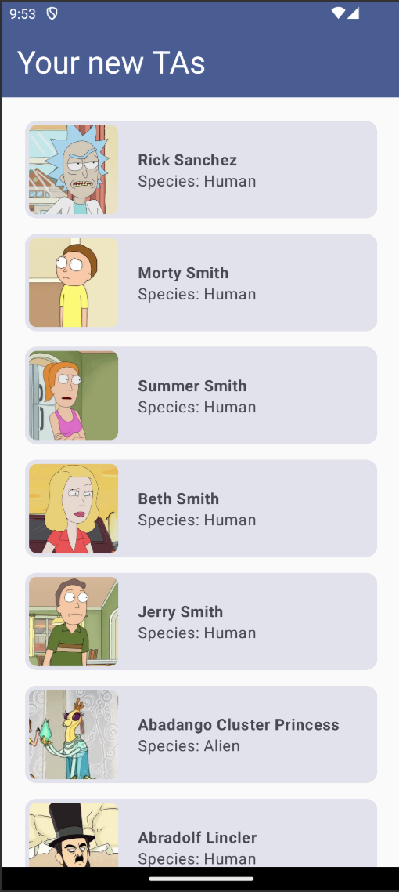

# _Model View ViewModel (MVVM) in Android: Rick and Morty Character Explorer_

<p align="center">

</p>

In this project, you will learn how to implement the MVVM pattern on Android by building a simple Rick and Morty Character Explorer. This app utilizes the [Rick and Morty API](https://rickandmortyapi.com/documentation) to display characters from the show.

It is also an opportunity to see examples of how to use simple Kotlin features, and Jetpack Compose to build the UI. Remember to always check for documentation online if you are stuck or if you are not sure about something!

We will guide you through the project step by step so that you hopefully have an overview of what a (simple and basic) android app looks like.

## Step 1: Project Overview, get familiar with the codebase!

The project is organized into several key packages, aligning with the MVVM architecture. For each part, you will need to fill in a bit of code.

This project showcases the connection between MVVM, LiveData, ViewModel, and Jetpack Compose, enabling efficient UI development with automatic and reactive UI updates.

Read through the codebase, it's not a lot but it's important to understand what's going on before you start coding. Here's a brief overview of the different parts of the app:

### 1. Model
The model part of the app, in `com.swent.mvvm.model` contains the data models, repository interfaces, API endpoints. Here's an overview:

- The `model/data/Character` represents a character from the show. Think of it as an object: the character's name, species, and profile picture, this is what we want to display to the user, bascially relevant data on the character.

- The `model/repository/CharacterRepository` outlines methods for fetching character data.

- `model/api/` hosts the API service interfaces and Retrofit implementations for network calls, where the `RickAndMortyApiService` class is responsible for defining endpoints.

> Head over the codebase now, and take a look at the model package, notice what TODOs are there, we will fill them in!

### 2. View Model
The view model part, `com.swent.mvvm.viewmodel` encompasses the ViewModel layer. The `CharacterViewModel` class handles data (from the model) fetching logic and exposes character data to the UI layer. In MVVM architecture, it acts as the bridge between the UI layer and the data model, managing UI-related data in a lifecycle-conscious way.

In other word, the `ViewModel` is responsible for preparing and managing the data for the UI, and it also handles the communication of the UI with the model. 

View model has some LiveData:
- **CharacterViewModel:** Utilizes the **repository** to fetch data and stores the result in a `MutableLiveData`, `_characters`, exposing it as immutable `LiveData`, `characters`, for the UI to observe. This ensures data is only modifiable within the `ViewModel`, maintaining a clean architecture.

**Note!** By live data we do not mean live data from the web (even if it could be, but not in this exercise).

> Head over the codebase now, and take a look at the viewmodel package.

### 3. View
Finally, the view, `com.swent.mvvm.view` includes UI components. The `MainActivity` class serves as the entry point of the app, and `CharacterListScreen.kt` in the `/screen` submodule is responsible for rendering for the our screen, and all elements in it. Notice how this view inherits from `ViewModel`.

> Head over the codebase now, and take a look at the view package. The content inside `/theme` was auto-generated, so you can ignore it for now.


## Step 1: Fetching Data with Retrofit

In this step, you will discover how to use [Retrofit](https://square.github.io/retrofit/) to make network calls.

[Retrofit](https://square.github.io/retrofit/) is a library that makes it easy to make network calls in Android, with little to no boilerplate code. Along with the GSON library, it allows [JSON](https://www.w3schools.com/js/js_json_intro.asp) responses (a very widely used data representation format, usually for APIs) to be converted to Kotlin objects.

First of all, what is the data that we want ot fetch? What does it look like? Structure? How to call it? We are using the [Rick and Morty API](https://rickandmortyapi.com/documentation) to fetch characters from the show.

Upon inspection, we find that we will be calling https://rickandmortyapi.com/api/character to get what we need! This returns a list of characters in the following format:

```json
{
  ...
  "results": [
    {
      "id": 1,
      "name": "Rick Sanchez",
      "status": "Alive",
      "species": "Human",
      "image": "https://rickandmortyapi.com/api/character/avatar/1.jpeg"
      ...
    },
    {
      "id": 2,
      "name": "Morty Smith",
      "status": "Alive",
      "species": "Human",
      "image": "https://rickandmortyapi.com/api/character/avatar/2.jpeg"
      ...
    },
    ...
  ]
}
```

We can see that we have a list of objects called `results`, where each object seems to represent a character. Each has an `id`, `name`, `status`, `species`, and `image`, and more... 

To represent a character, we create a data class `data/Character` with the fields we are interested in.

```kotlin
data class Character (
    /** The name of the character. */
    val name: String,

    /** The species of the character. */
    val species: String,

    /** The URL of the character's image. */
    val image: String
)
```

In Retrofit, you define an interface that describes the API you want to call. For example, if you want to call the Rick and Mort API, you can define an interface like this. We send a `GET` request to the `/character` endpoint. Here is the syntax used:

```kotlin
interface RickAndMortyApiService {
    @GET("character")
    suspend fun getCharacters(): Response<CharactersResponse>
}
```

This interface defines a method `getCharacters` that returns a response of the request, with the type `CharactersResponse`. The `@GET` annotation tells Retrofit that this method will make a `GET` request to the `/character` endpoint.

`CharactersResponse` is simply a wrapper class for the list of characters returned by our API.

```kotlin
data class CharactersResponse(
    val results: List<Character>
)
```

We have the interface! Great, now we need to create an actual Retrofit instance to make the network calls. Fortunately for that, you simply have to call the `Retrofit.Builder()` method, and then call the `create` method on the instance to create the "Live" service. Here is an example of how to do it:

```kotlin
val apiService: RickAndMortyApiService by lazy {
        Retrofit.Builder()
            .baseUrl("https://rickandmortyapi.com/api/")
            .addConverterFactory(GsonConverterFactory.create())
            .build()
            .create(RickAndMortyApiService::class.java)
    }
```

## Step 2: The Repository Pattern

Repositories act as mediators between different data sources (like remote servers and local databases) and the ViewModel. For example: a RestaurantRepository that fetches restaurant data over the network and caches it locally; the ViewModel interacts with this repository to retrieve data, unaware of the data's origin (network or cache).

While we won't worry about caching for now, we will already implement the repository pattern to fetch data from the Rick and Morty API through Retrofit.

As you can see, the `apiService` has been created for you, and you can use it to fetch the characters from the API, as mentioned previously.

Head over to `model/repository/CharacterRepository` and fill in the TODOs to implement the logic for fetching the characters from the API, `getCharacters()`.

Notice how the function returns an `ApiResponse<CharactersResponse>`. `ApiResponse` is a class that represents the result of the network call. It can be either a success or a failure. Here we use this to handle the different states of the network call:
- Upon success, it contains the data we want to use, in this case, the `CharactersResponse`.

- Upon failure, it contains an error message in the form of a string.

Appropriately handle the different states of the network call, and return the appropriate `ApiResponse` object.

> Hint: check Retrofit's documentation on how it handles network calls, errors, successful responses, etc.

## Step 3: Implementing the ViewModel

The `viewmodel/CharacterViewModel` is responsible for fetching the characters from the repository and exposing the (live and mutable) data to the UI layer. It uses the `CharacterRepository` to fetch the characters from the API.

In this step, your goal is to modify this view model so that you:
- Have a CharacterRepository as `repository` initialized. Use the `by lazy {...}` [syntax](https://kotlinlang.org/docs/delegated-properties.html#lazy-properties): it is a quick, convenient and efficient way to initialize properties that require significant resources to create or that might not be needed immediately or at all.

- Create a live data object that holds the `ApiResponse<CharactersResponse>` data. We use the `ApiResponse` wrapper as the ApiResponse may contain important information about the state of the network call that has different effects on the UI (eg: a failure message, the success with the data, etc).
    - The live data should only writable within the `ViewModel`.
    - However, it should be visable public to the UI layer, under the name of `characters`.

- Create a function `getCharacters()` that fetches the characters from the repository and updates the live data object. This uses a [coroutine](https://kotlinlang.org/docs/coroutines-overview.html) which is a way to handle asynchronous programming in Kotlin, great for calls that might take a while to complete, like network calls, and not to block the main thread. We can simulate a loading effect by setting the characters live data to the `ApiResponse.Loading()` state before the network call, and then update it with the result of the network call.

## Step 4: `View`ing time!

Now that everything is ready, it's time to present the data to the user! Jetpack Compose is a modern toolkit for building native Android UI, and it's the perfect tool for the job. Check out this [first steps tutorial](https://developer.android.com/jetpack/compose/tutorial) if you've never used it before to get a glimpse of what's the logic behind it. Or follow along the existing codebase!

Upon creation, the main activity (`MainActivity`) will display our (one and only) screen, the composable called `CharacterListScreen` with the `setContent{...}` code line.

Composables are building blocks: they can be entire screens, or just parts of the screen, such as UI elements. If you're familiar with HTML, it's the same deal! It's like a hierarchy of elements. The `CharacterListScreen` contains a `Column`, and this columns contains the `SimpleAppBar` (a block we made that contains the name of our app), and the `CharactersContent` (the main content block, with either a list of the character or messages on error).

The cool thing about a `@Composable` is that when LiveData changes (because it was modified in the view model) it will automatically update any UI element linked to it for you!

Your goal is to complete the `CharactersContent()` composable, which will display the list of characters or an error message, depending on the state of the `ApiResponse` object:
1. Get the characterViewModel's `characters` LiveData field (you can use `.observeAsState().value` on it to get the raw value).

2. Use Kotlin's `when(){}` statement on it to handle the different states of the `ApiResponse` that you get from this `chatacters` variable:
    - If it's a success, display the list of characters (call the `CharacterList` composable on the CharacterResponse data).
    - If it's a failure, display the error message (call the `CenteredMessage` composable by passing the error message, and set the `isError` parameter of this composable to `true`, as you can see it will set the text red).

3. **Bonus!** Did you know that you can view what a composable looks like while working on it in the preview window? You can do so by using the `@Preview` [syntax](https://developer.android.com/jetpack/compose/tooling/previews). Try to create a preview for the `CharacterItem` composable by filling in the TODO, and see how it looks like!

## That's it!

If you've filled in all the TODOs, you should now have a working app that fetches characters from the Rick and Morty API and displays them to the user. Congrats!

Try turning off the internet on your emulator or device to see how the app handles the error state (it might take a while for Retrofit to give up, so be patient!).