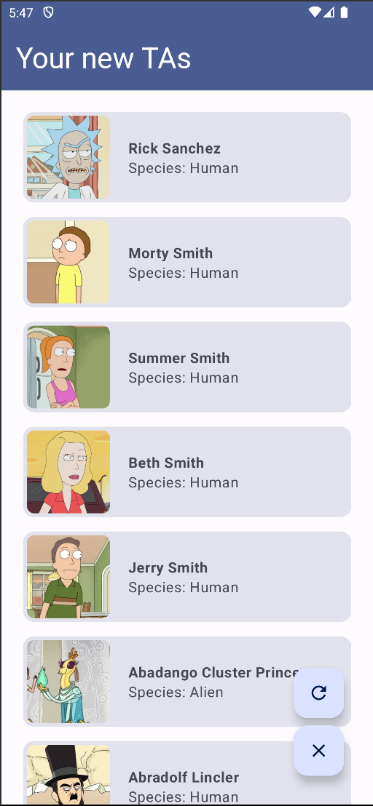
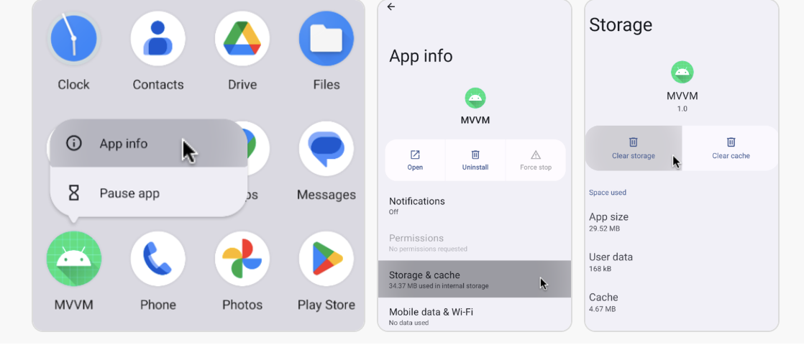

# Android Persistence

<p align="center">

</p>

When developing an Android application, you will often need to store data as an offline cache. This
can be done in a variety of ways, but the most common way is to use a database. There are many
different types of databases, but the most common one is the SQLite database. SQLite is a relational
database that is built into Android. It is a very simple database that is easy to use and is quite
fast. It is also very small, so it is a good choice for storing small amounts of data.

A common library for working with SQLite databases is
the [Room Persistence Library](https://developer.android.com/topic/libraries/architecture/room.html)
. Room provides an abstraction layer over SQLite to allow you to more easily work with objects,
provides compile-time checks of [SQL queries](https://www.w3schools.com/sql/sql_syntax.asp), and can return observable objects that will notify you when the database has changed.

In this exercise, you will extend the Rick and Morty app you completed in the previous exercise to store
the stories in a database, and load them from there in case there's no internet connection and the data fails to load.

## Step 1: Adding Room to the project

If you go to the `build.gradle` file for the app module, you will see that the Room library has been
added as a dependency:

```groovy
dependencies {
    val room_version = "2.6.1"
    implementation("androidx.room:room-runtime:$room_version")
    kapt("androidx.room:room-compiler:$room_version")
    implementation("androidx.room:room-ktx:$room_version")
    // ...
}
```
Breaking it down:
- `implementation("androidx.room:room-runtime:$room_version")` adds the Room runtime to the project.
- `kapt("androidx.room:room-compiler:$room_version")` adds the Room compiler to the project (it processes the various annotations that are shortcut for writing SQL queries).
- `implementation("androidx.room:room-ktx:$room_version")` adds the Room Kotlin extensions to the project (it provides Kotlin coroutines support for Room).

## Step 2: Study the app changes

The app has been slightly modified so that we can now provide offline support. Here is what changed and what you need to do (marked as **Task**):

### Adding new actions to the ViewModel and View
The `CharacterViewModel` class
now supports a `refresh` and a `clear` method. The `refresh` method will fetch the characters from
the API and store them in the database. The `clear` method will delete all characters from the
database.

The View now also has a `clear` and a `refresh` button. These buttons will call the respective methods from `CharacterViewModel`. 

**Task:** Link the buttons to the methods in the `FloatingActionButtons` composable.

### Adding Room to the app's model layer
We have added a new package `model/persistence` that contains the classes needed to work with Room:
- The `CharacterDatabase` class is the main access point to the database. It is an abstract class that extends `RoomDatabase` and is annotated with `@Database`. It contains a method to get the DAO.

- The `CharacterDao` interface is annotated with `@Dao` (Data Access Object) and contains the methods to interact with the database. It contains methods to insert, delete, and query characters.
    - This interface is automatically implemented by Room at compile time, you only need to define the methods along with the SQL queries.

- The `CharacterEntity` class is annotated with `@Entity` and represents the character table in the database. It contains the fields for the character's attributes.

**Task:** 
- Write the `CharacterDao` interface. You will need to write the methods to insert, delete, and query characters. You can use the `@Insert`, `@Delete`, and `@Query` annotations to define the SQL queries, and refer to the [DAO annotations](https://developer.android.com/reference/android/arch/persistence/room/Dao) for more information.

- Complete the `CharacterEntity` class. You will need to define the fields for the character's name, status, species, and image URL, and annotate the class with `@Entity`. You can refer to the [Entity annotations](https://developer.android.com/reference/android/arch/persistence/room/Entity) for more information. Make sure to define the primary key on the name field. (Please remove the _Temporary placeholder_ field).

> Hint: check out some of the basic SQL queries on how to insert, select, delete from tables.

### Adapting the repository
Finally! The use of the repository pattern will now pay off!

The `CharacterRepository` class now has a new variable alongside the apiService, the characterDao. This will allow us to fetch the characters from the database and store them in the database:

```kotlin
// Initializing the database (cache) service
private val dao: CharacterDao by lazy {
    val db = Room.databaseBuilder(
        context.applicationContext,
        AppDatabase::class.java, "characters"
    ).build()
    db.characterDao()
}
```
_Notice how we are using a `context` variable to initialize the database. Delegating the context to the repository is not a good practice: the model layer **should not have any knowledge of the Android framework.** For the sake of simplicity, we will keep it this way. Instead, it would be better to use a dependency injection framework like Hilt to provide the context to the repository, or to use a `ViewModel` to provide the context to the repository._

**Task:** Make sure you adapt your previously written `getCharacters()` method to also store the characters in the database. It is up to you to decide the behavior! You could:
- Save each time you perform a network call and only load from the database if there's no internet connection.
- Save the cache once and always provide that. Only update it if the user explicitly requests it (e.g. adding a new force refresh button).
- A time based cache? Always use cache once loaded for the first time but request a new update after a while (e.g. only update the cache if it's older than 1 hour, you could add a new `fetchTime` in the db).

> **Note:** Be sure to know the nature of data that you are loading: is it okay to cache data? Or is it highly dynamic and should be fetched every time? (e.g. a chat app should always fetch the latest messages, but a news app could cache the news for a while).

## Done! Testing (manually)...

Your app should now function correctly. Congrats!

Now, you should check carefully in the new implemention to enable the offline mode in the app. You should interact with the app after understanding the logics and simulate the scenarios according to what you've implemented. If you've implemented the first proposed implementation, this is what should happen:

- Turn off your internet, and launch the app (for the first time), you get an error popup. This corresponds to there's no internet connection + no cached data.

- If you enable your internet and click refresh, it will fetch them and automatically cache the results that you receive.

- If you remove the internet connection, and refresh (or clear then refresh), it will load for a while, but once it crashes because it can't connect to the internet, then it will get the data from the cache.

**Note:** When testing, you can clear the storage or cache as the following:
<p align="center">

</p>
