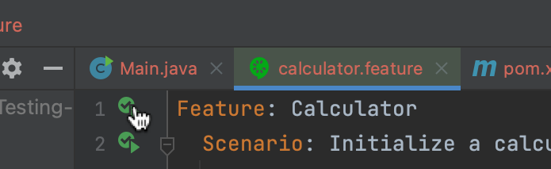

# Behavior-Driven Development with Cucumber
BDD is particularly interesting, as it allows for a more natural language to be used in the specification of the software. We'll use Cucumber, a popular BDD framework, to write the specification for a simple calculator.

Think of a calculator, ... pretty bland, but a great example! Let's say you develop an app that contains a calculator as a state-of-the-art **feature.** You want to test this feature with Cucumber and with natural language:
```gherkin
Feature: Calculator
```

More specifically, you will want to test **scenarios** that could occure while using the calculator feature:
```gherkin
Feature: Calculator

    Scenario: Add two numbers
        Given I have a calculator
        When I add 2
        And I add 3
        Then the result should be 5

    Scenario: Add to existing result
        Given I have a calculator displaying 5
        When I substract 4
        Then the result should be 1
```

Two simple scenarios! The keywords that you see highlighted help to "guide" the progress of the test. The text (and test) is self explainatory, it simply tells you what you do, and what you expect from doing that. And just as test, it would either pass or fail.

In this exercise, you will already recieve a written class `Calculator.java`. Your goal would be, in order to use the Cucumber framework, to:
1. Define the scenarios to test for the calculator (feature file)
2. Write the step definitions (bridge between text and code) for the scenarios (step definitions file)

## 1. The feature file
First of all, check out what our calculator is capable of. Head over to `Calculator.java` in the `src/main/` [package.](src/main/java/org/example/calculator/Calculator.java) Spoilers, not much. Notice how it is able to keep a state (as it is important when you write the scenarios).

Now, head over to the `calculator.feature` [file](src/test/java/ressources/features/calculator.feature) in `test/ressources`. This is where you will write the scenarios for the calculator. 

Let's look at the previous example again:
```gherkin
Feature: Calculator

    Scenario: Add two numbers
        Given I have a calculator
        When I add 2
        And I add 3
        Then the result should be 5
```

Notice the different keywords used in the feature file. The `Feature` keyword is used to define the feature that is being tested, usually the name of the class. The `Scenario` keyword is used to define a scenario that is being tested. It would be the equivalent of a test case in TDD.

The `Given`, `When`, and `Then` keywords are used to define the steps of the scenario.
- `Given` is used to define the initial state of the system.
- `When` is used to define an action that is being performed.
- `And` similar to `When`, is used to define another action to be performed.
- `Then` is used to define the expected result of the action.

For now, let's not worry how Cucumber will be able to interpret this plaintext. We will see that in the next part. **Athough make sure similar behaviors explicit the same wording/syntax!**

**Task:** Write at least 5 different scenarios for the calculator that exploit all of its capabilities in the `calculator.feature` file, by using the examples above. How and what you write is completely up to you, but make sure to test all the capabilities of the calculator (eg: _"Given I have a calculator displaying 5"_ _" When I substract 2"_ **versus** _"Given Elon musk decided to open a new bank account with 5.000.000 dollars on it"_ _"When he withdraws 2.000.000 from it"_ would be same).

## 2. Step definitions file

The feature file is just a plaintext file, but Cucumber needs to know how to interpret it. This is where the **step** definitions come in.

Steps define what code should be triggered when you use a keyword and a specific sentence in the feature file. For example, when you use the sentence `Given I have a calculator`, Cucumber will look for a method that is annotated with `@Given` and has the sentence `"I have a calculator"` as a parameter.

So this acts as a bridge between the feature file and the actual code that will be executed. These are specified in the `CalculatorStepDefinitions.java` [file](src/test/java/org/example/steps/CalculatorSteps.java) in `test/java/org/example/steps`.

**Task:** Write the step definitions for the scenarios you wrote in the `calculator.feature` file:
- You will need to use the `@Given`, `@When`, and `@Then` annotations to define the steps.
- Keep track of a state (of the calculator)! You create a calculator instance with `@Given`, you'll need to save it in a variable to be able to perform subsequent operations on it.
- `@Then` would usually contain an assertion to check if the result is as expected.
- Make sure all of the phrases you defined in the feature file are used in the step definitions!
    - Refine your feature file as you go along, and make sure you have the same wording/syntax for similar behaviors.

Here is an example to inspire yourself of. The following step from the `feature` file:
```gherkin
Given I have a dog called Lulu of age 3
When I walk her for 1 hour
Then she should be happy
```
... would be implemented in the `step` definitions file as:
```java
private Dog myDog;

@Given("I have a dog called {string} of age {int}")
public void i_have_a_dog_called_of_age(String name, int age) {
    myDog = new Dog(name, age);
}

@When("I walk her for {int} hour")
public void i_walk_her_for_hour(int hours) {
    myDog.walk(hours);
}

@Then("she should be happy")
public void she_should_be_happy() {
    assertTrue(myDog.isHappy());
}
```
Notice how parameters are grabbed from the feature file and used in the step definitions.

Once you have completed all the step, you should be able to see if the scenarios of the calculator feature act as expected!



You can now move on to another exercise!

### Technicalities:
Cucumber is not available on Kotlin directly (hence why this exercise is in Java), but we have found a repository that tries to wrap the Java version of Cucumber to Kotlin. You can find it [here.](https://github.com/jecklgamis/cucumber-jvm-kotlin-example)

We used Maven and the following dependencies in the `pom.xml` file to enable Cucumber:
```xml
<dependencies>
    <dependency>
        <groupId>io.cucumber</groupId>
        <artifactId>cucumber-java</artifactId>
        <version>7.0.0</version>
    </dependency>
    <dependency>
        <groupId>io.cucumber</groupId>
        <artifactId>cucumber-junit</artifactId>
        <version>7.0.0</version>
        <scope>test</scope>
    </dependency>

    <dependency>
        <groupId>org.junit.jupiter</groupId>
        <artifactId>junit-jupiter-api</artifactId>
        <version>5.7.0</version>
        <scope>test</scope>
    </dependency>
    <dependency>
        <groupId>org.junit.jupiter</groupId>
        <artifactId>junit-jupiter-engine</artifactId>
        <version>5.7.0</version>
        <scope>test</scope>
    </dependency>
</dependencies>
```

If you get errors, make sure you always build your project with Maven to get the latest dependencies and be able to run Cucumber!

In IntelliJ, you can run the tests by right-clicking on the `calculator.feature` file and selecting `Run 'Feature: calculator'`, or by clicking the green arrow next to a scenario, or the whole feature file.