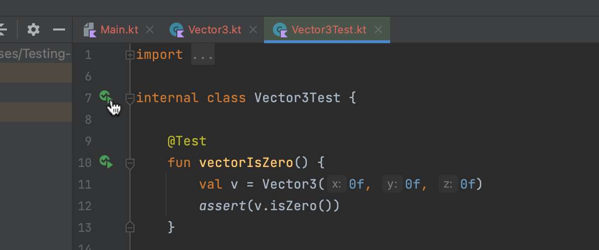

# Test Driven Development, hands-on exercise
You are a new developer working on a 3D game engine, Anarchy3D. You are tasked with writing the class representig a 3D vector.

In the class' documentation, write the specification for the [Vector3](src/main/kotlin/Vector3.kt) class in informal language.

This class should have at least the following capabilities:

- check if the vector is the zero vector
- compute the dot product with another vector
- compute the length of the vector
- compute the cross product with another vector
- normalize the vector
- scale the vector by a scalar

You are free to add any other functionality that you see fit. You can also use formal language, i.e., mathematical formulas, if required. Think about the edge cases when designing the specification and how they should be handled.

We have provided you with a sample test function to check for the first requirement. While you can launch this test, it will fail until you have properly implmented the Vector3 class, because the `isZero` method always returns `false` at the moment.

```kotlin
@Test
fun vectorIsZero() {
    val v = Vector3(0f, 0f, 0f)
    assert(v.isZero())
}
```

Remember, you can choose from set of assert functions to check values, such as: 
- `assert` for boolean values,
- `assertEquals(expected, actual)` for comparing two values,
- `assertEquals(expected, actual, delta)` for comparing two floating point numbers with a given precision,
- `assertFailsWith<IllegalArgumentException> { ... }` for checking if a block of code throws an exception of a given type,
- or learn more from the [official Kotlin documentation](https://kotlinlang.org/docs/jvm-test-using-junit.html).

Then, implement the Vector3 class using TDD. You are free to add any methods and classes that you like.

**Note:** You can run all (or some) of your tests by clicking this run arrow, in your test file:

