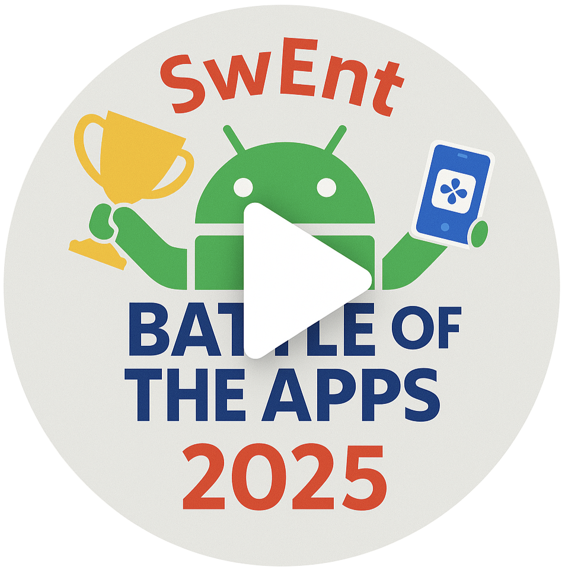

# The Battle of the Apps (BOTA)

 _Last update: November 7, 2025_

<table cellpadding="0" style="height:100%;">
  <tr valign="top">
    <td>
      
The BOTA competition will allow you to showcase your app and compete with other teams for substantial prizes. 
      Your course grade will not be affected by whether you participate in BOTA or how your demo goes. 
      So, you might ask, why participate? 
      The reason is that this is the culmination of your project, and it would be the first time you get to demo what you built in front of a big audience. 
      It is just plain cool and super satisfying to cap off this significant investment with a public demo.

      
The competition starts at <b>10:00</b> sharp, on <b>Friday 19.12.2025</b> in <a href="https://plan.epfl.ch/?room==STCC%207%208025">STCC Cloud C</a>.
      Please come to Cloud C at 9:15 for an end-to-end test of your setup.
      We will have to cut trials off at 9:45, to get the final preparations done.

    </td>
    <td style="vertical-align: top;">
      
    </td>
  </tr>
</table>

## Demo

Start your demo with a quick pitch, to set the context and develop a story:
Who is the app for?
What problem does the app solve for this audience?
Why should they use the app?
What differentiates your app from the thousands of other apps out there that do the same (or similar) things?

During the demo, focus on the key features that make your app special.
Make it memorable.

The order in which teams do their demos will be communicated at the start of the BOTA.
While one team is demo-ing, the next team must get ready to go on stage.
Your team will have a maximum of 5 minutes on stage, _including_ all the setup time you need after the previous team finishes.

You will demo your app using one or two phones (your choice); no emulators.
You will screencast your phone using the SwEnt Discord.
From your phone, you will need to join the `#BOTA` channel, then screen-share your app to the channel, and we will project the screencast on the big screen.
Make sure you come before the BOTA and test that this works for your phone(s).

>[!NOTE]
> By default, this form of screencasting will not make the taps on your phone visible, so the audience will not know what you're doing on the phone.
We recommend that you [enable "Show taps"](https://support.screenpal.com/portal/en/kb/articles/show-finger-taps-when-recording-on-your-android-device) beforehand, or adapt your demo script accordingly.

The BOTA will be video-recorded.

## Participation

Coaches will nominate specific teams for participation.
Nominated teams are free to refuse to participate.
If you wish to participate in the BOTA, announce it to your coaches several weeks in advance, and they will make a decision.

You should minimize the number of team members going on stage to do the demo (but the entire team cna help with setup). 
If you need an exception (e.g., because of your demo script), please ask the staff beforehand. 
The entire team should attend the event and support their teammates.

All teams participating in the BOTA are required to send to swent-staff@dslab.org one screenshot that is representative of their app at the latest by 13:00 the day before BOTA. 
This screenshot will be used to identify your app for the audience.

The BOTA will be attended by SwEnt students as well as external participants.
You are welcome to invite friends and family to the BOTA.

<!-- If you are in the audience, you will get to vote, as a team, by filling in a Google form. Each team will have a total of 30 points to distribute in the following way: 12 points for their top choice, 10 points for their 2nd choice, and 8 points for their 3rd choice. Together with the vote, you can submit a 1-sentence "nomination statement" that explains why you chose that particular team for that particular spot in your rankings.

>[!NOTE]
> Consider sitting together as a team; this will make the decision process easier.

Votes will remain anonymous to the audience, but not to the staff. You cannot vote for your own team, and you cannot vote more than once. Please vote carefully, because the staff will disqualify all votes that violate the rules.

The results of the votes will be revealed on the big screen, one vote at a time. The optional nomination statements will be read out loud (except for inappropriate ones) during the reveal.

The staff will vote only when necessary to break ties in the top-3 ranking.
The coaches of the tied teams will not vote in such a tie-breaker. -->

## The Prizes

Preparing for and participating in this competition is a reward in and of itself, and everyone who participates wins the experience.
Additionally, we will reward the top three teams as follows:

|                              |   Team prize                      |
|------------------------------|------------------------------------
| Team in 1st place |  500-CHF Digitec gift certificate |
| Team in 2nd place |  300-CHF Digitec gift certificate |
| Team in 3rd place |  150-CHF Digitec gift certificate |

There will be a panel of independent judges, combining people from industry, academia, investors,  and other domains.

Everyone who comes to the BOTA will receive a SwEnt sticker for their laptop.
We hope all students in SwEnt will come, including those whose teams are not demo-ing their app.

## Recent Winners

2024 (Fall)

1. _PlateSwipe_ (Y. Amar, A. Bader, A. Cadet, A. El Madhi, E. Hübner, R. Petre, Y. Vifian)
2. _EndurAI_ (L. Chapuis, D. Da Silva, N. Eddahir, H. Mouktar, R. Tipurita, A. Trachsel)
3. _BeatLink_ (E. Dall'Acqua, L. Hammi, S. Lilljequist, M. Magnin, M. Perevoznyk, L. Raithle, A. Wolf)

2024 (Spring)

1. _ActualIA_ (S. Nérisson, P. Madelénat, L. Cretegny, R. Paccaud, L. Mermod, C. Josso, J.Moretti)
2. _FeedMe_ (F. Déjean, O. Hammoud, S. Pichot, U. El-Khoury, J. De Marmiés, M. Rezziki, M. Imghi)
3. _SkySync_ (R. Sollberger, M. Mognol, G. Matthey-Doret, L. Guerin, T. Moebel, R. Mehenni, A. Goumaz)

2023
1. _MediaTo_ (S. Gueissaz, M. Greub, B. Morawiec, S. Kalbermatter, P-H. Levieil, M. Baccari)
2. _ConnectOut_ (L. Desmeules, D. Kalajdzic, E. Saikali, A. de Chillaz, M.Kalajdzic, T. Norlha-Tsang)
3. _cook4me_ (J. Taylor, D. Massonnet, D. Bucher, H. Li, P. Llordella, N. Gerber)

2022
1. _RateMyEPFL_ (E. Guandalino, A. Messmer, S. Boudouh, J. Mettler, N. Matekalo, M. Bouilloud)
2. _BlindWar_ (A. Papp, M. Marty, H. Gameiro, J. Monnet, N. Ouerghemi, P. Keller)
3. _Pawnies_ (A. Piveteau, M. Taddist, M. Burguburu, L. Barmettler, F. Mahmoud, C. Kot)
