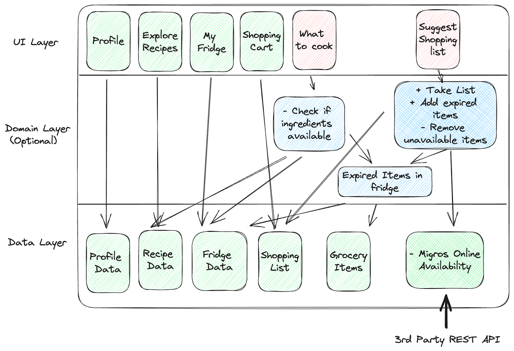

# Project Milestone M1

_Last updated: September 30, 2026_

Your project has three milestones (see [project README](./README.md)), and this handout concerns the first milestone, named M1.
It covers the first two Sprints (S1 and S2).

## Due Date

Friday 16.10.2026 at 08:45

## Overview

Milestone M1 will provide you with feedback on how you are coming together as a team, organizing yourselves, adopting good software engineering practices, and making progress toward delivering incremental value to your users. 
Consistent delivery of value every Sprint is an essential ingredient for your success in this and any other project. 
M1's goal is not to assess whether you are top-tier Android developers or software testers&mdash;this will be assessed in earnest in subsequent milestones, once you've had the opportunity to gain experience and acquire the relevant skills.

We encourage you to solicit informal feedback from your coaches on how you are doing; your coaches are an important resource that you should leverage for your success. 
Aside from the weekly meeting, reach out to them on Discord, email, or any other mutually agreed upon communication channel for receiving feedback.
The whole staff is committed to helping you.

We will proactively give you such informal feedback.
We will not stress you with a grade every Sprint, but you should nevertheless aim for all your _finalized_ PRs and code reviews to be of the highest quality, as they are an integral part of your individual performance.
Intermediate PRs and code reviews need not live up to those high expectations, of course.

## M1 Deliverables

Do not think of the milestone as some big deadline where you turn in everything you've done so far.
Instead, you should view it like any other Sprint Review: a checkpoint on the way to your final goal.
We provide below a list of items that your _team_ will need to prepare for M1, in order to make sure you're on-track:

1. Figma of the main user flows (wireframes, mockups, and screen linking between mockup screens1) ➡︎ on _figma.com_, linked from your project's GitHub wiki
2. Architecture diagram2 ➡︎ _your GitHub wiki_
3. Product Backlog3 ➡︎ _your GitHub Scrum board_
4. Sprint Backlog3 for Sprint S3 ➡︎ _your GitHub Scrum board_
5. Code repo with configured CI, analyzed by Sonar, tested solidly with >80% line test coverage, including at least 1 meaningful end-to-end test4 ➡︎ _GitHub_
6. Working, stable APK that features a first meaningful end-to-end user flow5 ➡︎ _GitHub Actions artifacts_
7. Scrum process documents6 ➡︎ _Steve_
   - one documented stand-up meeting for S2 (you can pick any one of the ≥2 stand-ups you do)
   - documented Sprint Retrospective for S2

Additionally, each _individual_ team member should prepare the following:

1. An individual Retrospective for S26 ➡︎ _Steve_
2. Code7,9: ≥1 PR in each Sprint, ready for review ≥24h before the end of the Sprint, merged into `main` before the end of the Sprint ➡︎ _GitHub_
3. Reviews8,9: ≥1 reviewed PR in each Sprint merged into `main` no later than the M1 deadline ➡︎ _GitHub_

Further details on some of the deliverables appear below.

### 1 Figma

We suggest that you start with wireframes, and then create full mockups whose screens are linked together, so that you can test the user flow and build a shared understanding within your team of what the application should look like. This will make it easier to define clear development tasks.

> [!IMPORTANT]
> The mockup should always stay ahead of the current implementation and drive development, not document it after the fact.

For the M1 deliverable, create a named version called "M1" on figma.com, copy the link from the version history, and put it in your project wiki.
Make sure the Figma is accessible to everyone.
Do not use a different name than the one indicated above.

### 2 Architecture Diagram

Start designing your app. Familiarize yourself with the [Android App Architecture](https://developer.android.com/topic/architecture/intro) guide, and then draft the UI and data layers. This will help you understand what dependencies you need to take into account when building your app.

It is still early, so we don't expect this diagram to represent the final architecture of your app. However, it should show that you have seriously thought through the relations between your screens, data sources, and internal state, and it should be complete for what your app does today. It must also stay consistent with your user stories (e.g., if a user story involves saving pictures, the diagram should show where they are stored). Put this diagram in your wiki.

> [!IMPORTANT]
> You must flesh out a high-quality app design before you start writing code. We will evaluate how well you do this on an ongoing basis. Start working on the architecture in the first Sprint (S1), do not wait until just before the deadline. As with the mockups, the architecture diagram should always stay ahead of the implementation and drive development.

Here is an example in the spirit of the Android App Architecture guide. The Domain layer may or may not be applicable to your app. 
You can use whatever drawing software you want (e.g., [Excalidraw](https://excalidraw.com/)), as long as the diagram displays when viewing your wiki with a standard Web browser.
We recommend you put the source file under version control.

### 3 Product and Sprint Backlogs (PB and SB)

As you approach M1, you should have a PB with clear, fine-grained high-priority user stories at the top; all user stories for your first epic should be worked out in reasonable detail.
Start thinking about a second epic too, and break it down into user stories; it's OK for the user stories at the bottom of the PB to be coarse-grained, since the PO may not flesh out in too much detail features that could drop from the PB before release.

> [!NOTE]
> The maintenance of the PB is the responsibility of the PO. You need to wear the PO (not Dev) hat when you work on the PB. Early on, the coaches may exercise some PO muscle as well, to get you used to the separation between PO and Dev team.

Your SB should contain the tasks for the current Sprint, each broken down from a user story in the PB. Every task should at least be tagged with a time estimate (or scope), a priority, and an assignee. The tasks should be distributed fairly across the team, so that every member has a clear share of the work in each Sprint.

> [!IMPORTANT]
> Your PB and SB _n_ must be ready in GitHub before the start of Sprint _n_ (i.e., before the coaching meeting). For M1, we will snapshot the PB and SB you have in GitHub at the deadline.

### 4 Testing

For M1, we consider an end-to-end test meaningful if it covers all the main features currently available in your app and the interactions between them. We will pay close attention to the quality of your tests&mdash;regardless of whether you wrote them yourselves or an AI, you own them. Reaching 80% line coverage in itself does not mean that the code is well tested. Beware that the 80% threshold is just a baseline, and it will increase for later milestones, so having a solid testing strategy in place will pay off.

### 5 Working, Stable APK

You must set up your repo with a GitHub workflow to build the app's APK such that, at the end of every Sprint, you can create a new release at the push of a button. For M1, your coaches must be able to install the APK on their Android phone and manually navigate around your app. The app should start without a hitch, and the completed features should work bug-free.

> [!NOTE]
> You might find yourself with functionality that is to-be-defined or simply not robust enough for M1. That is fine. What is not fine is for the app to misbehave&mdash;at the very least, a Toast or Snackbar should indicate that a particular function is not yet supported.

For M1, link from your wiki the GitHub Actions workflow run that has the M1 APK in its artifacts; we will download the APK from the run's Artifacts section.

Consider creating a [release branch](https://docs.github.com/en/repositories/releasing-projects-on-github/managing-releases-in-a-repository) called "M1" so that you have a clean snapshot of all code and assets related to M1.

> [!WARNING]
> Teams sometimes struggle to produce a working APK by M1: they have major bugs, missing essential functionality, etc. Producing a working APK is hard, and you should not leave it to the last minute. Aim to have a working APK for each Sprint Review, including S1, and then M1 will not take you by surprise.

### 6 Scrum Process Documents

You will be able to fill out the Scrum documents on Steve. We will judge positively your team Retrospective if you identify mistakes/problems and then come up with ways to improve.
Every team, no matter how professional, faces challenges and gets things wrong occasionally.
The good teams realize this, introspect, and improve; the poor teams remain oblivious and deteriorate over time.
All top-tier teams and professionals use introspection to learn and improve, so do take this seriously.
(The individual Retrospective is SwEnt-specific, not part of Scrum.)

### 7 Coding

You will use PRs for all sorts of things.

We emphasize _code_ PRs here because, in the context of SwEnt, we're mostly interested in seeing code contributions that enhance functionality, reliability, security, performance, etc.
Good graphic design, choice of colors and themes, and visual aesthetics are important in a real-world product, and you should devote to them their fair share of attention in your app, but they are peripheral to what we evaluate in SwEnt.
Having a good architecture and design is crucial, so PRs related to architecture documents count as code PRs. On top of that, each team member must contribute a minimum amount of pure coding. Figma and setting up GitHub and Firebase are important contributions but do not count as code PRs. At the same time, every _responsible_ team member will also contribute non-code PRs, and these will be taken into account.

Sometimes students work together on a PR.
This is fine.
However, in SwEnt, each PR counts for a single student only when it comes to course requirements.

### 8 Code Reviews

A PR can have multiple reviewers. However, in SwEnt, each PR counts as a review for a single student only.
A review covers the whole exchange with the author until the PR is merged, not just the initial feedback.
By approving a PR, the reviewer shares responsibility with its author for any issues the PR introduces into `main`.
Only reviews of PRs that are eventually merged into `main` are taken into account.

### 9 Ownership

We encourage you to use AI for both coding and reviewing, as taught in the lectures and the bootcamp. You remain nevertheless as responsible for this code and the reviews as if you had written them yourself. During each coaching meeting, we will discuss with individual team members their PRs and code reviews to assess how well they understand their work. For example, we will ask why you (or the PR you reviewed) made particular choices, what alternate designs you considered, how would your code (or the PR you reviewed) behave under this or that circumstance, etc.

The discussion of PRs merged later than Thursday afternoon will likely be rolled over to next week's coaching meeting. We realize this makes it harder for you to have a detailed conversation about them, but the coaches need enough time to prepare before the Friday meeting. Consider this an incentive to not merge your PRs at the last minute. (This does not make Thursday afternoon an official Sprint submission deadline.)

Pushing code you don't understand, or doing a superficial job on the code reviews, places an undue burden on your team. If you consistently demonstrate that you understand the design of your app, your code, and the code you reviewed, and you fulfill your other obligations shown below, then you can expect a passing grade for the _Projectindiv_ component of your grade. If not, then it means that you are not contributing work to your team's product, rather the opposite, so _Projectteam_ cannot be counted toward your final course grade. See the [course README](../README.md#grading) for more details.

## Grading

> [!NOTE]
> In SwEnt, the emphasis of grading is more on process, and less on features or the beauty of the UI.  These are of course important factors, but keep in mind that building an Android app in SwEnt is mainly a pretext for learning the process of how you can turn ideas into products, as a team.

The breakdown of the team / individual grades for M1 will be as follows:

<table style="table-layout:fixed; width:330px;">
  <colgroup>
    <col style="width:80%">
    <col style="width:20%">
  </colgroup>
  <tr><th>Team Grade</th><th>100%</th></tr>
  <tr><td>Architecture</td><td>15%</td></tr>
  <tr><td>Figma</td><td>15%</td></tr>
  <tr><td>Implementation (APK, CI, tests)</td><td>40%</td></tr>
  <tr><td>Sprint Backlog & Product Backlog</td><td>20%</td></tr>
  <tr><td>Scrum process documents</td><td>10%</td></tr>
</table>

 

<table style="table-layout:fixed; width:330px;">
  <colgroup>
    <col style="width:80%">
    <col style="width:20%">
  </colgroup>
  <tr><th>Individual Grade</th><th>100%</th></tr>
  <tr><td>Quality and Ownership of code PRs10</td><td>40%</td></tr>
  <tr><td>Quality and Ownership of code reviews11</td><td>25%</td></tr>
  <tr><td>Individual Retrospective</td><td>5%</td></tr>
  <tr><td>Participation12</td><td>10%</td></tr>
  <tr><td>Responsibility13</td><td>20%</td></tr>
</table>

> [!NOTE]
> Late submissions will be penalized 2% per hour of lateness. For example, a submission that is 1 day late and would earn the full 100 points will be reduced to 52 points, i.e., will incur a 24h x 2% = 48% penalty. The rule applies to both team and individual submissions.

> [!NOTE]
> It is the team's collective responsibility to submit the team deliverables on time.  For example, if Eva is tasked to submit the deliverables by the deadline, and she doesn't do it because of a medical emergency or because her laptop exploded, the team is not absolved from this responsibility.  You must put in place backup mechanisms to account for unexpected circumstances.

10 M1 is about ensuring that you start working effectively as a team; we aim to give you personalized feedback, to help you grow. You must merge at least the required number of code PRs; missing this minimum will slow down your team and thus cost you points. Beyond that minimum, we grade the overall quality and your ownership9 of all your code PRs, not just your best ones. Quality code is modular, well designed, and builds on the existing codebase rather than duplicate parts of it. Be careful with AI agents here, as this is one of their blindspots: they often write self-contained code that ignores what already exists.

In addition to the quality of the code merged, a code PR's quality also includes whether you follow the best practices taught in lectures: Does the PR have a clear goal and description? Does it have a single purpose (e.g., does not mix unrelated things in one PR)? Does it align with the task's definition of done?

> [!NOTE]
> We take into account every PR merged into `main`, even if its changes are later reverted or overwritten. This is because any work pushed to `main` must meet the standards of quality and ownership.

11 You must complete at least the required number of reviews, missing this minimum will cost you points. Beyond that, we grade the overall quality and value of all your reviews, not just your best ones. Our evaluation of the quality of a code review has two dimensions: First, the technical aspects, i.e., did the review identify all serious problems with the PR and help improve it? Second, the "collegiality" component: Is the feedback phrased in a constructive way? Are the suggestions useful and humble? Does the review focus on the code not the person? We also take into account your ownership9 of the code you approved.

Since it takes some practice to get reviews right, expectations will be lighter at first and increase quickly over the course of the semester. Use S1 as an opportunity to learn how to do this well.

12 This refers to your active participation in the [Scrum ceremonies](Ceremonies.md) that take place on Friday.
Being present and contributing to each of the three ceremonies is essential.

13 This evaluates how responsible you are as a team member. Have you properly fulfilled your Developer, PO and/or Scrum Master duties when it was your turn to undertake them?
Did you do everything that could reasonably be done to ensure the successful completion of your tasks and of the team's as a whole?
Were you responsive in dealing with blockers?

What "being responsible" means depends on circumstances:

- you might finish the task yourself; or
- ask for help in a timely fashion when you're stuck or unavailable, so the team can move ahead; or
- bring up the challenges latest at the next stand-up meeting; or
- ask your coaches for help if your team is stuck and everything you tried has failed; or
- bring the serious blockers for discussion in the Retrospective and/or Planning meetings; or
- finish what can be finished, and discuss a change of strategy for what remains
- ...

What we want to see here is that you've truly done your best, given the time budget for this course.
You might not have succeeded in all your undertakings (that's ok, one can't always win), but what matters is that you tried in an active manner to find solutions.

Remember that there are no losers on a winning team, and no winners on a losing team[*](https://documents.manchester.ac.uk/display.aspx?DocID=19334).