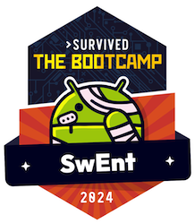

# The Battle of the Apps (BOTA)

 _[updated 27.05.2024]_

<table cellpadding="0">
  <tr valign=top>
    <td>
The BOTA competition will allow you to showcase your app and compete with other teams for substantial prizes and SwEnt swag. It will take place on <b>Thursday 30.05.2024</b>, starting at <b>10:15</b> in STCC Cloud C.

    
Your course grade will not be affected by whether you participate in BOTA or how your demo goes. So, you might ask, why participate? The reason is that this is the culmination of your project, and it would be the first time you get to demo what you built in front of a big audience. It is just plain cool and super satisfying to cap off this significant investment with a public demo.

</td>
    <td width=200></td>
  </tr>
</table>

## Demo

To prepare your demo, we recommend that you first review the _Doing Demos_ and the _Pitching to a Prospective Customer_ slides of the [first lecture](https://moodle.epfl.ch/pluginfile.php/3317323/mod_resource/content/2/Wk1.1%20-%20Introduction%20%2B%20Requirements.pdf). At the BOTA, your team will have a maximum of 5 minutes on stage (including any setup time). 

Remember to start your demo with a quick pitch, which sets the context and develops a story: Who should use the app? What problem does the app solve for this audience? Why should they use the app? What differentiates your app from the thousands of other apps out there that do the same (or similar) things? Then, during the demo, focus on they key features that make your app special.

You will demo your app using 1 or 2 phones, your choice.
No emulators.
You will screencast your phone using the SwEnt Discord, which we will then display on the big screen.

There will be one computer connected to the big screen.
From your phone, you will need to join the `#BOTA` channel, then screen-share your app to the channel.
By default, this form of screencasting will not make the taps on your phone visible, so the audience will not know what you're doing on the phone&mdash;we recommend that you either [enable "Show taps"](https://support.screenpal.com/portal/en/kb/articles/show-finger-taps-when-recording-on-your-android-device) or adapt the script of your demo accordingly.

Please come to Cloud C between 9:15-10:00 before the BOTA for an end-to-end test of your Discord setup.
We will have to cut trials off at 10:00, so we can get the final preparations done.

We will communicate to you the order in which teams will demo at the beginning of the BOTA.
While one team is demo-ing, we expect the next team to get ready.

The BOTA will be video-recorded, like the lectures.

## Participation

Any team is free to participate.
Coaches will additionally nominate specific teams for participation. These teams are free to refuse to participate.

A maximum of 2 members of each participating team can do the demo (but the entire team can help with setup). If you need an exception, please ask the staff. It would be ideal for the entire team to attend the event and support their teammates.

All teams participating in BOTA are required to send to swent-staff@dslab.org one screenshot that is representative of their app at the latest by 18:00 CEST the day before BOTA. This screenshot will be used to identify your app for the audience.

## Audience 

The BOTA will be attended primarily by SwEnt students.

If you are in the audience, you will get to vote, as a team, by filling in a Google form. Each team will have a total of 30 points to distribute in the following way: 12 points for their top choice, 10 points for their 2nd choice, and 8 points for their 3rd choice. Together with the vote, you can submit a 1-sentence "nomination statement" that explains why you chose that particular team for that particular spot in your rankings.

>[!NOTE]
> Consider sitting together as a team; this will make the decision process easier.

Votes will remain anonymous to the audience, but not to the staff. You cannot vote for your own team, and you cannot vote more than once. Please vote carefully, because the staff will disqualify all votes that violate the rules.

The results of the votes will be revealed on the big screen, one vote at a time. The optional nomination statements will be read out loud (except for inappropriate ones) during the reveal.

The staff will vote only when necessary to break ties in the top-3 ranking.
The coaches of the tied teams will not vote in such a tie-breaker.

## The Prizes

Preparing for and participating in this competition is a reward in and of itself, and everyone who participates wins the experience.

Additionally, we will reward the top three teams as follows:

|                              |   Swag for *each* team member   |  Prize for *each* team member   |
|------------------------------|---------------------------------|----------------------------------
| Team in 1st place | A SwEnt embroidered sweatshirt  | 75-CHF Digitec gift certificate |
| Team in 2nd place | A SwEnt printed T-shirt         | 50-CHF Digitec gift certificate |
| Team in 3rd place | A SwEnt printed T-shirt         | 25-CHF Digitec gift certificate |

Everyone who comes to the BOTA will receive a SwEnt sticker for their laptop, designed by our very own Daniel Demko. We hope all students in SwEnt will come, including those whose teams are not demo-ing their app.

## Recent Winners

2023
1. **MediaTo** (S. Gueissaz, M. Greub, B. Morawiec, S. Kalbermatter, P-H. Levieil, M. Baccari)
2. **ConnectOut** (L. Desmeules, D. Kalajdzic, E. Saikali, A. de Chillaz, M.Kalajdzic, T. Norlha-Tsang)
3. **cook4me** (J. Taylor, D. Massonnet, D. Bucher, H. Li, P. Llordella, N. Gerber)

2022
1. **RateMyEPFL** (E. Guandalino, A. Messmer, S. Boudouh, J. Mettler, N. Matekalo, M. Bouilloud)
2. **BlindWar** (A. Papp, M. Marty, H. Gameiro, J. Monnet, N. Ouerghemi, P. Keller)
3. **Pawnies** (A. Piveteau, M. Taddist, M. Burguburu, L. Barmettler, F. Mahmoud, C. Kot)
