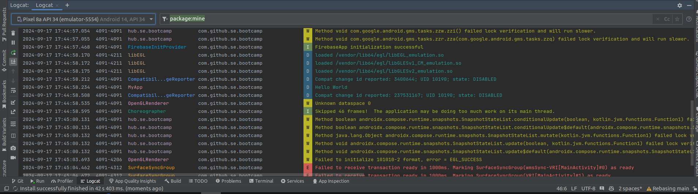
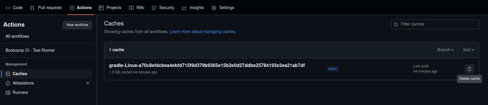

# Debugging Tutorial

## Introduction

Debugging is a critical skill for developers. 
You need to know how to fix your own code and that of others, how to get your CI to work, etc.
Learning to debug effectively can make you a lot more productive.
In this tutorial we gathered some of the essential debugging techniques, how to debug systematically, and what information to provide when asking others for help.

There are three steps to resolving issues, and you always need to follow them in sequence; most of the time you don't even get to step 3:

1. [Debugging on your own](#1-debugging-on-your-own)
2. [Using an AI assistant](#2-using-an-ai-assistant)
3. [Asking another human for help](#3-asking-another-human-for-help)

## 1. Debugging on Your Own

A skilled developer can solve most of the issues (s)he encounters on her/his own.

### Replay

Try to reproduce the problem.
If you manage to do so consistently, it's like you have a "replay" button: you can experiment with various solutions and see which one fixes the problem.

### Rubber Duck

Try to make sense of your problem.
One way to do this is the [Rubber-duck debugging](https://en.wikipedia.org/wiki/Rubber_duck_debugging) method.
It consists of articulating a problem verbally (or in writing) to a (real or imaginary) rubber duck.
The act of describing your problem in this way will help your brain work on finding solutions in a way that it cannot do unless it hears you describe the problem.

### Logs

Logs are crucial for debugging, providing insights into what went wrong.
Always check logs for errors and warnings, and try to understand why the first one occurred, and how the subsequent ones are related to it.

For Android development, [Logcat](https://developer.android.com/studio/debug/logcat) is the go-to tool for viewing system messages, including errors from your own app.
Here's how to use it:

1. Logcat: In Android Studio, you can open Logcat by going to *View > Tool Windows > Logcat*.
2. Filter: You can filter by your app’s package to narrow down the relevant events. You can also search for keywords like "Exception" or "Error".
3. Use a log: Use `Log.d`, `Log.e`, or `Log.i` to print out custom messages in the Logcat from your app. For example:

   ```kotlin
   Log.d("MyApp", "Just about to display login screen");
   ...
   Log.d("MyApp", "Received input from user");
   ```



Carefully read the error messages and research their meaning. They often include:

- *Error type*: like `NullPointerException` or `NoSuchElementException`
- *Error code*: An API or library may return "Error 10" or "404". You should research what these error codes signify in the context of the API or library.
- *Stack trace*: The [stack trace](https://en.wikipedia.org/wiki/Stack_trace) shows you the active sequence of function calls that led to the curent location, e.g., where an exception was thrown. This can point you directly to the file and line number where the problem is.

### Continuous Integration

If your CI failed, try to re-run it with the "Enable debug logging" option on, or equivalent.
Without it, the CI will provide sparse detail as to why it failed, and this can lead to confusion.

Next, ask yourself where that error could come from.
Act as a crime investigator.
Are the recent changes related to the error?
Did the change you introduce require a modification to the workflow? (e.g., the CI might not have the right permissions to enable the camera by default, yet a new test you just wrote might require it).

If the issue persists, and it seems to you unexplainable, clear your GitHub workflow cache.
Cached information can sometimes become outdated or corrupt (e.g., due to bugs), so clearing the cache forces the CI to rebuild dependencies and configurations from scratch, getting rid of the stale or conflicting data that is causing build failures or anomalies.



## 2. Using an AI Assistant

We talked about how you can use generative AI in the _AI Coding Assistant_ [[slides](../lectures/Wk1.A%20-%20Requirements%20and%20User%20Stories.pdf) \| [video](https://www.youtube.com/watch?v=F8NZdL-ahKg)] lecture.  
In addition to what we said there, something as simple as an AI chatbot (like ChatGPT or Gemini) can offer great help in debugging a perplexing failure of your code or of the CI.
Such a chatbot allows you to tap into the experience of vast numbers of other developers who came before you.

With an AI, it's crucial to clearly define the problem and avoid any ambiguity. Crafting effective [prompts](https://developers.google.com/machine-learning/resources/prompt-eng) is an art and will significantly improve the quality of the result.

Often simply telling the chatbot "I am encountering the following issue, what can I do..." and copy-pasting the error you see on screen can give you starting points for your investigation. 
Then use your own brain to reason through the suggestions, and see which one might make sense.

As mentioned in lecture, you need to provide sufficient context to the AI assistant.
When you debug, for instance, a CI or test failure, including a stack trace, a complete error log, code snippets, etc. in addition to copy-pasting the problem you're facing can help a lot.

Do review the lecture, as we are not repeating here things that were already said there.

## 3. Asking Another Human for Help

If you were unable to resolve the issue with your own debugging attempts, and the AI could not help you either, then you should ask another human for help (a colleague, post on a forum, etc.).

When you do so, you often will need to provide more context than for the AI.  This includes:

- Expected behavior: What did you do and what did you expect to see happen?
- Actual behavior: What is happening instead?
- The full error message, relevant logs, etc.
- Environment information: OS, IDE & Language
- What have you tried to do to fix it, and what was the outcome of your attempts?

The latter point is particularly important.
First, it avoids having the human go down the same paths as you did and simply repeat the things you did (and thus waste time).
Second, it demonstrates to the human that you have made an effort to solve the problem on your own, and you're not asking simply because you're lazy or clueless.
