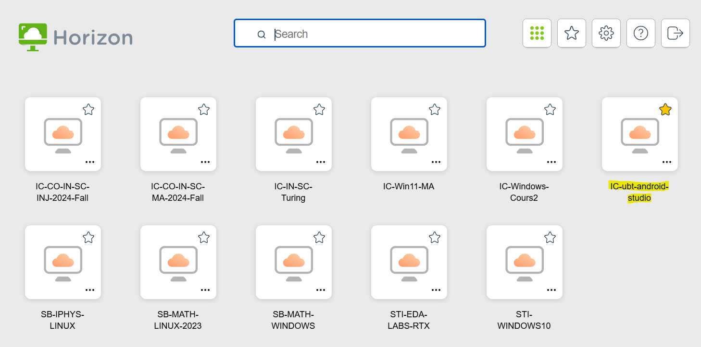
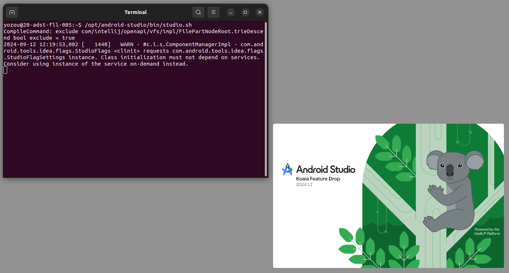

# A guide to the SwEnt VDI machines

## Get access to VDI machines

First, please check the [official document](https://www.epfl.ch/campus/services/wp-content/uploads/2020/09/Livret_Accueil_VDI_v2.docx) about VDI machines to familiarize yourself with their usage. Learn how to log in to the platform and try to use an existing machine to understand the basic operations.

Second, please add your name to [the Ed thread](https://edstem.org/eu/courses/1567/discussion/127313) so that we can grant you access to SwEnt machines.

Finally, log in to the platform and make sure you can see the machine called **IC-ubt-android-studio**.

<p align="center"></p>

## Set up Android Studio on the machine

IT only configured the Ubuntu environment for us, so if you are not familiar with Linux, please learn the basic operations, be patient, and try to solve problems by searching, asking ChatGPT, and getting help from us.

The Android Studio is installed on the machine. After opening the machine, you need to open a terminal (it should be on the dock) and use the following command to open Android Studio:

```shell
/opt/android-studio/bin/studio.sh
```

You will see some output in the terminal, but you can usually ignore them. You should now see Android Studio. Then, follow the document in your Bootcamp repo to initialize Android Studio.

<p align="center"></p>

## Cloning the Bootcamp repo

VDI machines are for temporary use, so they will reset files if you disconnect. To save your files, we asked IT to set up several special folders that will not be reset. There are two unhidden folders in your home folder (```/home/$USER```): ```Android``` and ```AndrodiStudioProjects```. The ```Android``` folder is the default location to install SDKs required by Android Studio.

We want you to set your Bootcamp repo in the ```AndrodiStudioProjects``` folder. To do so, use ```git clone``` in this folder.

## Limitations of VDI machines

As we said before, we asked IT to set up special folders. The full list of the folders are listed below:

```
/home/$USER/Android
/home/$USER/AndroidStudioProjects
/home/$USER/.java
/home/$USER/.android
```

Folders that start with ```.``` will store the temporary results of building your app. However, to achieve persistence, reading and writing these folders are slow. So, if you find that building, indexing, and downloading in these folders are slow, that’s the normal case.

There is a caching folder that IT cannot set up it as the special folder. So, if you find that Android Studio is re-indexing the code after you reconnect, that’s also a normal case.

## Common issues

If Android Studio does not automatically start building and indexing the project, please check whether there is a bar asking you to trust the project. If there is, click ```Trust```.

If there is a pop window to ask you which JDK you want to use, it should not matter which JDK you choose. Usually, you can select the Android Studio’s SDK.

